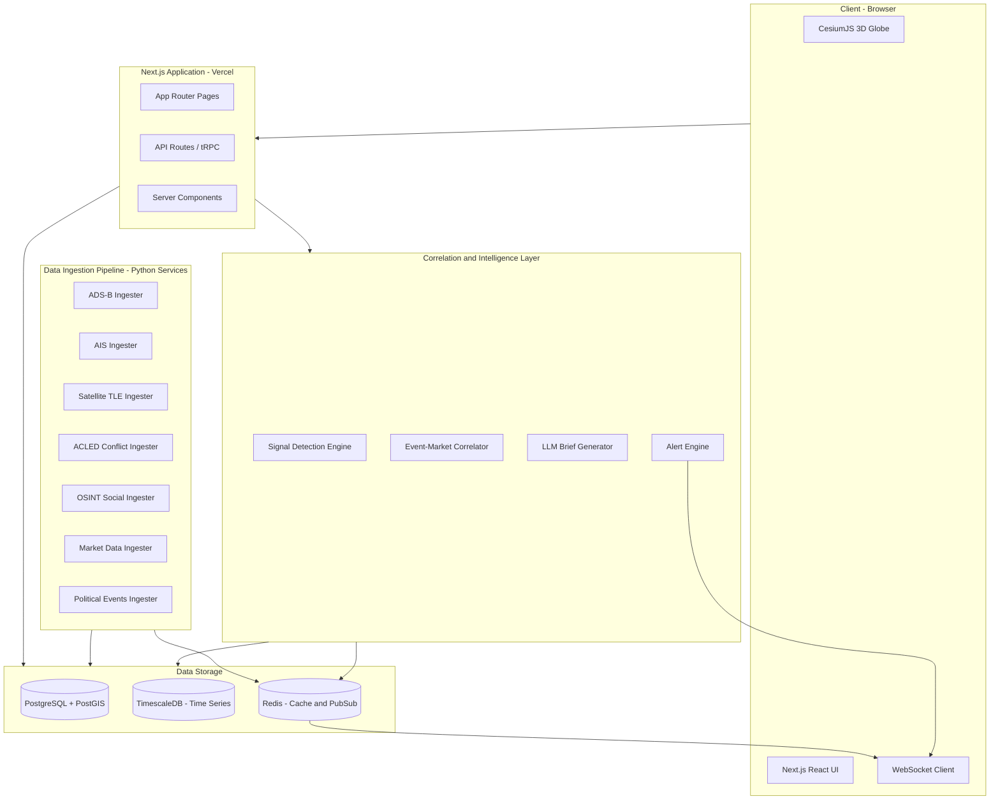
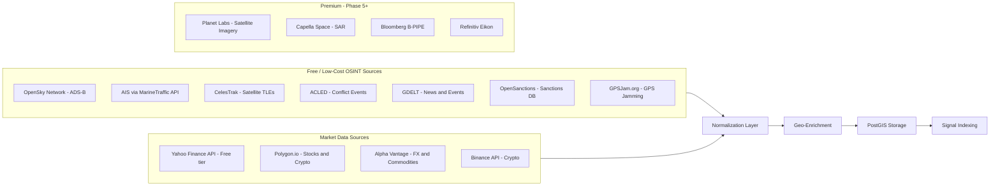

# Meridian — Implementation Plan

## Overview

A geospatial market intelligence platform that fuses OSINT signals from across the physical and political world and surfaces them as actionable trading and investment signals on a live 3D globe. This plan assumes a solo/small-team build, bootstrapping on free/cheap data sources, targeting a working prototype first, then iterating toward a paid SaaS product.

---

## Decisions (Confirmed)

1. **First milestone target** — MVP with real data to validate concept and onboard early users
2. **Team size** — Solo build
3. **Tech stack** — As proposed below (Next.js + CesiumJS + Python pipeline)
4. **Lead data sources** — Free/open data sources only (OpenSky ADS-B, CelesTrak TLEs, ACLED, GPSJam)
5. **Budget** — Cap at $100 per coding session for external API costs; prioritize free tiers

---

## Proposed Tech Stack

| Layer | Technology | Rationale |
|-------|-----------|-----------|
| Frontend Framework | Next.js 15 with App Router | SSR for SEO, API routes for backend, React ecosystem |
| 3D Globe | CesiumJS + Google Photorealistic 3D Tiles | Referenced in inspiration, free API tier, best-in-class |
| Styling | Tailwind CSS + shadcn/ui | Rapid UI development, consistent design system |
| State Management | Zustand | Lightweight, works well with real-time data streams |
| Backend API | Next.js API Routes + tRPC | Type-safe API, co-located with frontend |
| Data Pipeline | Python FastAPI microservices | Best ecosystem for geospatial/data processing |
| Database | PostgreSQL + PostGIS + TimescaleDB | Geospatial queries + time-series data in one DB |
| Cache/Queue | Redis + BullMQ | Real-time pub/sub, job scheduling for data ingestion |
| AI/LLM | Claude API or OpenAI | Brief generation, signal correlation narration |
| Auth | Clerk or NextAuth.js | Fast to implement, supports tiered access |
| Payments | Stripe | Industry standard SaaS billing |
| Hosting | Vercel (frontend) + Railway/Fly.io (services) | Easy deployment, good DX for solo/small team |
| Monitoring | Sentry + Posthog | Error tracking + product analytics |

---

## System Architecture



---

## Data Source Architecture



---

## Phased Implementation

### Phase 1 — Foundation and Globe MVP

**Goal:** Render a 3D globe with one live data source and a basic UI shell.

- [ ] Initialize Next.js 15 project with TypeScript, Tailwind CSS, shadcn/ui
- [ ] Set up CesiumJS integration with Google Photorealistic 3D Tiles
- [ ] Build globe component with camera controls, zoom, rotation, click-to-inspect
- [ ] Integrate first data source: ADS-B flight tracking via OpenSky Network API
- [ ] Render aircraft positions as animated entities on the globe
- [ ] Build sidebar panel UI for inspecting selected entities
- [ ] Add basic time display and data freshness indicator
- [ ] Set up project structure: monorepo with frontend and services directories
- [ ] Deploy to Vercel for live demo

### Phase 2 — Multi-Source Data Ingestion

**Goal:** Add 3-4 more data sources with a proper backend pipeline.

- [ ] Set up PostgreSQL + PostGIS database schema for geospatial events
- [ ] Build Python FastAPI data ingestion service
- [ ] Add AIS maritime vessel tracking (MarineTraffic or alternative free API)
- [ ] Add ACLED conflict event data ingestion
- [ ] Add satellite TLE orbital data from CelesTrak
- [ ] Add GPS jamming zone data from GPSJam.org
- [ ] Build unified GeoJSON event format for all data sources
- [ ] Implement data normalization and geo-enrichment pipeline
- [ ] Add Redis pub/sub for real-time data push to frontend
- [ ] Build WebSocket connection for live data streaming to globe
- [ ] Add layer toggle UI — show/hide each data source on globe
- [ ] Add entity clustering for dense areas (ship clusters, flight paths)
- [ ] Color-code entities by type and severity

### Phase 3 — Market Data Integration

**Goal:** Connect the "what is happening" layer to the "what it means for markets" layer.

- [ ] Integrate market data API (Polygon.io or Yahoo Finance)
- [ ] Build market data models: instruments, prices, sectors, correlations
- [ ] Create instrument-to-region mapping (e.g., Hormuz -> WTI crude, Suez -> container shipping stocks)
- [ ] Build market ticker/dashboard panel in UI
- [ ] Add "related instruments" panel when clicking a geospatial event
- [ ] Implement basic correlation scoring: event severity x instrument sensitivity
- [ ] Add price sparklines overlaid on regions of interest
- [ ] Build watchlist feature — user-selected instruments to track

### Phase 4 — Intelligence and Correlation Layer

**Goal:** The core product differentiator — AI-powered signal detection and narration.

- [ ] Build signal detection engine: rule-based triggers for known patterns
  - GPS jamming in Hormuz -> oil alert
  - Military flight patterns -> conflict escalation
  - Vessel rerouting around chokepoint -> supply disruption
- [ ] Implement event clustering: group related events into "situations"
- [ ] Build LLM-powered brief generator using Claude API
  - Input: clustered events + market context
  - Output: natural language intelligence brief
- [ ] Create "Signal Feed" UI panel — chronological stream of detected signals
- [ ] Build alert system: configurable thresholds, email/push notifications
- [ ] Add confidence scoring to signals (based on source count, historical accuracy)
- [ ] Implement feedback loop — users can rate signal quality to improve models

### Phase 5 — Historical Replay and Backtesting

**Goal:** Let users scrub back in time to see what signals looked like before market moves.

- [ ] Build time-slider UI component for historical navigation
- [ ] Implement efficient time-series queries for historical event replay
- [ ] Add "snapshot" system — store globe state at regular intervals
- [ ] Build backtesting framework: "Given these signals, what would you have traded?"
- [ ] Add event timeline visualization alongside price charts
- [ ] Implement "case study" mode — curated replays of major events
  - Suez blockage (Ever Given)
  - Russia-Ukraine conflict escalation
  - Red Sea Houthi attacks on shipping
- [ ] Historical signal accuracy tracking and display

### Phase 6 — Productization and SaaS Infrastructure

**Goal:** Turn the prototype into a paying product.

- [ ] Implement authentication with Clerk (or NextAuth.js)
- [ ] Build user roles and permission tiers
- [ ] Integrate Stripe for subscription billing
- [ ] Define tier features:
  - **Free**: Globe + basic layers, delayed data
  - **Pro** ($99-$299/mo): Real-time data, signals, alerts, AI briefs
  - **Institutional** ($5K-$50K/mo): API access, custom signals, priority data, white-label
- [ ] Build admin dashboard for user management and analytics
- [ ] Add rate limiting and API key management
- [ ] Implement data export (CSV, API)
- [ ] Performance optimization: WebGL rendering, data pagination, CDN caching
- [ ] Security audit: API hardening, data access controls
- [ ] Landing page and marketing site
- [ ] Documentation and onboarding flow

---

## Directory Structure (Proposed)

```
meridian/
├── apps/
│   └── web/                    # Next.js 15 application
│       ├── app/                # App Router
│       │   ├── (auth)/         # Auth pages
│       │   ├── (dashboard)/    # Main app
│       │   │   ├── globe/      # Globe view
│       │   │   ├── signals/    # Signal feed
│       │   │   ├── markets/    # Market dashboard
│       │   │   └── replay/     # Historical replay
│       │   └── api/            # API routes
│       ├── components/
│       │   ├── globe/          # CesiumJS globe components
│       │   ├── panels/         # Sidebar panels
│       │   ├── charts/         # Market charts
│       │   └── ui/             # shadcn/ui components
│       ├── lib/
│       │   ├── cesium/         # Cesium configuration and helpers
│       │   ├── data/           # Data fetching and transformation
│       │   └── stores/         # Zustand stores
│       └── styles/
├── services/
│   └── pipeline/               # Python data ingestion pipeline
│       ├── ingesters/          # Per-source ingestion modules
│       │   ├── adsb.py
│       │   ├── ais.py
│       │   ├── acled.py
│       │   ├── satellites.py
│       │   ├── markets.py
│       │   └── osint.py
│       ├── processors/         # Normalization, enrichment
│       ├── correlators/        # Signal detection
│       └── api/                # FastAPI endpoints
├── packages/
│   └── shared/                 # Shared types and utilities
├── database/
│   ├── migrations/             # SQL migrations
│   └── seeds/                  # Seed data for development
├── plans/                      # Architecture and planning docs
└── docker-compose.yml          # Local development stack
```

---

## Key Technical Decisions

### Why CesiumJS over Mapbox/Deck.gl?
- True 3D globe (not projected map) — essential for the "command center" feel
- Native support for Google Photorealistic 3D Tiles
- Built-in time-dynamic visualization (critical for replay feature)
- Entity tracking, camera fly-to, and 3D model rendering out of the box

### Why Next.js + Python (hybrid)?
- Next.js gives fast frontend iteration, SSR, and API routes for simple queries
- Python is superior for geospatial processing (GeoPandas, Shapely, scikit-learn)
- Data pipeline runs independently — can scale/deploy separately from frontend
- Both are solo-developer-friendly

### Why PostgreSQL + PostGIS over specialized DBs?
- Single database for relational + geospatial + time-series (with TimescaleDB extension)
- PostGIS spatial queries are battle-tested and performant
- Avoids managing multiple database systems early on
- Easy to migrate to dedicated services later if needed

---

## Risk Factors

| Risk | Mitigation |
|------|-----------|
| CesiumJS performance with large datasets | Entity clustering, LOD, viewport-based loading |
| Data source API changes or rate limits | Abstract data sources behind adapter pattern, cache aggressively |
| Signal correlation accuracy | Start with rule-based signals, add ML gradually, build feedback loop |
| Scope creep | Strict phase gates — each phase must be usable before starting next |
| Solo developer bottleneck | Prioritize ruthlessly, use AI-assisted development, defer non-essential features |

---

## Next Steps

1. **Confirm or adjust** the open questions above (milestone target, tech stack, lead data source, budget)
2. **Approve or revise** this phased plan
3. **Switch to Code mode** to begin Phase 1 implementation
