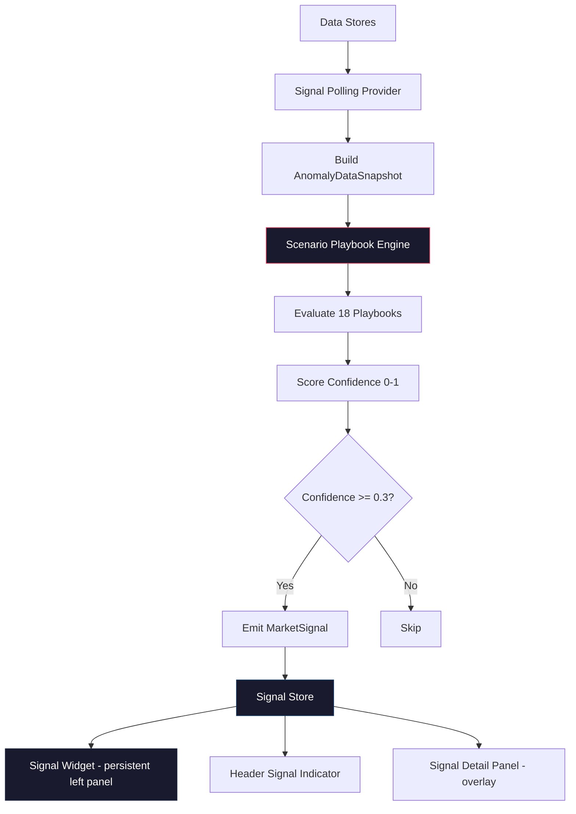

# Phase 6: Market Impact Signals Dashboard

> **Status:** Implementation Plan — Single Source of Truth  
> **Created:** 2026-03-12  
> **Scope:** Scenario Playbook Engine + Signal Store + Signal Widget + Signal Detail Panel + Header Indicator + Polling Provider

---

## 1. Overview

The analytics engines (anomaly detection, risk scoring, pattern recognition) compute scores and detect anomalies, but there is **no user-facing component that shows causal reasoning**. Phase 6 introduces a **Market Impact Signals** system — a persistent, always-visible dashboard that evaluates pre-defined causal chain templates ("playbooks") against live data and surfaces actionable market intelligence.

### What It Looks Like

```
┌────────────────────────────────────────────────────────────────┐
│ [HEADER]   ... StatusBar ...  Intel  Analytics  [⚡ 2 SIGNALS]  Alerts │
├────────────────────────────────────────────────────────────────┤
│ ┌──────────┐                                                   │
│ │ Layer    │                                                   │
│ │ Panel    │              GLOBE                                │
│ ├──────────┤                                                   │
│ │ ⚡SIGNALS │                                                   │
│ │ 🔴 2 active│                                                  │
│ │          │                                                   │
│ │ Hormuz   │                                                   │
│ │ Disruption│                                                  │
│ │ 87% ████ │                                                   │
│ │          │                                                   │
│ │ Taiwan   │                                                   │
│ │ Supply   │                                                   │
│ │ 62% ███  │                                                   │
│ └──────────┘                                                   │
│ ┌─ Market Ticker ─────────────────────────────────────────────┐│
│ │ CL=F ↑2.3%  BZ=F ↑1.8%  TSM ↓3.1%  NVDA ↓2.7%  ^VIX ↑15%││
│ └─────────────────────────────────────────────────────────────┘│
└────────────────────────────────────────────────────────────────┘
```

### Signal Examples

| Scenario | Trigger Conditions | Market Impact |
|---|---|---|
| Hormuz Shipping Disruption | Vessel deviation in Hormuz + GPS jamming cluster + conflict event ≥ high + negative sentiment | CL=F ↑3-8%, BZ=F ↑3-8%, STNG ↑, XOM ↑ within 24-72h |
| Taiwan Strait Escalation | Aircraft loitering near Taiwan + GPS jamming + hawkish social posts | TSM ↓5-15%, NVDA ↓3-8%, LMT ↑2-5% within 48-96h |
| Black Sea Grain Crisis | Conflict escalation in Black Sea + vessel deviations + negative sentiment | ZW=F ↑5-12%, ZC=F ↑3-8%, DBA ↑ within 24-48h |
| Global Risk-Off Cascade | Multiple regions ≥ high risk + VIX market anomaly + negative sentiment across platforms | ^VIX ↑20-40%, GLD ↑3-6%, ^GSPC ↓2-5% within 12-48h |

---

## 2. Architecture



### Data Flow

1. [`SignalPollingProvider`](components/providers/signal-polling-provider.tsx) runs every 60s
2. Reads from [`useDataStore`](lib/stores/data-store.ts), [`useAircraftStore`](lib/stores/aircraft-store.ts), [`useMarketStore`](lib/stores/market-store.ts), [`useAnalyticsStore`](lib/stores/analytics-store.ts)
3. Builds an [`AnomalyDataSnapshot`](lib/analytics/anomaly-engine.ts:32) + analytics results snapshot
4. Passes snapshot to [`evaluateScenarios()`](lib/scenario-engine.ts) which iterates all playbooks
5. Each playbook checks trigger conditions against snapshot data, scores confidence
6. Active signals (confidence ≥ 0.3) written to [`useSignalStore`](lib/stores/signal-store.ts)
7. UI components react: [`SignalWidget`](components/signals/signal-widget.tsx), [`SignalIndicator`](components/header/signal-indicator.tsx), [`SignalDetailPanel`](components/signals/signal-detail.tsx)

---

## 3. Type Definitions

All new types go in [`lib/types/signal.ts`](lib/types/signal.ts).

### Core Types

```typescript
// Signal severity derived from confidence thresholds
export type SignalSeverity = "critical" | "high" | "moderate";

// Direction of expected market move
export type MarketDirection = "up" | "down" | "volatile";

// Magnitude of expected impact
export type MarketMagnitude = "small" | "moderate" | "large";

// Playbook category
export type PlaybookCategory =
  | "energy_disruption"
  | "technology_supply_chain"
  | "currency_macro"
  | "safe_haven_flows"
  | "commodity_disruption";

// Time horizon for expected effects
export type TimeHorizon = "immediate" | "short" | "medium" | "extended";
// immediate = 0-12h, short = 12-48h, medium = 48-96h, extended = 96h+
```

### Playbook Definition

```typescript
export interface TriggerCondition {
  id: string;
  /** Human-readable description */
  description: string;
  /** Which anomaly kind or data source to check */
  dataSource: AnomalyKind | "risk_score" | "pattern";
  /** Region this condition applies to; null = any region */
  regionName: string | null;
  /** Evaluation function key; the engine maps this to actual logic */
  evaluator: string;
  /** Threshold parameters for the evaluator */
  params: Record<string, unknown>;
  /** Weight of this condition in overall confidence: 0.0-1.0 */
  weight: number;
}

export interface CausalChainStep {
  order: number;
  cause: string;
  effect: string;
  /** Which trigger conditions feed this step */
  triggerIds: string[];
}

export interface MarketTarget {
  symbol: string;
  instrumentName: string;
  expectedDirection: MarketDirection;
  expectedMagnitude: MarketMagnitude;
  /** Expected % range, e.g. "3-8%" */
  expectedRange: string;
  rationale: string;
}

export interface ScenarioPlaybook {
  id: string;
  name: string;
  category: PlaybookCategory;
  description: string;
  /** Region this playbook primarily monitors */
  primaryRegion: string;
  triggerConditions: TriggerCondition[];
  causalChain: CausalChainStep[];
  marketTargets: MarketTarget[];
  timeHorizon: TimeHorizon;
  /** Optional historical precedent reference */
  historicalPrecedent?: string;
}
```

### Market Signal (output)

```typescript
export interface TriggerResult {
  conditionId: string;
  description: string;
  met: boolean;
  /** Evidence: the anomaly/risk/pattern that satisfied this condition */
  evidence?: {
    type: string;
    id: string;
    title: string;
    score: number;
  };
}

export interface MarketSignal {
  id: string;
  playbookId: string;
  playbookName: string;
  category: PlaybookCategory;
  /** Overall confidence: 0.0-1.0 */
  confidence: number;
  severity: SignalSeverity;
  /** Full description of the scenario */
  description: string;
  /** Region triggering this signal */
  regionName: string;
  /** Results for each trigger condition */
  triggerResults: TriggerResult[];
  /** Number of conditions met / total */
  conditionsMet: number;
  conditionsTotal: number;
  /** Causal chain with step-level status */
  causalChain: CausalChainStep[];
  /** Market targets with expected moves */
  marketTargets: MarketTarget[];
  timeHorizon: TimeHorizon;
  historicalPrecedent?: string;
  /** Timestamps */
  detectedAt: string;
  lastEvaluatedAt: string;
  /** User interaction state */
  acknowledged: boolean;
  dismissed: boolean;
}
```

### Helper Functions

```typescript
export function getSignalSeverity(confidence: number): SignalSeverity;
export function getSignalSeverityColor(severity: SignalSeverity): string;
export function getTimeHorizonLabel(horizon: TimeHorizon): string;
export function getDirectionArrow(direction: MarketDirection): string;
export function getCategoryIcon(category: PlaybookCategory): string;
export function getCategoryLabel(category: PlaybookCategory): string;
```

---

## 4. Scenario Playbook Definitions

All 18 playbooks live in [`lib/scenario-engine.ts`](lib/scenario-engine.ts). Below is the full catalog organized by category.

### 4.1 Energy Disruption (5 playbooks)

| ID | Name | Region | Key Triggers | Market Targets |
|---|---|---|---|---|
| `hormuz-shipping` | Hormuz Shipping Disruption | Strait of Hormuz | vessel_deviation in Hormuz, gps_jamming_cluster near Hormuz, conflict ≥ high, negative sentiment | CL=F ↑, BZ=F ↑, STNG ↑, XOM ↑, FRO ↑ |
| `red-sea-attack` | Red Sea Shipping Attack | Red Sea / Gulf of Aden | vessel_deviation in Red Sea, conflict_escalation in Red Sea, negative sentiment | CL=F ↑, BZ=F ↑, ZIM ↑, MATX ↑, BDRY ↑ |
| `black-sea-energy` | Black Sea Energy Disruption | Black Sea | conflict_escalation in Black Sea, gps_jamming near Black Sea, vessel_deviation | NG=F ↑, CL=F ↑, ZW=F ↑ |
| `persian-gulf-tension` | Persian Gulf Tension | Strait of Hormuz | conflict_escalation in ME, aircraft_loitering near Gulf, market_anomaly in oil futures | CL=F ↑, BZ=F ↑, NG=F ↑, XOM ↑, SHEL ↑ |
| `suez-disruption` | Suez Canal Disruption | Eastern Mediterranean | vessel_deviation near Suez, conflict in E. Med, negative sentiment | ZIM ↑, MATX ↑, CL=F ↑, BDRY ↑ |

### 4.2 Technology/Supply Chain (4 playbooks)

| ID | Name | Region | Key Triggers | Market Targets |
|---|---|---|---|---|
| `taiwan-strait-escalation` | Taiwan Strait Military Escalation | Taiwan Strait | aircraft_loitering near Taiwan, gps_jamming near Taiwan, conflict_escalation, hawkish sentiment | TSM ↓, NVDA ↓, ASML ↓, SOXX ↓, LMT ↑ |
| `south-china-sea-standoff` | South China Sea Naval Standoff | South China Sea | vessel_deviation in SCS, aircraft_loitering, conflict_escalation | TSM ↓, NVDA ↓, SMH ↓, LMT ↑, RTX ↑ |
| `korea-tech-disruption` | Korean Peninsula Tech Disruption | Korean Peninsula | conflict_escalation in Korea, aircraft_loitering, market_anomaly in tech | ^GSPC ↓, SOXX ↓, LMT ↑, RTX ↑, GLD ↑ |
| `semiconductor-supply-shock` | Global Semiconductor Supply Shock | Taiwan Strait | taiwan-strait triggers + SCS triggers compound | TSM ↓, NVDA ↓, AAPL ↓, INTC ↓, SOXX ↓ |

### 4.3 Currency/Macro (3 playbooks)

| ID | Name | Region | Key Triggers | Market Targets |
|---|---|---|---|---|
| `global-risk-off` | Global Risk-Off Cascade | Multiple | ≥3 regions at high risk, VIX market_anomaly, broad negative sentiment | ^VIX ↑, GLD ↑, TLT ↑, ^GSPC ↓, ^DJI ↓ |
| `dollar-strength-shock` | Dollar Strength Shock | Multiple | market_anomaly in UUP, emerging market conflicts, negative sentiment | UUP ↑, GLD ↓, ^GSPC volatile, TLT ↑ |
| `energy-inflation-spiral` | Energy Inflation Spiral | Strait of Hormuz | oil futures market_anomaly, multiple energy playbooks active, sentiment shift | CL=F ↑, ^VIX ↑, GLD ↑, ^GSPC ↓ |

### 4.4 Safe Haven Flows (3 playbooks)

| ID | Name | Region | Key Triggers | Market Targets |
|---|---|---|---|---|
| `multi-region-escalation` | Multi-Region Conflict Escalation | Multiple | conflict_escalation in ≥2 regions, aircraft_loitering in ≥2 regions | GLD ↑, ^VIX ↑, TLT ↑, LMT ↑, ^GSPC ↓ |
| `defense-spending-surge` | Defense Spending Surge | Multiple | conflict events in NATO-adjacent regions, hawkish sentiment, defense stock anomalies | LMT ↑, RTX ↑, NOC ↑, GD ↑, BA ↑, ITA ↑ |
| `gold-safe-haven-bid` | Gold Safe Haven Bid | Multiple | GLD market_anomaly, ≥2 high-risk regions, negative sentiment shift | GLD ↑, SLV ↑, ^VIX ↑, ^GSPC ↓ |

### 4.5 Commodity Disruption (3 playbooks)

| ID | Name | Region | Key Triggers | Market Targets |
|---|---|---|---|---|
| `black-sea-grain` | Black Sea Grain Crisis | Black Sea | conflict_escalation in Black Sea, vessel_deviation in Black Sea, negative sentiment on grain | ZW=F ↑, ZC=F ↑, ZS=F ↑, DBA ↑ |
| `african-resource-conflict` | African Resource Conflict | Sub-Saharan Africa | conflict_escalation in SSA, negative sentiment, pattern detection | GLD ↑, SLV ↑ |
| `food-security-crisis` | Global Food Security Crisis | Multiple | grain futures market_anomaly, Black Sea + Africa conflicts, sentiment shift | ZW=F ↑, ZC=F ↑, DBA ↑, ^VIX ↑ |

---

## 5. Engine Implementation Details

### 5.1 Trigger Condition Evaluators

The engine maps each [`TriggerCondition.evaluator`](lib/types/signal.ts) string to a pure function. All evaluators are deterministic and side-effect-free.

| Evaluator Key | Logic | Params |
|---|---|---|
| `anomaly_in_region` | Check if any anomaly of `params.kind` exists in `params.region` with `score >= params.minScore` | `kind: AnomalyKind, region: string, minScore: number` |
| `anomaly_count` | Check if count of anomaly kind in region ≥ threshold | `kind: AnomalyKind, region: string, minCount: number` |
| `risk_score_above` | Check if risk score for region ≥ threshold | `region: string, minScore: number` |
| `multi_region_risk` | Check if ≥ N regions have risk score ≥ threshold | `minRegions: number, minScore: number` |
| `sentiment_negative` | Check if sentiment shift anomaly exists with negative shift ≥ magnitude | `minMagnitude: number, region?: string` |
| `market_anomaly_symbol` | Check if market anomaly exists for specific symbol | `symbol: string, minZScore: number` |
| `pattern_detected` | Check if pattern of given kind exists involving given layers | `kind: PatternKind, layers?: string[]` |
| `compound_playbooks` | Check if other playbook IDs are active with minConfidence | `playbookIds: string[], minConfidence: number` |

### 5.2 Confidence Scoring

```
confidence = Σ (condition.weight × condition.met ? 1 : 0) / Σ (condition.weight)
```

All weights within a playbook sum to 1.0. Confidence thresholds:
- **≥ 0.8** → `critical` severity (red)
- **0.6 – 0.79** → `high` severity (amber)
- **0.3 – 0.59** → `moderate` severity (yellow)
- **< 0.3** → signal not emitted

### 5.3 Sample Data Fallback

When stores are empty, [`generateSampleSignals()`](lib/scenario-engine.ts) produces 2-3 deterministic sample signals using the Mulberry32 PRNG pattern from [`sample-analytics-data.ts`](lib/analytics/sample-analytics-data.ts). These use the same playbook definitions but with synthetic trigger results.

---

## 6. Store Design

[`lib/stores/signal-store.ts`](lib/stores/signal-store.ts) — follows the exact pattern of [`analytics-store.ts`](lib/stores/analytics-store.ts).

### State Shape

```typescript
interface SignalStoreState {
  // Data
  activeSignals: MarketSignal[];
  signalHistory: MarketSignal[];  // last 50 resolved signals

  // UI State
  signalPanelOpen: boolean;
  selectedSignalId: string | null;
  widgetExpanded: boolean;

  // Status
  isEvaluating: boolean;
  lastEvaluatedAt: string | null;
  isSampleData: boolean;

  // Actions
  setSignals: (signals: MarketSignal[], isSample: boolean) => void;
  dismissSignal: (signalId: string) => void;
  acknowledgeSignal: (signalId: string) => void;
  setSignalPanelOpen: (open: boolean) => void;
  setSelectedSignalId: (id: string | null) => void;
  setWidgetExpanded: (expanded: boolean) => void;
  setEvaluating: (evaluating: boolean) => void;
}
```

### Selector Hooks

**Critical:** All selectors use [`useShallow`](lib/stores/analytics-store.ts:10) for object selectors. Derived data uses [`useMemo`](lib/stores/analytics-store.ts:8). NEVER call `.filter()` inside `useShallow`.

```typescript
// Raw store references only — no derived computation
export const useSignalOverview = () =>
  useSignalStore(useShallow((s) => ({
    activeSignals: s.activeSignals,
    isEvaluating: s.isEvaluating,
    lastEvaluatedAt: s.lastEvaluatedAt,
    isSampleData: s.isSampleData,
  })));

// Widget state
export const useSignalWidget = () =>
  useSignalStore(useShallow((s) => ({
    activeSignals: s.activeSignals,
    widgetExpanded: s.widgetExpanded,
    setWidgetExpanded: s.setWidgetExpanded,
    setSelectedSignalId: s.setSelectedSignalId,
    setSignalPanelOpen: s.setSignalPanelOpen,
  })));

// Panel state
export const useSignalPanelState = () =>
  useSignalStore(useShallow((s) => ({
    panelOpen: s.signalPanelOpen,
    selectedSignalId: s.selectedSignalId,
    setPanelOpen: s.setSignalPanelOpen,
    setSelectedSignalId: s.setSelectedSignalId,
  })));

// Scalar selector — no useShallow needed
export const useActiveSignalCount = () =>
  useSignalStore((s) => s.activeSignals.length);

// Highest severity — derived in useMemo at component level
export const useHighestSignalSeverity = () =>
  useSignalStore((s) => s.activeSignals);
// Component uses: useMemo(() => computeHighest(signals), [signals])
```

---

## 7. Implementation Steps

### Batch 1: Foundation (Steps 6.1–6.4)

#### Step 6.1 — Signal Type Definitions

| | |
|---|---|
| **Create** | [`lib/types/signal.ts`](lib/types/signal.ts) |
| **Description** | Define all types from Section 3: `SignalSeverity`, `MarketDirection`, `MarketMagnitude`, `PlaybookCategory`, `TimeHorizon`, `TriggerCondition`, `CausalChainStep`, `MarketTarget`, `ScenarioPlaybook`, `TriggerResult`, `MarketSignal`, plus helper functions (`getSignalSeverity`, `getSignalSeverityColor`, `getTimeHorizonLabel`, `getDirectionArrow`, `getCategoryIcon`, `getCategoryLabel`). Follow the exact style of [`lib/types/analytics.ts`](lib/types/analytics.ts) — JSDoc comments, exported unions, switch-based helpers returning Tailwind classes. |
| **Dependencies** | None |

#### Step 6.2 — Scenario Playbook Engine

| | |
|---|---|
| **Create** | [`lib/scenario-engine.ts`](lib/scenario-engine.ts) |
| **Description** | Implement the core engine with: (1) All 18 `ScenarioPlaybook` definitions from Section 4, organized by category constant arrays that merge into `ALL_PLAYBOOKS`. (2) Evaluator function registry — a `Record<string, EvaluatorFn>` mapping evaluator keys from Section 5.1 to pure functions. Each evaluator receives `(params, snapshot, analyticsResults)` and returns `{ met: boolean; evidence?: {...} }`. (3) `evaluateScenarios(snapshot, analyticsResults)` — iterates all playbooks, evaluates each trigger condition, computes weighted confidence, filters by ≥ 0.3 threshold, returns `MarketSignal[]`. (4) `generateSampleSignals()` — deterministic fallback using Mulberry32 PRNG, produces 2-3 hardcoded sample signals with realistic trigger results. The snapshot type is `AnomalyDataSnapshot` from [`anomaly-engine.ts`](lib/analytics/anomaly-engine.ts:32). Analytics results type wraps anomalies/riskScores/patterns from [`AnalyticsSnapshot`](lib/types/analytics.ts:261). |
| **Dependencies** | Step 6.1 |

#### Step 6.3 — Signal Store

| | |
|---|---|
| **Create** | [`lib/stores/signal-store.ts`](lib/stores/signal-store.ts) |
| **Description** | Zustand store following Section 6 design. Must include `"use client"` directive. Import `useShallow` from `zustand/react/shallow` and `useMemo` from React. State shape, actions, and selector hooks as specified. The `setSignals` action handles signal lifecycle: merges incoming signals with existing active signals by `playbookId`, moves signals that drop below 0.3 confidence to `signalHistory` (capped at 50), preserves `acknowledged`/`dismissed` state for signals that persist across evaluations. The `dismissSignal` action moves a signal to history. Follow exact patterns from [`analytics-store.ts`](lib/stores/analytics-store.ts). |
| **Dependencies** | Step 6.1 |

#### Step 6.4 — Signals API Route (Optional, for persistence)

| | |
|---|---|
| **Create** | [`app/api/signals/route.ts`](app/api/signals/route.ts) |
| **Description** | GET endpoint that returns current signal state. Similar to [`app/api/analytics/snapshot/route.ts`](app/api/analytics/snapshot/route.ts). Imports `evaluateScenarios` and `generateSampleSignals` from the scenario engine. Accepts optional `?sample=true` query param. Returns `{ signals: MarketSignal[], isSampleData: boolean, metadata: { timestamp, count } }`. Cache-Control: no-cache since signals change every 60s. This route is primarily for debugging/external consumers — the UI reads from the Zustand store directly. |
| **Dependencies** | Steps 6.1, 6.2 |

---

### Batch 2: UI Components (Steps 6.5–6.8)

#### Step 6.5 — Signal Widget (Persistent Left Panel)

| | |
|---|---|
| **Create** | [`components/signals/signal-widget.tsx`](components/signals/signal-widget.tsx) |
| **Description** | Persistent, always-visible widget positioned on the left side below [`LayerPanel`](components/layers/layer-panel.tsx). **NOT** hidden behind a button. Uses Tailwind positioning classes matching `LayerPanel` pattern. |

**Collapsed state** (default):
- Header row: `⚡ SIGNALS` label + traffic light indicator (🔴/🟡/🟢) + signal count
- Single line showing highest-severity signal name + confidence %
- Click to expand

**Expanded state:**
- All active signals as stacked cards, sorted by confidence descending
- Each card shows:
  - Colored badge with confidence % (red ≥80, amber 60-79, yellow 30-59)
  - Playbook name (bold, 11px uppercase tracking-wider)
  - Region name (zinc-500 text)
  - Mini causal chain: vertical arrow diagram with ✓/○ on triggered/pending conditions (max 3 visible, "+N more" for overflow)
  - Market targets row: symbol + direction arrow (↑↓↕) in a horizontal flex
  - Time horizon badge
  - "View Analysis →" button → opens Signal Detail Panel

**Styling:** `bg-black/95`, `border-white/10`, zinc text hierarchy — matches [`analytics-panel.tsx`](components/analytics/analytics-panel.tsx:64) dark theme. Uses [`Card`](components/ui/card.tsx), [`Badge`](components/ui/badge.tsx), [`ScrollArea`](components/ui/scroll-area.tsx), [`Button`](components/ui/button.tsx), [`Separator`](components/ui/separator.tsx) from shadcn/ui.

**State:** Uses `useSignalWidget` selector hook. Derives sorted/filtered signals in `useMemo`.

| **Dependencies** | Steps 6.1, 6.3 |

#### Step 6.6 — Signal Detail Panel (Overlay)

| | |
|---|---|
| **Create** | [`components/signals/signal-detail.tsx`](components/signals/signal-detail.tsx) |
| **Description** | Full-screen slide-in overlay following the exact pattern of [`AnalyticsPanel`](components/analytics/analytics-panel.tsx): fixed right-0, max-w-2xl, backdrop blur, slide-in animation. Opens when `signalPanelOpen === true && selectedSignalId !== null`. |

**Sections:**
1. **Header**: Playbook name, severity badge, confidence %, close button, sample data indicator
2. **Causal Chain**: Full ordered sequence from the playbook. Each step shows cause → effect with a connector line. Steps whose `triggerIds` are all met show ✓ green; partially met show ◐ amber; unmet show ○ gray
3. **Evidence Panel**: For each met trigger condition, show the actual anomaly/event that matched — anomaly title, score, detected time, region. Uses compact card layout
4. **Market Targets Table**: Table with columns: Symbol, Name, Direction (↑↓↕ with color), Expected Range, Rationale. Optionally show current price from market store
5. **Confidence Breakdown**: Horizontal bar chart showing each condition's weight and met/unmet status. Total confidence as large number
6. **Time Horizon**: Badge showing expected timeframe with explanation
7. **Historical Precedent**: If present, a blockquote-styled reference

**State:** Uses `useSignalPanelState` selector. Reads `selectedSignal` by filtering `activeSignals` with the `selectedSignalId` in a `useMemo`.

| **Dependencies** | Steps 6.1, 6.3, 6.5 |

#### Step 6.7 — Signal Card Sub-Component

| | |
|---|---|
| **Create** | [`components/signals/signal-card.tsx`](components/signals/signal-card.tsx) |
| **Description** | Reusable card component extracted from the widget's card layout. Accepts a `MarketSignal` prop and renders the compact card view (badge, name, region, mini chain, targets, time horizon). Used by both `SignalWidget` and potentially `SignalDetailPanel` for the signal list. Includes hover state with subtle border glow matching severity color. |
| **Dependencies** | Step 6.1 |

#### Step 6.8 — Barrel Exports

| | |
|---|---|
| **Create** | [`components/signals/index.ts`](components/signals/index.ts) |
| **Description** | Export `SignalWidget`, `SignalDetailPanel`, `SignalCard` from the signals directory. Follow pattern of [`components/analytics/index.ts`](components/analytics/index.ts). |
| **Dependencies** | Steps 6.5, 6.6, 6.7 |

---

### Batch 3: Integration (Steps 6.9–6.11)

#### Step 6.9 — Header Signal Indicator

| | |
|---|---|
| **Create** | [`components/header/signal-indicator.tsx`](components/header/signal-indicator.tsx) |
| **Modify** | [`components/header/header.tsx`](components/header/header.tsx) |
| **Description** | New component: `SignalIndicator` — renders `[⚡ N SIGNALS]` badge in the header. Styling: red pulse animation when any signal has confidence ≥ 0.8; amber static when highest is 0.6-0.79; dim green when no active signals. Uses `useActiveSignalCount` scalar selector + `useHighestSignalSeverity` with `useMemo` for severity derivation. On click, calls `setWidgetExpanded(true)` or scrolls to widget. Modify [`header.tsx`](components/header/header.tsx): import `SignalIndicator`, place it between the Analytics button and the Alerts button (around line 132). Also update the currently-disabled `NavItem` for "Signals" at [line 163](components/header/header.tsx:163) — either replace it with the indicator or remove the disabled NavItem. Update [`components/header/index.ts`](components/header/index.ts) to export `SignalIndicator`. |
| **Dependencies** | Steps 6.1, 6.3 |

#### Step 6.10 — Signal Polling Provider

| | |
|---|---|
| **Create** | [`components/providers/signal-polling-provider.tsx`](components/providers/signal-polling-provider.tsx) |
| **Modify** | [`components/providers/index.ts`](components/providers/index.ts) |
| **Description** | Follow the exact pattern of [`AnalyticsPollingProvider`](components/providers/analytics-polling-provider.tsx). Runs every 60 seconds. Reads from all data stores + analytics store. Builds `AnomalyDataSnapshot` and analytics results. Calls `evaluateScenarios()` or falls back to `generateSampleSignals()` when no real data is available. Writes results to signal store via `setSignals()`. Timer cleanup in useEffect return. Add export to [`components/providers/index.ts`](components/providers/index.ts). |
| **Dependencies** | Steps 6.1, 6.2, 6.3 |

#### Step 6.11 — Layout and Page Integration

| | |
|---|---|
| **Modify** | [`app/layout.tsx`](app/layout.tsx), [`app/page.tsx`](app/page.tsx) |
| **Description** | **layout.tsx**: Import `SignalPollingProvider` from `@/components/providers`. Wrap it as the innermost provider (inside `AnalyticsPollingProvider`) since it depends on analytics results being available. **page.tsx**: Import `SignalWidget` and `SignalDetailPanel` from `@/components/signals`. Add `<SignalWidget />` after `<LayerPanel />` at [line 83](app/page.tsx:83). Add `<SignalDetailPanel />` after `<AnalyticsPanel />` at [line 88](app/page.tsx:88). |

Updated provider nesting order in [`layout.tsx`](app/layout.tsx):
```
AircraftPollingProvider
  DataPollingProvider
    MarketPollingProvider
      AlertPollingProvider
        AnalyticsPollingProvider
          SignalPollingProvider        ← NEW (innermost)
            {children}
```

Updated component list in [`page.tsx`](app/page.tsx) `GlobeWithAllData`:
```
<GlobeContainer ... />
<Sidebar />
<LayerPanel />
<SignalWidget />                      ← NEW
<MarketTicker />
<IntelFeed />
<IntelPanel />
<AlertPanel />
<AnalyticsPanel />
<SignalDetailPanel />                 ← NEW
<AlertToastContainer />
```

| **Dependencies** | Steps 6.8, 6.9, 6.10 |

---

## 8. File Manifest

### New Files (11)

| File | Type | Step |
|---|---|---|
| `lib/types/signal.ts` | Types | 6.1 |
| `lib/scenario-engine.ts` | Engine | 6.2 |
| `lib/stores/signal-store.ts` | Store | 6.3 |
| `app/api/signals/route.ts` | API | 6.4 |
| `components/signals/signal-widget.tsx` | Component | 6.5 |
| `components/signals/signal-detail.tsx` | Component | 6.6 |
| `components/signals/signal-card.tsx` | Component | 6.7 |
| `components/signals/index.ts` | Barrel | 6.8 |
| `components/header/signal-indicator.tsx` | Component | 6.9 |
| `components/providers/signal-polling-provider.tsx` | Provider | 6.10 |

### Modified Files (5)

| File | Change | Step |
|---|---|---|
| `components/header/header.tsx` | Add SignalIndicator between Analytics and Alerts buttons | 6.9 |
| `components/header/index.ts` | Export SignalIndicator | 6.9 |
| `components/providers/index.ts` | Export SignalPollingProvider | 6.10 |
| `app/layout.tsx` | Add SignalPollingProvider to provider chain | 6.11 |
| `app/page.tsx` | Add SignalWidget and SignalDetailPanel | 6.11 |

---

## 9. Critical Constraints Checklist

- [ ] **React Error #185 Prevention**: All `useShallow` selectors return raw store references only. All derived data uses `useMemo` in the component. No `.filter()`, `.map()`, `.sort()` inside `useShallow` callbacks.
- [ ] **shadcn/ui Usage**: Use `Button`, `Badge`, `Card`, `ScrollArea`, `Separator`, `Skeleton` — no custom primitives.
- [ ] **Existing Patterns**: Store follows [`analytics-store.ts`](lib/stores/analytics-store.ts) pattern. Provider follows [`analytics-polling-provider.tsx`](components/providers/analytics-polling-provider.tsx) pattern. Panel follows [`analytics-panel.tsx`](components/analytics/analytics-panel.tsx) overlay pattern.
- [ ] **No New Libraries**: Zero new npm dependencies.
- [ ] **Deterministic Sample Data**: Use Mulberry32 PRNG with fixed seed, same as [`sample-analytics-data.ts`](lib/analytics/sample-analytics-data.ts:33).
- [ ] **Persistent Widget**: `SignalWidget` is always rendered, not conditionally mounted behind a button.
- [ ] **Dark Theme**: `bg-black/95`, `border-white/10`, zinc text hierarchy throughout.
- [ ] **"use client"** directive on all component and store files.
- [ ] **60-second polling interval** matching existing analytics provider.
- [ ] **Signal history capped at 50** entries to prevent memory growth.

---

## 10. Testing Verification

After implementation, verify:

1. **No console errors** — especially no React error #185 infinite loop
2. **Signal widget visible** on initial page load (with sample data)
3. **Traffic light indicator** shows correct color for sample signal confidence
4. **Expanding widget** shows signal cards with causal chains
5. **Clicking "View Analysis"** opens the detail panel overlay
6. **Header indicator** shows correct count and pulses for critical signals
7. **Dismissing a signal** moves it to history and removes from active list
8. **60-second re-evaluation** updates signals (visible in lastEvaluatedAt timestamp)
9. **Sample data badge** appears when using generated data
10. **No layout shift** — widget doesn't push other elements around
