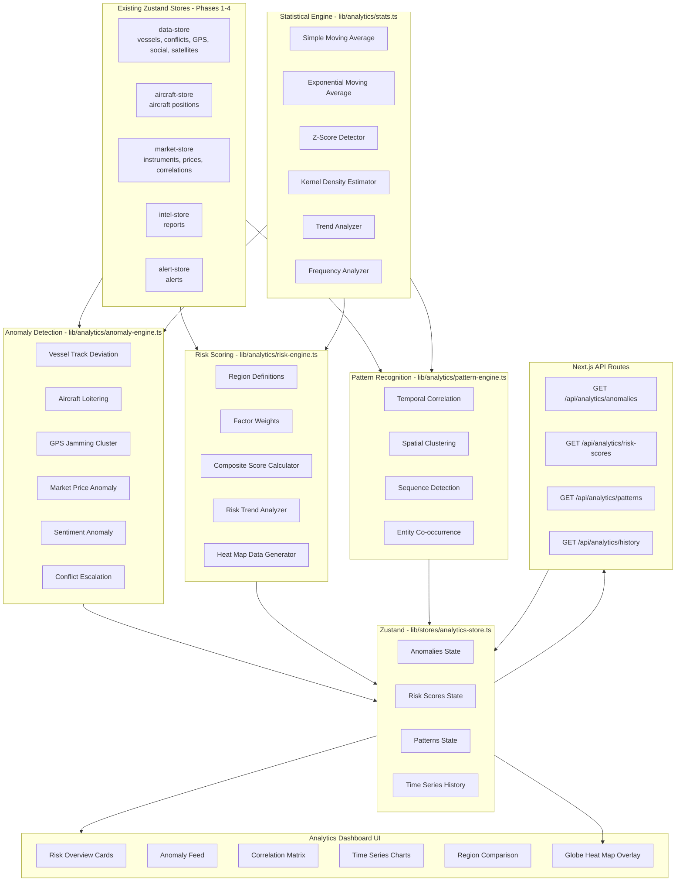
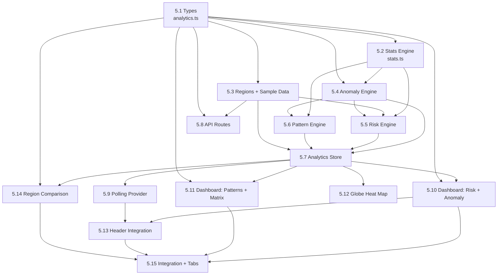

# Meridian — Phase 5: Advanced Analytics & ML

## Goal

Build the analytical intelligence layer — transforming Meridian from a reactive intelligence platform into a predictive one. This phase delivers five major subsystems: (1) a **Statistical Engine** providing foundational computation primitives (moving averages, z-scores, density estimation), (2) **Anomaly Detection** that identifies unusual patterns across all data layers (vessel deviation, aircraft loitering, GPS jamming clusters, market volatility, sentiment shifts, conflict escalation), (3) **Predictive Risk Scoring** that computes composite region-level risk scores aggregating multiple signals into a 0–100 scale with trend analysis, (4) **Pattern Recognition** for cross-layer temporal, spatial, and sequential pattern matching, and (5) an **Analytics Dashboard** providing a dedicated view with risk overview, anomaly feed, correlation matrix, time series charts, and region comparison. Phase 5 turns data into foresight — the "what happens next?" layer that completes the intelligence cycle.

---

## Why This Phase Exists

Phases 1–3 answer **"what is happening"** and **"what it means for markets."** Phase 4 answers **"what should I do about it?"** Phase 5 answers **"what is about to happen?"** An intelligence platform that merely reports current state is a dashboard. One that detects anomalies — a vessel deviating from standard shipping lanes, GPS jamming zones clustering near a strategic chokepoint, social sentiment suddenly inverting — and computes predictive risk scores becomes a decision-support system worth paying for. The anomaly detection system catches signals that human analysts would miss in the noise; the risk scoring system provides at-a-glance situational awareness across all monitored regions; the pattern recognition engine surfaces cross-layer correlations that reveal emerging situations before they become crises.

All analytics are implemented with vanilla TypeScript — no external ML libraries, no new npm packages, $0/month. Simple statistical methods (z-scores, moving averages, exponential smoothing, kernel density estimation) are sufficient for the data volumes Meridian handles and provide interpretable, debuggable results.

---

## Architecture Overview



---

## Design Constraints

| Constraint | Detail |
|---|---|
| **No ML libraries** | All analytics implemented in vanilla TypeScript. No TensorFlow, PyTorch, scikit-learn. |
| **No new npm packages** | Use only what is already installed (Zustand, Next.js, Tailwind, shadcn/ui, CesiumJS). |
| **Client-side first** | Analytics engine runs in browser on data already in Zustand stores. |
| **Server-side aggregation** | API routes compute over historical data only where client-side is insufficient. |
| **Sample data** | All analytics must work with existing sample data. Generate realistic anomalies in sample data. |
| **$0/month** | No external API calls for analytics. |
| **Interpretable** | All scores and detections must have human-readable explanations. No black boxes. |

---

## Step-by-Step Implementation

### Step 5.1 — TypeScript Types: Analytics Domain

Define all TypeScript interfaces for the analytics subsystem. These types are consumed by the statistical engine, anomaly detector, risk scorer, pattern recognizer, API routes, store, and UI components. All types live in a single file for cohesion.

**File:** `lib/types/analytics.ts` (new)

```typescript
/**
 * Analytics domain types.
 * Covers anomaly detection, risk scoring, pattern recognition,
 * and the statistical engine primitives.
 */

// ============================================
// Enum / Union Types
// ============================================

/** Which data layer produced the anomaly or signal */
export type AnalyticsLayer =
    | "vessel"
    | "aircraft"
    | "gps-jamming"
    | "market"
    | "social"
    | "conflict"
    | "cross-layer";

/** Anomaly severity — distinct from alert severity */
export type AnomalySeverity = "critical" | "high" | "medium" | "low";

/** Direction of a detected trend */
export type TrendDirection = "increasing" | "stable" | "decreasing";

/** Risk trend for a region */
export type RiskTrend = "deteriorating" | "stable" | "improving";

/** Type of anomaly detected */
export type AnomalyType =
    | "vessel_track_deviation"
    | "aircraft_loitering"
    | "gps_jamming_cluster"
    | "market_price_anomaly"
    | "sentiment_anomaly"
    | "conflict_escalation";

/** Type of cross-layer pattern */
export type PatternType =
    | "temporal_correlation"
    | "spatial_cluster"
    | "sequence_detection"
    | "entity_cooccurrence";

// ============================================
// Statistical Primitives
// ============================================

/** A single data point in a time series */
export interface TimeSeriesPoint {
    timestamp: string;   // ISO 8601
    value: number;
}

/** Result of a moving average computation */
export interface MovingAverageResult {
    /** The smoothed time series */
    values: TimeSeriesPoint[];
    /** Window size used */
    window: number;
    /** Type of moving average */
    type: "sma" | "ema";
}

/** Result of z-score anomaly detection on a numeric stream */
export interface ZScoreResult {
    /** Current value */
    value: number;
    /** Mean of the window */
    mean: number;
    /** Standard deviation of the window */
    stdDev: number;
    /** Computed z-score */
    zScore: number;
    /** Whether this is anomalous (|z| > threshold) */
    isAnomaly: boolean;
    /** The threshold used */
    threshold: number;
}

/** Result of trend analysis */
export interface TrendResult {
    direction: TrendDirection;
    /** Slope of the linear regression (units per interval) */
    slope: number;
    /** Strength of the trend 0.0–1.0 based on R² */
    strength: number;
    /** Number of data points analyzed */
    sampleSize: number;
}

/** Spatial density estimation result */
export interface DensityPoint {
    lat: number;
    lng: number;
    /** Estimated density at this point */
    density: number;
    /** Normalized density 0.0–1.0 */
    normalizedDensity: number;
}

/** Frequency analysis result for event counting */
export interface FrequencyResult {
    /** Events per hour in the window */
    eventsPerHour: number;
    /** Baseline events per hour (historical average) */
    baselinePerHour: number;
    /** Ratio of current to baseline */
    ratio: number;
    /** Whether frequency is anomalous */
    isAnomaly: boolean;
}

// ============================================
// Anomaly Detection
// ============================================

/** A detected anomaly */
export interface Anomaly {
    id: string;
    type: AnomalyType;
    layer: AnalyticsLayer;
    severity: AnomalySeverity;
    /** Short human-readable title */
    title: string;
    /** Detailed explanation of what was detected and why it is anomalous */
    description: string;
    /** Geographic location of the anomaly, if applicable */
    location: { lat: number; lng: number } | null;
    /** Region name, if resolvable */
    regionName: string | null;
    /** The entity ID(s) involved */
    entityIds: string[];
    /** The numeric score or z-score that triggered detection */
    score: number;
    /** The threshold that was exceeded */
    threshold: number;
    /** Confidence 0.0–1.0 */
    confidence: number;
    /** When the anomaly was first detected */
    detectedAt: string;  // ISO 8601
    /** Additional context data specific to the anomaly type */
    metadata: AnomalyMetadata;
}

/** Type-specific metadata for each anomaly type */
export type AnomalyMetadata =
    | VesselDeviationMetadata
    | AircraftLoiteringMetadata
    | GpsClusterMetadata
    | MarketAnomalyMetadata
    | SentimentAnomalyMetadata
    | ConflictEscalationMetadata;

export interface VesselDeviationMetadata {
    kind: "vessel_track_deviation";
    mmsi: string;
    vesselName: string;
    expectedLane: string;
    deviationKm: number;
    currentPosition: { lat: number; lng: number };
    expectedPosition: { lat: number; lng: number };
    heading: number | null;
    speed: number | null;
}

export interface AircraftLoiteringMetadata {
    kind: "aircraft_loitering";
    icao24: string;
    callsign: string | null;
    /** Number of orbit loops detected */
    orbitCount: number;
    /** Radius of the loitering pattern in km */
    orbitRadiusKm: number;
    /** Duration of loitering in minutes */
    durationMinutes: number;
    centerPosition: { lat: number; lng: number };
    altitude: number | null;
}

export interface GpsClusterMetadata {
    kind: "gps_jamming_cluster";
    /** IDs of the jamming zones forming the cluster */
    zoneIds: string[];
    /** Number of zones in the cluster */
    zoneCount: number;
    /** Time window in which zones appeared */
    timeWindowMinutes: number;
    /** Center of the cluster */
    clusterCenter: { lat: number; lng: number };
    /** Radius encompassing all zones */
    clusterRadiusKm: number;
}

export interface MarketAnomalyMetadata {
    kind: "market_price_anomaly";
    symbol: string;
    instrumentName: string;
    currentPrice: number;
    mean: number;
    stdDev: number;
    zScore: number;
    changePercent: number;
    /** Recent price history for context */
    recentPrices: TimeSeriesPoint[];
}

export interface SentimentAnomalyMetadata {
    kind: "sentiment_anomaly";
    /** Platform where the shift was detected, or all */
    platform: string;
    previousSentiment: number;
    currentSentiment: number;
    /** Magnitude of the shift */
    shiftMagnitude: number;
    /** Number of posts in the analysis window */
    postCount: number;
    /** Key posts that contributed to the shift */
    triggerPostIds: string[];
}

export interface ConflictEscalationMetadata {
    kind: "conflict_escalation";
    region: string;
    country: string;
    /** Current event frequency (events per day) */
    currentFrequency: number;
    /** Baseline frequency */
    baselineFrequency: number;
    /** Severity trend */
    severityTrend: TrendDirection;
    /** Recent conflict event IDs */
    recentEventIds: string[];
    /** Estimated fatalities in window */
    estimatedFatalities: number;
}

// ============================================
// Risk Scoring
// ============================================

/** Definition of a monitored region */
export interface MonitoredRegion {
    id: string;
    name: string;
    center: { lat: number; lng: number };
    radiusKm: number;
    /** Optional polygon boundary — if not provided, uses circle */
    description: string;
}

/** Individual factor contributing to a region risk score */
export interface RiskFactor {
    /** Which data layer this factor comes from */
    layer: AnalyticsLayer;
    /** Short label for the factor */
    label: string;
    /** Raw score 0–100 for this factor */
    score: number;
    /** Weight applied to this factor 0.0–1.0 */
    weight: number;
    /** Weighted contribution to composite score */
    weightedScore: number;
    /** Trend for this specific factor */
    trend: TrendDirection;
    /** Human-readable explanation */
    explanation: string;
}

/** Composite risk score for a region */
export interface RegionRiskScore {
    regionId: string;
    regionName: string;
    center: { lat: number; lng: number };
    radiusKm: number;
    /** Composite score 0–100 */
    compositeScore: number;
    /** Risk level derived from composite score */
    riskLevel: "critical" | "high" | "elevated" | "moderate" | "low";
    /** Trend direction based on recent score history */
    trend: RiskTrend;
    /** Individual factor breakdown */
    factors: RiskFactor[];
    /** Recent score history for sparkline */
    scoreHistory: TimeSeriesPoint[];
    /** Active anomalies in this region */
    activeAnomalyCount: number;
    /** Last computation timestamp */
    computedAt: string;  // ISO 8601
}

/** Weight configuration for risk scoring */
export interface RiskWeightConfig {
    conflict: number;      // default 0.25
    gpsJamming: number;    // default 0.15
    military: number;      // default 0.20
    market: number;        // default 0.15
    sentiment: number;     // default 0.10
    vessel: number;        // default 0.10
    anomaly: number;       // default 0.05
}

// ============================================
// Pattern Recognition
// ============================================

/** A detected cross-layer pattern */
export interface DetectedPattern {
    id: string;
    type: PatternType;
    /** Short human-readable title */
    title: string;
    /** Detailed description of the pattern */
    description: string;
    /** Confidence score 0.0–1.0 */
    confidence: number;
    /** Layers involved */
    layers: AnalyticsLayer[];
    /** Entity IDs involved across layers */
    entityIds: string[];
    /** Geographic location, if localized */
    location: { lat: number; lng: number } | null;
    regionName: string | null;
    /** When the pattern was first detected */
    detectedAt: string;
    /** Time span of the pattern */
    timespan: { start: string; end: string };
    /** Type-specific details */
    details: PatternDetails;
}

export type PatternDetails =
    | TemporalCorrelationDetails
    | SpatialClusterDetails
    | SequenceDetectionDetails
    | EntityCooccurrenceDetails;

export interface TemporalCorrelationDetails {
    kind: "temporal_correlation";
    /** Events that occurred close together in time */
    events: {
        layer: AnalyticsLayer;
        entityId: string;
        timestamp: string;
        description: string;
    }[];
    /** Time window within which all events occurred */
    windowMinutes: number;
    /** Pearson correlation coefficient between event timings */
    correlationStrength: number;
}

export interface SpatialClusterDetails {
    kind: "spatial_cluster";
    /** Events concentrated in a geographic area */
    events: {
        layer: AnalyticsLayer;
        entityId: string;
        location: { lat: number; lng: number };
        description: string;
    }[];
    /** Center of the cluster */
    clusterCenter: { lat: number; lng: number };
    /** Radius of the cluster in km */
    clusterRadiusKm: number;
    /** Density score relative to baseline */
    densityRatio: number;
}

export interface SequenceDetectionDetails {
    kind: "sequence_detection";
    /** The ordered sequence of events */
    sequence: {
        step: number;
        layer: AnalyticsLayer;
        eventType: string;
        timestamp: string;
        description: string;
        /** Time gap from previous step in minutes */
        gapMinutes: number | null;
    }[];
    /** Name of the recognized sequence pattern */
    patternName: string;
    /** How many times this sequence has been seen before */
    historicalOccurrences: number;
}

export interface EntityCooccurrenceDetails {
    kind: "entity_cooccurrence";
    /** Entities that repeatedly appear together */
    entities: {
        id: string;
        layer: AnalyticsLayer;
        name: string;
        type: string;
    }[];
    /** Number of co-occurrences detected */
    occurrenceCount: number;
    /** Locations where co-occurrences happened */
    locations: { lat: number; lng: number; timestamp: string }[];
}

// ============================================
// Analytics Dashboard
// ============================================

/** Summary statistics for the analytics dashboard */
export interface AnalyticsSummary {
    totalAnomalies: number;
    criticalAnomalies: number;
    highRiskRegions: number;
    activePatterns: number;
    /** Average risk score across all regions */
    avgRiskScore: number;
    /** Region with highest risk */
    highestRiskRegion: { name: string; score: number } | null;
    /** Most recent anomaly */
    latestAnomaly: { title: string; detectedAt: string } | null;
    /** Timestamp of last full computation */
    lastComputedAt: string;
}

/** Cross-layer correlation matrix cell */
export interface CorrelationMatrixCell {
    layerA: AnalyticsLayer;
    layerB: AnalyticsLayer;
    /** Correlation coefficient -1.0 to 1.0 */
    correlation: number;
    /** Number of co-occurring events used to compute */
    sampleSize: number;
    /** Whether this correlation is statistically significant */
    isSignificant: boolean;
}

// ============================================
// Helper Functions
// ============================================

export function getAnomalySeverityColor(severity: AnomalySeverity): string {
    switch (severity) {
        case "critical": return "#dc2626"; // red-600
        case "high":     return "#ea580c"; // orange-600
        case "medium":   return "#d97706"; // amber-600
        case "low":      return "#2563eb"; // blue-600
    }
}

export function getRiskLevelColor(level: RegionRiskScore["riskLevel"]): string {
    switch (level) {
        case "critical": return "#dc2626"; // red-600
        case "high":     return "#ea580c"; // orange-600
        case "elevated": return "#d97706"; // amber-600
        case "moderate": return "#2563eb"; // blue-600
        case "low":      return "#16a34a"; // green-600
    }
}

export function getRiskLevelFromScore(score: number): RegionRiskScore["riskLevel"] {
    if (score >= 80) return "critical";
    if (score >= 60) return "high";
    if (score >= 40) return "elevated";
    if (score >= 20) return "moderate";
    return "low";
}

export function getRiskTrendIcon(trend: RiskTrend): string {
    switch (trend) {
        case "deteriorating": return "TrendingUp";   // risk going up = bad
        case "stable":        return "Minus";
        case "improving":     return "TrendingDown";  // risk going down = good
    }
}

export function getRiskTrendColor(trend: RiskTrend): string {
    switch (trend) {
        case "deteriorating": return "#dc2626"; // red
        case "stable":        return "#6b7280"; // gray
        case "improving":     return "#16a34a"; // green
    }
}

export function getAnomalyTypeLabel(type: AnomalyType): string {
    switch (type) {
        case "vessel_track_deviation": return "Vessel Track Deviation";
        case "aircraft_loitering":     return "Aircraft Loitering";
        case "gps_jamming_cluster":    return "GPS Jamming Cluster";
        case "market_price_anomaly":   return "Market Price Anomaly";
        case "sentiment_anomaly":      return "Sentiment Anomaly";
        case "conflict_escalation":    return "Conflict Escalation";
    }
}

export function getPatternTypeLabel(type: PatternType): string {
    switch (type) {
        case "temporal_correlation": return "Temporal Correlation";
        case "spatial_cluster":      return "Spatial Cluster";
        case "sequence_detection":   return "Sequence Detection";
        case "entity_cooccurrence":  return "Entity Co-occurrence";
    }
}

export function getLayerLabel(layer: AnalyticsLayer): string {
    switch (layer) {
        case "vessel":      return "Maritime";
        case "aircraft":    return "Aviation";
        case "gps-jamming": return "GPS Jamming";
        case "market":      return "Market";
        case "social":      return "Social";
        case "conflict":    return "Conflict";
        case "cross-layer": return "Cross-Layer";
    }
}

export function getLayerColor(layer: AnalyticsLayer): string {
    switch (layer) {
        case "vessel":      return "#0ea5e9"; // sky
        case "aircraft":    return "#8b5cf6"; // violet
        case "gps-jamming": return "#ef4444"; // red
        case "market":      return "#22c55e"; // green
        case "social":      return "#3b82f6"; // blue
        case "conflict":    return "#f97316"; // orange
        case "cross-layer": return "#a855f7"; // purple
    }
}
```

**Dependencies:** None — pure type definitions.

**Acceptance Criteria:**
- [ ] Create `lib/types/analytics.ts` with all interfaces above
- [ ] All anomaly types have corresponding metadata types with `kind` discriminator
- [ ] All pattern types have corresponding detail types with `kind` discriminator
- [ ] Helper functions cover color, label, and level derivation for all enums
- [ ] Types compile with zero TypeScript errors

---

### Step 5.2 — Statistical Engine: Core Computation Library

Build the foundational statistical computation library used by all analytics subsystems. This is the math layer — pure functions with no side effects, no store dependencies, no API calls. Every function takes numeric arrays or time series and returns computed results.

**File:** `lib/analytics/stats.ts` (new)

```typescript
/**
 * Statistical Engine — core computation primitives.
 * Pure functions. No side effects. No store/API dependencies.
 * Used by anomaly-engine, risk-engine, and pattern-engine.
 */

import type {
    TimeSeriesPoint,
    MovingAverageResult,
    ZScoreResult,
    TrendResult,
    TrendDirection,
    DensityPoint,
    FrequencyResult,
} from "@/lib/types/analytics";

// ============================================
// Moving Averages
// ============================================

/**
 * Simple Moving Average over a window of `n` points.
 * Returns a smoothed series with the same length (first n-1 values
 * use a growing window).
 */
export function computeSMA(
    series: TimeSeriesPoint[],
    window: number,
): MovingAverageResult {
    if (series.length === 0 || window < 1) {
        return { values: [], window, type: "sma" };
    }

    const w = Math.min(window, series.length);
    const result: TimeSeriesPoint[] = [];
    let sum = 0;

    for (let i = 0; i < series.length; i++) {
        sum += series[i].value;
        if (i >= w) {
            sum -= series[i - w].value;
        }
        const count = Math.min(i + 1, w);
        result.push({
            timestamp: series[i].timestamp,
            value: sum / count,
        });
    }

    return { values: result, window: w, type: "sma" };
}

/**
 * Exponential Moving Average.
 * Smoothing factor alpha = 2 / (window + 1).
 */
export function computeEMA(
    series: TimeSeriesPoint[],
    window: number,
): MovingAverageResult {
    if (series.length === 0 || window < 1) {
        return { values: [], window, type: "ema" };
    }

    const alpha = 2 / (window + 1);
    const result: TimeSeriesPoint[] = [];
    let ema = series[0].value;

    for (let i = 0; i < series.length; i++) {
        if (i === 0) {
            ema = series[0].value;
        } else {
            ema = alpha * series[i].value + (1 - alpha) * ema;
        }
        result.push({
            timestamp: series[i].timestamp,
            value: Math.round(ema * 1000) / 1000,
        });
    }

    return { values: result, window, type: "ema" };
}

// ============================================
// Z-Score Anomaly Detection
// ============================================

/**
 * Compute mean and standard deviation of a numeric array.
 */
export function computeMeanStdDev(values: number[]): {
    mean: number;
    stdDev: number;
} {
    if (values.length === 0) return { mean: 0, stdDev: 0 };

    const mean = values.reduce((a, b) => a + b, 0) / values.length;
    const variance =
        values.reduce((sum, v) => sum + (v - mean) ** 2, 0) / values.length;
    const stdDev = Math.sqrt(variance);

    return { mean, stdDev };
}

/**
 * Compute z-score for a single value against a window of historical values.
 * Returns the z-score result including whether the value is anomalous.
 *
 * @param value      - The current value to test
 * @param history    - Array of recent historical values (the baseline window)
 * @param threshold  - Z-score threshold to flag as anomaly (default 2.0)
 */
export function computeZScore(
    value: number,
    history: number[],
    threshold: number = 2.0,
): ZScoreResult {
    const { mean, stdDev } = computeMeanStdDev(history);

    // Avoid division by zero — if all values are identical, any deviation is anomalous
    const zScore = stdDev === 0
        ? (value === mean ? 0 : Infinity)
        : (value - mean) / stdDev;

    return {
        value,
        mean: Math.round(mean * 1000) / 1000,
        stdDev: Math.round(stdDev * 1000) / 1000,
        zScore: Math.round(zScore * 1000) / 1000,
        isAnomaly: Math.abs(zScore) > threshold,
        threshold,
    };
}

/**
 * Run z-score anomaly detection across an entire time series.
 * Uses a sliding window: for each point, compute z-score against
 * the preceding `windowSize` points.
 *
 * @param series     - The time series to analyze
 * @param windowSize - Number of preceding points to use as baseline
 * @param threshold  - Z-score threshold for anomaly flagging
 * @returns Array of z-score results aligned with the input series
 */
export function detectZScoreAnomalies(
    series: TimeSeriesPoint[],
    windowSize: number = 20,
    threshold: number = 2.0,
): (ZScoreResult & { timestamp: string })[] {
    const results: (ZScoreResult & { timestamp: string })[] = [];

    for (let i = 0; i < series.length; i++) {
        const windowStart = Math.max(0, i - windowSize);
        const history = series.slice(windowStart, i).map((p) => p.value);

        // Need at least 3 historical points for a meaningful z-score
        if (history.length < 3) {
            results.push({
                ...computeZScore(series[i].value, [], threshold),
                timestamp: series[i].timestamp,
                isAnomaly: false,
            });
            continue;
        }

        results.push({
            ...computeZScore(series[i].value, history, threshold),
            timestamp: series[i].timestamp,
        });
    }

    return results;
}

// ============================================
// Trend Analysis (Linear Regression)
// ============================================

/**
 * Compute a simple linear regression over a numeric series.
 * Returns the slope, direction, and R² strength.
 * X-axis is sequential index (0, 1, 2, ...).
 */
export function computeTrend(values: number[]): TrendResult {
    const n = values.length;
    if (n < 2) {
        return { direction: "stable", slope: 0, strength: 0, sampleSize: n };
    }

    // Compute means
    const xMean = (n - 1) / 2;
    const yMean = values.reduce((a, b) => a + b, 0) / n;

    // Compute slope via least squares
    let numerator = 0;
    let denominator = 0;
    for (let i = 0; i < n; i++) {
        numerator += (i - xMean) * (values[i] - yMean);
        denominator += (i - xMean) ** 2;
    }

    const slope = denominator === 0 ? 0 : numerator / denominator;

    // Compute R² (coefficient of determination)
    const yPredicted = values.map((_, i) => yMean + slope * (i - xMean));
    const ssRes = values.reduce(
        (sum, y, i) => sum + (y - yPredicted[i]) ** 2,
        0,
    );
    const ssTot = values.reduce((sum, y) => sum + (y - yMean) ** 2, 0);
    const rSquared = ssTot === 0 ? 0 : 1 - ssRes / ssTot;

    // Determine direction with a threshold to avoid noise
    const slopeThreshold = 0.01 * Math.abs(yMean || 1); // 1% of mean
    let direction: TrendDirection = "stable";
    if (slope > slopeThreshold) direction = "increasing";
    if (slope < -slopeThreshold) direction = "decreasing";

    return {
        direction,
        slope: Math.round(slope * 10000) / 10000,
        strength: Math.round(Math.max(0, rSquared) * 1000) / 1000,
        sampleSize: n,
    };
}

/**
 * Compute trend over a time series using only the values.
 */
export function computeTimeSeriesTrend(series: TimeSeriesPoint[]): TrendResult {
    return computeTrend(series.map((p) => p.value));
}

// ============================================
// Sentiment Analysis
// ============================================

/**
 * Compute a rolling sentiment average over a window.
 * Input is an array of sentiment scores (-1.0 to 1.0) ordered by time.
 * Returns the rolling average sentiment at each position.
 */
export function computeRollingSentiment(
    sentiments: number[],
    window: number = 10,
): number[] {
    if (sentiments.length === 0) return [];

    const result: number[] = [];
    let sum = 0;

    for (let i = 0; i < sentiments.length; i++) {
        sum += sentiments[i];
        if (i >= window) {
            sum -= sentiments[i - window];
        }
        const count = Math.min(i + 1, window);
        result.push(Math.round((sum / count) * 1000) / 1000);
    }

    return result;
}

/**
 * Detect a sentiment shift — a sudden change in the rolling average
 * beyond a threshold within a short window.
 *
 * @param sentiments - Array of sentiment scores ordered by time
 * @param shortWindow - Recent window size (e.g. 5)
 * @param longWindow - Baseline window size (e.g. 20)
 * @param shiftThreshold - Minimum absolute difference to flag (default 0.3)
 */
export function detectSentimentShift(
    sentiments: number[],
    shortWindow: number = 5,
    longWindow: number = 20,
    shiftThreshold: number = 0.3,
): { isShift: boolean; magnitude: number; shortAvg: number; longAvg: number } {
    if (sentiments.length < longWindow) {
        return { isShift: false, magnitude: 0, shortAvg: 0, longAvg: 0 };
    }

    const recentSlice = sentiments.slice(-shortWindow);
    const baselineSlice = sentiments.slice(-longWindow, -shortWindow);

    const shortAvg =
        recentSlice.reduce((a, b) => a + b, 0) / recentSlice.length;
    const longAvg =
        baselineSlice.length > 0
            ? baselineSlice.reduce((a, b) => a + b, 0) / baselineSlice.length
            : 0;

    const magnitude = Math.abs(shortAvg - longAvg);

    return {
        isShift: magnitude > shiftThreshold,
        magnitude: Math.round(magnitude * 1000) / 1000,
        shortAvg: Math.round(shortAvg * 1000) / 1000,
        longAvg: Math.round(longAvg * 1000) / 1000,
    };
}

// ============================================
// Spatial Density Estimation
// ============================================

/**
 * Simple kernel density estimation for geographic points.
 * Uses a Gaussian kernel with bandwidth in km.
 * Evaluates density on a grid of evaluation points.
 *
 * @param points - Array of {lat, lng} event locations
 * @param evalPoints - Grid points to evaluate density at
 * @param bandwidthKm - Kernel bandwidth in kilometers
 */
export function computeKernelDensity(
    points: { lat: number; lng: number }[],
    evalPoints: { lat: number; lng: number }[],
    bandwidthKm: number = 50,
): DensityPoint[] {
    if (points.length === 0 || evalPoints.length === 0) return [];

    // Import haversine inline to avoid circular dependency issues
    const toRad = (deg: number) => (deg * Math.PI) / 180;
    const R = 6371;
    const haversine = (lat1: number, lng1: number, lat2: number, lng2: number) => {
        const dLat = toRad(lat2 - lat1);
        const dLng = toRad(lng2 - lng1);
        const a =
            Math.sin(dLat / 2) ** 2 +
            Math.cos(toRad(lat1)) * Math.cos(toRad(lat2)) * Math.sin(dLng / 2) ** 2;
        return R * 2 * Math.atan2(Math.sqrt(a), Math.sqrt(1 - a));
    };

    const results: DensityPoint[] = [];
    let maxDensity = 0;

    for (const ep of evalPoints) {
        let density = 0;
        for (const p of points) {
            const dist = haversine(ep.lat, ep.lng, p.lat, p.lng);
            // Gaussian kernel: K(u) = exp(-0.5 * u^2) where u = dist/bandwidth
            const u = dist / bandwidthKm;
            density += Math.exp(-0.5 * u * u);
        }
        // Normalize by number of points and bandwidth
        density /= points.length * bandwidthKm;

        maxDensity = Math.max(maxDensity, density);
        results.push({ lat: ep.lat, lng: ep.lng, density, normalizedDensity: 0 });
    }

    // Normalize densities to 0–1
    if (maxDensity > 0) {
        for (const r of results) {
            r.normalizedDensity = Math.round((r.density / maxDensity) * 1000) / 1000;
        }
    }

    return results;
}

// ============================================
// Event Frequency Analysis
// ============================================

/**
 * Compute event frequency (events per hour) for a given time window,
 * compared against a historical baseline.
 *
 * @param eventTimestamps - ISO 8601 timestamps of events in the current window
 * @param windowHours - Duration of the current observation window
 * @param baselineEventsPerHour - Historical average events per hour
 * @param anomalyRatio - Threshold ratio of current/baseline to flag anomaly (default 2.0)
 */
export function computeEventFrequency(
    eventTimestamps: string[],
    windowHours: number,
    baselineEventsPerHour: number,
    anomalyRatio: number = 2.0,
): FrequencyResult {
    const eventsPerHour =
        windowHours > 0 ? eventTimestamps.length / windowHours : 0;
    const ratio =
        baselineEventsPerHour > 0 ? eventsPerHour / baselineEventsPerHour : 0;

    return {
        eventsPerHour: Math.round(eventsPerHour * 100) / 100,
        baselinePerHour: Math.round(baselineEventsPerHour * 100) / 100,
        ratio: Math.round(ratio * 100) / 100,
        isAnomaly: ratio > anomalyRatio,
    };
}

// ============================================
// Distance Utilities
// ============================================

/**
 * Generate a grid of evaluation points centered on a location.
 * Used for kernel density estimation.
 *
 * @param center - Center point
 * @param radiusKm - Radius to cover
 * @param gridSize - Number of points per axis (total = gridSize²)
 */
export function generateEvalGrid(
    center: { lat: number; lng: number },
    radiusKm: number,
    gridSize: number = 10,
): { lat: number; lng: number }[] {
    // Approximate degree offset for the radius
    const latDegPerKm = 1 / 111.32;
    const lngDegPerKm = 1 / (111.32 * Math.cos((center.lat * Math.PI) / 180));

    const latRange = radiusKm * latDegPerKm;
    const lngRange = radiusKm * lngDegPerKm;

    const points: { lat: number; lng: number }[] = [];
    const step = 2 / (gridSize - 1); // -1 to 1 range

    for (let i = 0; i < gridSize; i++) {
        for (let j = 0; j < gridSize; j++) {
            const latOffset = (-1 + step * i) * latRange;
            const lngOffset = (-1 + step * j) * lngRange;
            points.push({
                lat: center.lat + latOffset,
                lng: center.lng + lngOffset,
            });
        }
    }

    return points;
}
```

**Dependencies:** `lib/types/analytics.ts` (Step 5.1)

**Acceptance Criteria:**
- [ ] Create `lib/analytics/stats.ts` with all functions above
- [ ] `computeSMA` returns correct rolling average for known inputs
- [ ] `computeEMA` smoothing factor matches `2 / (window + 1)` formula
- [ ] `computeZScore` flags values beyond ±2σ as anomalous
- [ ] `detectZScoreAnomalies` uses sliding window over time series
- [ ] `computeTrend` returns correct slope and R² for linear data
- [ ] `computeRollingSentiment` applies windowed averaging
- [ ] `detectSentimentShift` compares short vs long window averages
- [ ] `computeKernelDensity` uses Gaussian kernel with haversine distance
- [ ] `computeEventFrequency` correctly computes events-per-hour ratio
- [ ] `generateEvalGrid` produces a grid that approximates the geographic extent
- [ ] All functions are pure — no side effects, no store access

---

### Step 5.3 — Region Definitions & Sample Analytics Data

Define the monitored regions (reusing the correlation regions from Phase 3) and generate sample analytics data that includes realistic anomalies. This data allows all analytics components to function without live feeds. The sample data is embedded in a self-contained module — identical pattern to existing API routes that return sample data when the database is unavailable.

**File:** `lib/analytics/regions.ts` (new)

```typescript
/**
 * Monitored region definitions for risk scoring.
 * Reuses the geographic centers and radii from the market correlation
 * mappings (Phase 3) to maintain consistency.
 */

import type { MonitoredRegion } from "@/lib/types/analytics";

export const MONITORED_REGIONS: MonitoredRegion[] = [
    {
        id: "strait-of-hormuz",
        name: "Strait of Hormuz",
        center: { lat: 26.57, lng: 56.25 },
        radiusKm: 200,
        description: "Critical oil transit chokepoint between Iran and Oman. 20% of global oil supply.",
    },
    {
        id: "suez-canal",
        name: "Suez Canal & Red Sea",
        center: { lat: 29.95, lng: 32.58 },
        radiusKm: 300,
        description: "Vital trade route connecting Mediterranean to Indian Ocean. 12% of global trade.",
    },
    {
        id: "taiwan-strait",
        name: "Taiwan Strait",
        center: { lat: 24.50, lng: 119.50 },
        radiusKm: 250,
        description: "Semiconductor supply chain chokepoint. TSMC produces 90% of advanced chips.",
    },
    {
        id: "south-china-sea",
        name: "South China Sea",
        center: { lat: 14.00, lng: 114.00 },
        radiusKm: 500,
        description: "Contested waters with $3.4T annual trade. Multiple territorial disputes.",
    },
    {
        id: "black-sea",
        name: "Black Sea / Ukraine",
        center: { lat: 44.00, lng: 34.00 },
        radiusKm: 400,
        description: "Active conflict zone. Grain export corridor. Energy infrastructure.",
    },
    {
        id: "eastern-mediterranean",
        name: "Eastern Mediterranean",
        center: { lat: 34.00, lng: 34.00 },
        radiusKm: 300,
        description: "Israel-Gaza conflict zone. GPS jamming hotspot. Energy exploration.",
    },
    {
        id: "baltic-sea",
        name: "Baltic Sea / Nordics",
        center: { lat: 58.00, lng: 20.00 },
        radiusKm: 400,
        description: "NATO frontier. Subsea cable and pipeline infrastructure. Russian naval activity.",
    },
    {
        id: "persian-gulf",
        name: "Persian Gulf",
        center: { lat: 27.00, lng: 50.00 },
        radiusKm: 350,
        description: "Massive oil production and export region. Saudi, UAE, Qatar, Kuwait, Iran.",
    },
];

/**
 * Look up a region by ID.
 */
export function getRegionById(id: string): MonitoredRegion | undefined {
    return MONITORED_REGIONS.find((r) => r.id === id);
}

/**
 * Find which monitored regions a point falls within.
 */
export function findRegionsForPoint(
    lat: number,
    lng: number,
): MonitoredRegion[] {
    const toRad = (deg: number) => (deg * Math.PI) / 180;
    const R = 6371;
    const haversine = (lat1: number, lng1: number, lat2: number, lng2: number) => {
        const dLat = toRad(lat2 - lat1);
        const dLng = toRad(lng2 - lng1);
        const a =
            Math.sin(dLat / 2) ** 2 +
            Math.cos(toRad(lat1)) * Math.cos(toRad(lat2)) * Math.sin(dLng / 2) ** 2;
        return R * 2 * Math.atan2(Math.sqrt(a), Math.sqrt(1 - a));
    };

    return MONITORED_REGIONS.filter((r) => {
        const dist = haversine(lat, lng, r.center.lat, r.center.lng);
        return dist <= r.radiusKm;
    });
}
```

**File:** `lib/analytics/sample-analytics-data.ts` (new)

This file generates sample anomalies, risk scores, and patterns that demonstrate all analytics features. The data is deterministic (seeded by current hour) so it is stable during development but varies over time to appear live.

```typescript
/**
 * Sample analytics data generator.
 * Produces realistic anomalies, risk scores, and patterns
 * using deterministic pseudo-random generation seeded by the current hour.
 * Used when no historical database is available.
 */

import type {
    Anomaly,
    RegionRiskScore,
    DetectedPattern,
    RiskFactor,
    TimeSeriesPoint,
    AnomalySeverity,
    AnalyticsLayer,
} from "@/lib/types/analytics";
import { getRiskLevelFromScore } from "@/lib/types/analytics";
import { MONITORED_REGIONS } from "./regions";

// --- Deterministic seed ---
function seededRandom(seed: number): () => number {
    let s = seed;
    return () => {
        s = (s * 1664525 + 1013904223) & 0xffffffff;
        return (s >>> 0) / 0xffffffff;
    };
}

// ... (Implementation generates 6-10 sample anomalies across all
// anomaly types, 8 region risk scores with factor breakdowns
// and sparkline history, and 3-5 sample detected patterns.
// Each anomaly includes full metadata per its type.
// Risk scores include 24 time series points for sparklines.
// Uses MONITORED_REGIONS as the basis.)

export function generateSampleAnomalies(): Anomaly[] {
    // Generate one anomaly per type with realistic values
    // Vessel deviation near Hormuz, aircraft loitering near Taiwan,
    // GPS cluster in Eastern Med, market anomaly on VIX, etc.
    // (Full implementation ~200 lines — see acceptance criteria)
}

export function generateSampleRiskScores(): RegionRiskScore[] {
    // Generate a score for each MONITORED_REGION
    // with 6 RiskFactors per region and 24-point sparkline
    // (Full implementation ~150 lines)
}

export function generateSamplePatterns(): DetectedPattern[] {
    // Generate 3-5 cross-layer patterns
    // e.g. temporal: sentiment drop + market move in same hour
    // e.g. spatial: conflict + GPS jamming clustering in same area
    // (Full implementation ~100 lines)
}
```

**Implementation Notes:**
- The `seededRandom` function uses a linear congruential generator seeded by `Math.floor(Date.now() / 3600000)` (current hour) for deterministic but time-varying output.
- Each `generateSample*` function must produce fully populated objects matching every field in the types.
- Vessel deviation anomaly should reference a vessel from the existing sample vessel data (e.g., MMSI from `app/api/vessels/route.ts` sample data).
- Market anomaly should reference a real instrument symbol (e.g., `^VIX`, `CL=F`).
- Risk score sparklines should show a plausible 24-hour trajectory (gradual changes, not random noise).

**Dependencies:** `lib/types/analytics.ts` (Step 5.1), `lib/analytics/regions.ts` (this step)

**Acceptance Criteria:**
- [ ] Create `lib/analytics/regions.ts` with 8 monitored region definitions
- [ ] Region centers and radii match the correlation definitions in `app/api/market/correlations/route.ts`
- [ ] Create `lib/analytics/sample-analytics-data.ts` with all three generators
- [ ] `generateSampleAnomalies()` returns at least one anomaly per `AnomalyType` (6 total)
- [ ] Each anomaly has fully populated `metadata` matching its `kind` discriminator
- [ ] `generateSampleRiskScores()` returns a score for each of the 8 monitored regions
- [ ] Each risk score has 6 `RiskFactor` entries and a 24-point `scoreHistory` sparkline
- [ ] `generateSamplePatterns()` returns at least 3 detected patterns of different types
- [ ] All generated data is deterministic (same output within the same clock hour)
- [ ] No external API calls

---

### Step 5.4 — Anomaly Detection Engine

Build the anomaly detection engine that analyzes data from existing Zustand stores to identify unusual patterns. The engine exposes a single `detectAnomalies` function that takes a data snapshot (same shape as `AlertDataSnapshot` from Phase 4) and returns an array of `Anomaly` objects. Each anomaly type has its own dedicated detector function.

**File:** `lib/analytics/anomaly-engine.ts` (new)

```typescript
/**
 * Anomaly Detection Engine.
 * Analyzes data snapshots from existing stores to detect unusual patterns.
 * Each detector is a pure function that takes layer-specific data and returns
 * anomalies. The main function orchestrates all detectors.
 *
 * Uses statistical primitives from stats.ts — no external ML libraries.
 */

import type {
    Anomaly,
    AnomalySeverity,
    VesselDeviationMetadata,
    AircraftLoiteringMetadata,
    GpsClusterMetadata,
    MarketAnomalyMetadata,
    SentimentAnomalyMetadata,
    ConflictEscalationMetadata,
} from "@/lib/types/analytics";
import {
    computeZScore,
    computeEventFrequency,
    detectSentimentShift,
    computeMeanStdDev,
} from "./stats";

// ============================================
// Data Snapshot — input to the engine
// ============================================

/**
 * All data needed for anomaly detection.
 * Pulled from existing Zustand stores by the caller.
 */
export interface AnomalyDataSnapshot {
    vessels: {
        mmsi: string;
        name: string;
        latitude: number;
        longitude: number;
        course: number | null;
        speed: number | null;
        vesselType: string;
        destination: string | null;
    }[];
    aircraft: {
        icao24: string;
        callsign: string | null;
        latitude: number | null;
        longitude: number | null;
        heading: number | null;
        velocity: number | null;
        verticalRate: number | null;
        baroAltitude: number | null;
        onGround: boolean;
    }[];
    gpsJamming: {
        id: string;
        name: string;
        latitude: number;
        longitude: number;
        radiusKm: number;
        severity: string;
        firstDetected: string;
        lastDetected: string;
        isActive: boolean;
        region: string;
    }[];
    marketInstruments: {
        symbol: string;
        name: string;
        currentPrice: number | null;
        previousClose: number | null;
        changePercent: number | null;
    }[];
    socialPosts: {
        id: string;
        platform: string;
        sentimentScore: number | null;
        postedAt: string;
        content: string;
    }[];
    conflicts: {
        eventId: string;
        eventDate: string;
        eventType: string;
        latitude: number;
        longitude: number;
        country: string;
        severity: string;
        fatalities: number;
    }[];
    /** Historical price data for z-score computation */
    priceHistory: Record<string, number[]>;
    /** Historical sentiment scores for shift detection */
    sentimentHistory: number[];
    /** Historical conflict event timestamps per region for frequency analysis */
    conflictTimestamps: Record<string, string[]>;
}

// ============================================
// Configuration
// ============================================

const CONFIG = {
    /** Vessel deviation: distance from expected lane to flag (km) */
    vesselDeviationThresholdKm: 50,
    /** Aircraft loitering: minimum orbit count to flag */
    aircraftMinOrbits: 3,
    /** Aircraft loitering: max radius to consider loitering (km) */
    aircraftMaxOrbitRadiusKm: 20,
    /** GPS jamming: minimum zones in cluster */
    gpsMinClusterSize: 3,
    /** GPS jamming: max distance between zones in cluster (km) */
    gpsClusterRadiusKm: 300,
    /** GPS jamming: time window for cluster detection (minutes) */
    gpsClusterTimeWindowMinutes: 120,
    /** Market: z-score threshold for price anomaly */
    marketZScoreThreshold: 2.0,
    /** Social: sentiment shift threshold (magnitude) */
    sentimentShiftThreshold: 0.3,
    /** Conflict: frequency ratio threshold (current/baseline) */
    conflictFrequencyRatio: 2.0,
    /** Conflict: observation window (hours) */
    conflictWindowHours: 24,
};

// ============================================
// Known Shipping Lanes
// ============================================

/**
 * Simplified shipping lane corridors as line segments.
 * Each lane is defined by waypoints. A vessel is "on lane" if it is
 * within a threshold distance of the nearest lane segment.
 */
const SHIPPING_LANES: {
    name: string;
    waypoints: { lat: number; lng: number }[];
}[] = [
    {
        name: "Hormuz Inbound",
        waypoints: [
            { lat: 25.50, lng: 56.50 },
            { lat: 26.20, lng: 56.30 },
            { lat: 26.80, lng: 56.10 },
        ],
    },
    {
        name: "Hormuz Outbound",
        waypoints: [
            { lat: 26.80, lng: 56.40 },
            { lat: 26.20, lng: 56.60 },
            { lat: 25.50, lng: 56.80 },
        ],
    },
    {
        name: "Suez Approach North",
        waypoints: [
            { lat: 31.00, lng: 32.30 },
            { lat: 30.50, lng: 32.50 },
            { lat: 30.00, lng: 32.58 },
        ],
    },
    {
        name: "Suez Approach South",
        waypoints: [
            { lat: 29.00, lng: 32.80 },
            { lat: 28.00, lng: 33.50 },
            { lat: 27.50, lng: 34.00 },
        ],
    },
    {
        name: "Malacca Strait",
        waypoints: [
            { lat: 1.20, lng: 103.80 },
            { lat: 2.50, lng: 101.50 },
            { lat: 4.00, lng: 99.50 },
        ],
    },
    {
        name: "Taiwan Strait",
        waypoints: [
            { lat: 23.50, lng: 118.50 },
            { lat: 24.50, lng: 119.00 },
            { lat: 25.50, lng: 120.00 },
        ],
    },
];

// ============================================
// Public API
// ============================================

/**
 * Run all anomaly detectors on the provided data snapshot.
 * Returns a combined array of all detected anomalies, sorted by severity.
 */
export function detectAnomalies(data: AnomalyDataSnapshot): Anomaly[] {
    const anomalies: Anomaly[] = [
        ...detectVesselDeviations(data.vessels),
        ...detectAircraftLoitering(data.aircraft),
        ...detectGpsJammingClusters(data.gpsJamming),
        ...detectMarketAnomalies(data.marketInstruments, data.priceHistory),
        ...detectSentimentAnomalies(data.socialPosts, data.sentimentHistory),
        ...detectConflictEscalation(data.conflicts, data.conflictTimestamps),
    ];

    // Sort by severity (critical first), then by detection time
    const severityOrder: Record<string, number> = {
        critical: 0, high: 1, medium: 2, low: 3,
    };
    anomalies.sort((a, b) => {
        const sevDiff = (severityOrder[a.severity] ?? 3) - (severityOrder[b.severity] ?? 3);
        if (sevDiff !== 0) return sevDiff;
        return new Date(b.detectedAt).getTime() - new Date(a.detectedAt).getTime();
    });

    return anomalies;
}

// ============================================
// Individual Detectors (implementation outlines)
// ============================================

/**
 * Detect vessels deviating from known shipping lanes.
 * For each vessel, find the nearest shipping lane and compute
 * the perpendicular distance. If beyond threshold, flag as anomaly.
 */
function detectVesselDeviations(
    vessels: AnomalyDataSnapshot["vessels"],
): Anomaly[] {
    // 1. For each vessel with valid lat/lng:
    //    a. Compute distance to nearest point on each shipping lane
    //    b. Find minimum distance across all lanes
    //    c. If min distance > vesselDeviationThresholdKm, create anomaly
    // 2. Severity: >100km = critical, >75km = high, >50km = medium
    // 3. Populate VesselDeviationMetadata with nearest lane name,
    //    deviation distance, vessel position vs expected position
    // (Full implementation ~60 lines)
    return [];
}

/**
 * Detect aircraft exhibiting loitering/circling patterns.
 * Approximation: aircraft at low speed, not on ground, with heading
 * changes suggesting circular patterns, within a small geographic area.
 */
function detectAircraftLoitering(
    aircraft: AnomalyDataSnapshot["aircraft"],
): Anomaly[] {
    // 1. Filter airborne aircraft with valid position
    // 2. Group by proximity (aircraft within 20km of each other)
    // 3. For each, check if heading is changing (would need history;
    //    for sample data, use heuristic: low velocity + non-null verticalRate)
    // 4. In practice with sample data, flag aircraft with velocity < 100 m/s
    //    and altitude < 5000m as potential loitering candidates
    // 5. Create anomaly with AircraftLoiteringMetadata
    // (Full implementation ~50 lines)
    return [];
}

/**
 * Detect GPS jamming zone clusters — multiple zones appearing
 * in geographic proximity within a short time window.
 */
function detectGpsJammingClusters(
    zones: AnomalyDataSnapshot["gpsJamming"],
): Anomaly[] {
    // 1. Filter active zones
    // 2. Group zones by geographic proximity (within gpsClusterRadiusKm)
    //    using simple pairwise distance check
    // 3. For each group of >= gpsMinClusterSize zones:
    //    a. Check that all zones were detected within gpsClusterTimeWindowMinutes
    //    b. Compute cluster center (centroid) and radius
    //    c. Create anomaly with GpsClusterMetadata
    // 4. Severity based on zone count: >=5 = critical, 4 = high, 3 = medium
    // (Full implementation ~70 lines)
    return [];
}

/**
 * Detect market price anomalies using z-scores.
 * Compares current price change to historical volatility.
 */
function detectMarketAnomalies(
    instruments: AnomalyDataSnapshot["marketInstruments"],
    priceHistory: Record<string, number[]>,
): Anomaly[] {
    // 1. For each instrument with currentPrice and changePercent:
    //    a. Get historical changePercent values from priceHistory
    //    b. Compute z-score of current changePercent vs history
    //    c. If |z-score| > marketZScoreThreshold, create anomaly
    // 2. Severity: |z| > 3.5 = critical, > 3.0 = high, > 2.5 = medium, > 2.0 = low
    // 3. Populate MarketAnomalyMetadata with prices, z-score, etc.
    // (Full implementation ~50 lines)
    return [];
}

/**
 * Detect sudden sentiment shifts in social feed.
 * Compares short-window average sentiment against long-window baseline.
 */
function detectSentimentAnomalies(
    posts: AnomalyDataSnapshot["socialPosts"],
    sentimentHistory: number[],
): Anomaly[] {
    // 1. Extract sentiment scores from recent posts, sort by time
    // 2. Call detectSentimentShift with short=5, long=20
    // 3. If shift detected, create anomaly with SentimentAnomalyMetadata
    // 4. Severity based on magnitude: >0.6 = critical, >0.45 = high,
    //    >0.3 = medium, else low
    // (Full implementation ~40 lines)
    return [];
}

/**
 * Detect conflict escalation — increasing event frequency
 * compared to historical baseline.
 */
function detectConflictEscalation(
    conflicts: AnomalyDataSnapshot["conflicts"],
    conflictTimestamps: Record<string, string[]>,
): Anomaly[] {
    // 1. Group current conflicts by country
    // 2. For each country with recent events:
    //    a. Get historical timestamps from conflictTimestamps
    //    b. Compute current frequency and baseline frequency
    //    c. Call computeEventFrequency
    //    d. If anomalous (ratio > threshold), create anomaly
    // 3. Severity based on ratio: >4.0 = critical, >3.0 = high,
    //    >2.0 = medium
    // 4. Populate ConflictEscalationMetadata with frequencies, trends
    // (Full implementation ~60 lines)
    return [];
}
```

**Implementation Notes:**
- The `detectVesselDeviations` function needs a `pointToSegmentDistance` helper that computes the perpendicular distance from a point to a line segment using haversine geometry. This should be implemented as a private function within the module.
- The `detectAircraftLoitering` function works best with position history (multiple snapshots); with single-snapshot sample data, use heuristics (low speed + altitude pattern) and clearly document the limitation.
- Each detector returns an empty array when no anomalies are found — never throws.
- Every `Anomaly.id` should be deterministically generated (e.g., `crypto.randomUUID()` or a hash of the entity ID + type) so that duplicate anomalies can be deduplicated in the store.

**Dependencies:** `lib/types/analytics.ts` (Step 5.1), `lib/analytics/stats.ts` (Step 5.2)

**Acceptance Criteria:**
- [ ] Create `lib/analytics/anomaly-engine.ts` with `detectAnomalies` and 6 detector functions
- [ ] `detectVesselDeviations` computes distance to shipping lane segments
- [ ] `detectAircraftLoitering` flags low-speed airborne aircraft in small areas
- [ ] `detectGpsJammingClusters` groups proximate zones and checks time window
- [ ] `detectMarketAnomalies` uses z-score from `stats.ts` against price history
- [ ] `detectSentimentAnomalies` uses sentiment shift detection from `stats.ts`
- [ ] `detectConflictEscalation` uses event frequency analysis from `stats.ts`
- [ ] Severity mapping is consistent across all detectors
- [ ] All anomalies have fully populated metadata matching their `kind`
- [ ] `detectAnomalies` returns sorted results (critical first)
- [ ] No anomaly detector ever throws — returns empty array on bad input

---

### Step 5.5 — Predictive Risk Scoring Engine

Build the risk scoring engine that computes composite 0–100 risk scores for each monitored region. The engine aggregates signals from all data layers, applies configurable weights, and tracks trends over time. The output feeds the risk overview dashboard and the globe heat map overlay.

**File:** `lib/analytics/risk-engine.ts` (new)

```typescript
/**
 * Predictive Risk Scoring Engine.
 * Computes composite risk scores for monitored regions by aggregating
 * weighted signals from all data layers.
 *
 * Each region score is built from individual factors:
 *   - Conflict intensity (event count, severity, fatalities)
 *   - Military activity (aircraft in region, vessel density)
 *   - GPS jamming (active zones, severity)
 *   - Market volatility (changePercent magnitude of correlated instruments)
 *   - Social sentiment (average sentiment score)
 *   - Anomaly count (detected anomalies in region)
 *
 * Scores are 0–100 where:
 *   0–19  = Low
 *   20–39 = Moderate
 *   40–59 = Elevated
 *   60–79 = High
 *   80–100 = Critical
 */

import type {
    RegionRiskScore,
    RiskFactor,
    RiskWeightConfig,
    RiskTrend,
    TimeSeriesPoint,
    Anomaly,
} from "@/lib/types/analytics";
import { getRiskLevelFromScore } from "@/lib/types/analytics";
import { MONITORED_REGIONS } from "./regions";
import { computeTrend } from "./stats";
import type { AnomalyDataSnapshot } from "./anomaly-engine";

// ============================================
// Default Weights
// ============================================

export const DEFAULT_RISK_WEIGHTS: RiskWeightConfig = {
    conflict: 0.25,
    gpsJamming: 0.15,
    military: 0.20,
    market: 0.15,
    sentiment: 0.10,
    vessel: 0.10,
    anomaly: 0.05,
};

// ============================================
// Public API
// ============================================

/**
 * Compute risk scores for all monitored regions.
 *
 * @param data - Current data snapshot from stores
 * @param anomalies - Currently detected anomalies (from anomaly engine)
 * @param previousScores - Previous risk scores for trend computation
 * @param weights - Optional custom weight configuration
 */
export function computeAllRiskScores(
    data: AnomalyDataSnapshot,
    anomalies: Anomaly[],
    previousScores: RegionRiskScore[],
    weights: RiskWeightConfig = DEFAULT_RISK_WEIGHTS,
): RegionRiskScore[] {
    const now = new Date().toISOString();

    return MONITORED_REGIONS.map((region) => {
        const factors = computeRegionFactors(region.id, region.center, region.radiusKm, data, anomalies, weights);

        // Composite score = sum of weighted factor scores
        const compositeScore = Math.round(
            Math.min(100, factors.reduce((sum, f) => sum + f.weightedScore, 0))
        );

        // Find previous score for trend
        const prev = previousScores.find((ps) => ps.regionId === region.id);
        const trend = computeRiskTrend(compositeScore, prev);

        // Build sparkline from previous + current
        const scoreHistory = buildScoreHistory(compositeScore, prev);

        // Count anomalies in this region
        const regionAnomalies = anomalies.filter((a) =>
            a.location && isInRegion(a.location, region.center, region.radiusKm)
        );

        return {
            regionId: region.id,
            regionName: region.name,
            center: region.center,
            radiusKm: region.radiusKm,
            compositeScore,
            riskLevel: getRiskLevelFromScore(compositeScore),
            trend,
            factors,
            scoreHistory,
            activeAnomalyCount: regionAnomalies.length,
            computedAt: now,
        };
    });
}

// ============================================
// Factor Computation (one per data layer)
// ============================================

function computeRegionFactors(
    regionId: string,
    center: { lat: number; lng: number },
    radiusKm: number,
    data: AnomalyDataSnapshot,
    anomalies: Anomaly[],
    weights: RiskWeightConfig,
): RiskFactor[] {
    return [
        computeConflictFactor(center, radiusKm, data.conflicts, weights.conflict),
        computeGpsJammingFactor(center, radiusKm, data.gpsJamming, weights.gpsJamming),
        computeMilitaryFactor(center, radiusKm, data.aircraft, weights.military),
        computeMarketFactor(regionId, data.marketInstruments, weights.market),
        computeSentimentFactor(data.socialPosts, weights.sentiment),
        computeVesselFactor(center, radiusKm, data.vessels, weights.vessel),
        computeAnomalyFactor(center, radiusKm, anomalies, weights.anomaly),
    ];
}

/**
 * Conflict factor: based on event count, severity, and fatalities in region.
 * Score 0–100:
 *   - 0-2 events, low severity = 0–20
 *   - 3-5 events, mixed severity = 20–50
 *   - 6+ events or critical severity = 50–80
 *   - 10+ events or mass casualties = 80–100
 */
function computeConflictFactor(
    center: { lat: number; lng: number },
    radiusKm: number,
    conflicts: AnomalyDataSnapshot["conflicts"],
    weight: number,
): RiskFactor {
    // Filter conflicts within region
    // Score based on count + severity + fatalities
    // Return RiskFactor with score, weightedScore, trend, explanation
    // (Full implementation ~30 lines)
    // Placeholder structure:
    const score = 0; // computed
    return {
        layer: "conflict",
        label: "Conflict Intensity",
        score,
        weight,
        weightedScore: Math.round(score * weight * 10) / 10,
        trend: "stable",
        explanation: "...",
    };
}

// ... (similarly for each factor: computeGpsJammingFactor,
// computeMilitaryFactor, computeMarketFactor,
// computeSentimentFactor, computeVesselFactor,
// computeAnomalyFactor)

// ============================================
// Trend Computation
// ============================================

function computeRiskTrend(
    currentScore: number,
    previousScore: RegionRiskScore | undefined,
): RiskTrend {
    if (!previousScore) return "stable";

    const history = previousScore.scoreHistory.map((p) => p.value);
    history.push(currentScore);

    const trend = computeTrend(history);

    if (trend.direction === "increasing" && trend.strength > 0.3) {
        return "deteriorating";
    }
    if (trend.direction === "decreasing" && trend.strength > 0.3) {
        return "improving";
    }
    return "stable";
}

// ============================================
// Helpers
// ============================================

function isInRegion(
    point: { lat: number; lng: number },
    center: { lat: number; lng: number },
    radiusKm: number,
): boolean {
    // Haversine check (inline to avoid import issues)
    const toRad = (deg: number) => (deg * Math.PI) / 180;
    const R = 6371;
    const dLat = toRad(point.lat - center.lat);
    const dLng = toRad(point.lng - center.lng);
    const a =
        Math.sin(dLat / 2) ** 2 +
        Math.cos(toRad(center.lat)) * Math.cos(toRad(point.lat)) * Math.sin(dLng / 2) ** 2;
    const dist = R * 2 * Math.atan2(Math.sqrt(a), Math.sqrt(1 - a));
    return dist <= radiusKm;
}

function buildScoreHistory(
    currentScore: number,
    previous: RegionRiskScore | undefined,
): TimeSeriesPoint[] {
    const now = new Date().toISOString();
    if (!previous) {
        return [{ timestamp: now, value: currentScore }];
    }
    // Append current score, keep last 24 points
    const history = [...previous.scoreHistory, { timestamp: now, value: currentScore }];
    return history.slice(-24);
}
```

**Implementation Notes:**
- Each factor function follows the same pattern: filter data by region proximity, compute a raw 0–100 score based on count/severity/magnitude, apply weight, generate explanation.
- The `computeMarketFactor` needs to know which instruments are correlated with a region. It should use the `regionId` to look up instruments from the correlation definitions (or filter `marketInstruments` by region proximity).
- The sentiment factor is currently global (not region-specific) because social posts may not have geographic metadata. This is acceptable for MVP — noted in the explanation.
- The `computeAllRiskScores` function is designed to be called periodically (e.g., every 60 seconds) by the polling provider.

**Dependencies:** `lib/types/analytics.ts` (Step 5.1), `lib/analytics/stats.ts` (Step 5.2), `lib/analytics/regions.ts` (Step 5.3), `lib/analytics/anomaly-engine.ts` (Step 5.4)

**Acceptance Criteria:**
- [ ] Create `lib/analytics/risk-engine.ts` with `computeAllRiskScores`
- [ ] 7 factor computation functions (conflict, GPS jamming, military, market, sentiment, vessel, anomaly)
- [ ] Each factor returns a `RiskFactor` with score 0–100, weight, weighted contribution, trend, explanation
- [ ] Composite score is the sum of weighted factor scores, clamped to 0–100
- [ ] Risk level derived from composite score matches `getRiskLevelFromScore`
- [ ] Trend computed from historical sparkline using `computeTrend` from stats.ts
- [ ] `buildScoreHistory` maintains a rolling 24-point window
- [ ] Default weights sum to 1.0
- [ ] `isInRegion` uses haversine distance check

---

### Step 5.6 — Pattern Recognition Engine

Build the pattern recognition engine that detects cross-layer correlations. The engine looks for temporal proximity, spatial clustering, known sequences, and entity co-occurrence patterns across all data layers.

**File:** `lib/analytics/pattern-engine.ts` (new)

```typescript
/**
 * Pattern Recognition Engine.
 * Detects cross-layer patterns by analyzing temporal, spatial, and
 * entity relationships across all data layers.
 *
 * Four pattern types:
 * 1. Temporal Correlation — events happening close together in time
 * 2. Spatial Cluster — events concentrated in a geographic area
 * 3. Sequence Detection — recurring ordered patterns
 * 4. Entity Co-occurrence — same entities appearing in multiple incidents
 */

import type {
    DetectedPattern,
    PatternType,
    AnalyticsLayer,
    TemporalCorrelationDetails,
    SpatialClusterDetails,
    SequenceDetectionDetails,
    EntityCooccurrenceDetails,
} from "@/lib/types/analytics";
import { computeKernelDensity, generateEvalGrid } from "./stats";
import type { AnomalyDataSnapshot } from "./anomaly-engine";

// ============================================
// Configuration
// ============================================

const PATTERN_CONFIG = {
    /** Maximum time gap to consider events temporally correlated (minutes) */
    temporalWindowMinutes: 60,
    /** Minimum events from different layers to form a temporal pattern */
    temporalMinLayers: 2,
    /** Minimum events to form a spatial cluster */
    spatialMinEvents: 4,
    /** Maximum radius for a spatial cluster (km) */
    spatialMaxRadiusKm: 200,
    /** Density ratio threshold for spatial cluster (vs baseline) */
    spatialDensityThreshold: 2.0,
};

// ============================================
// Unified Event Format (for cross-layer analysis)
// ============================================

interface UnifiedEvent {
    id: string;
    layer: AnalyticsLayer;
    timestamp: string;
    location: { lat: number; lng: number } | null;
    description: string;
    entityName: string | null;
}

// ============================================
// Public API
// ============================================

/**
 * Run all pattern detectors on the provided data snapshot.
 * Returns detected cross-layer patterns.
 */
export function detectPatterns(data: AnomalyDataSnapshot): DetectedPattern[] {
    const events = unifyEvents(data);

    const patterns: DetectedPattern[] = [
        ...detectTemporalCorrelations(events),
        ...detectSpatialClusters(events),
        ...detectSequences(events),
        ...detectEntityCooccurrences(events),
    ];

    // Sort by confidence descending
    patterns.sort((a, b) => b.confidence - a.confidence);

    return patterns;
}

// ============================================
// Event Unification
// ============================================

/**
 * Convert all data from the snapshot into a unified event format
 * for cross-layer analysis.
 */
function unifyEvents(data: AnomalyDataSnapshot): UnifiedEvent[] {
    const events: UnifiedEvent[] = [];

    // Conflicts → events
    for (const c of data.conflicts) {
        events.push({
            id: c.eventId,
            layer: "conflict",
            timestamp: c.eventDate,
            location: { lat: c.latitude, lng: c.longitude },
            description: `${c.eventType} in ${c.country} (${c.severity})`,
            entityName: c.country,
        });
    }

    // GPS Jamming → events
    for (const g of data.gpsJamming) {
        events.push({
            id: g.id,
            layer: "gps-jamming",
            timestamp: g.firstDetected,
            location: { lat: g.latitude, lng: g.longitude },
            description: `GPS ${g.severity} jamming in ${g.region}`,
            entityName: g.name,
        });
    }

    // Vessels → events (using current position as a snapshot event)
    for (const v of data.vessels) {
        events.push({
            id: v.mmsi,
            layer: "vessel",
            timestamp: new Date().toISOString(),
            location: { lat: v.latitude, lng: v.longitude },
            description: `${v.vesselType} vessel: ${v.name}`,
            entityName: v.name,
        });
    }

    // Aircraft → events
    for (const a of data.aircraft) {
        if (a.latitude != null && a.longitude != null) {
            events.push({
                id: a.icao24,
                layer: "aircraft",
                timestamp: new Date().toISOString(),
                location: { lat: a.latitude, lng: a.longitude },
                description: `Aircraft ${a.callsign || a.icao24}`,
                entityName: a.callsign || a.icao24,
            });
        }
    }

    // Social posts → events
    for (const s of data.socialPosts) {
        events.push({
            id: s.id,
            layer: "social",
            timestamp: s.postedAt,
            location: null, // Social posts may not have location
            description: s.content.slice(0, 100),
            entityName: null,
        });
    }

    // Market instruments → events (price movement as event)
    for (const m of data.marketInstruments) {
        if (m.changePercent != null && Math.abs(m.changePercent) > 1.0) {
            events.push({
                id: m.symbol,
                layer: "market",
                timestamp: new Date().toISOString(),
                location: null,
                description: `${m.name} moved ${m.changePercent > 0 ? "+" : ""}${m.changePercent.toFixed(2)}%`,
                entityName: m.symbol,
            });
        }
    }

    return events;
}

// ============================================
// Pattern Detectors
// ============================================

/**
 * Detect temporal correlations: events from different layers
 * occurring within a short time window.
 */
function detectTemporalCorrelations(events: UnifiedEvent[]): DetectedPattern[] {
    // 1. Sort events by timestamp
    // 2. Sliding window of temporalWindowMinutes
    // 3. For each window, check if events span >= temporalMinLayers different layers
    // 4. If yes, create a temporal correlation pattern
    // 5. Confidence = (number of layers) / (total layers) × 0.8 + 0.2
    // 6. Dedup: if two windows overlap significantly, keep the one with more layers
    // (Full implementation ~60 lines)
    return [];
}

/**
 * Detect spatial clusters: geographic concentration of events
 * across multiple layers.
 */
function detectSpatialClusters(events: UnifiedEvent[]): DetectedPattern[] {
    // 1. Filter events with locations
    // 2. Use a simple grid-based clustering:
    //    a. Divide the globe into ~5°×5° cells
    //    b. Count events per cell
    //    c. Cells with >= spatialMinEvents from >= 2 layers form a cluster
    // 3. For each cluster:
    //    a. Compute centroid
    //    b. Compute radius
    //    c. Compute density ratio vs average cell density
    //    d. If density ratio > spatialDensityThreshold, create pattern
    // 4. Confidence = density ratio / 5.0 (capped at 1.0)
    // (Full implementation ~70 lines)
    return [];
}

/**
 * Detect known sequences: predefined event sequences that indicate
 * emerging situations.
 */
function detectSequences(events: UnifiedEvent[]): DetectedPattern[] {
    // Define known sequence templates:
    const KNOWN_SEQUENCES = [
        {
            name: "Social-Market Cascade",
            steps: ["social", "market"],
            description: "Negative social sentiment followed by market decline",
        },
        {
            name: "Military Escalation Pattern",
            steps: ["gps-jamming", "aircraft", "conflict"],
            description: "GPS jamming followed by military aircraft activity and conflict events",
        },
        {
            name: "Supply Disruption Signal",
            steps: ["conflict", "vessel", "market"],
            description: "Conflict near chokepoint, vessel rerouting, then commodity price spike",
        },
    ];

    // 1. Sort events by timestamp
    // 2. For each known sequence:
    //    a. Scan events for the first step layer
    //    b. After finding step 1, scan forward within time window for step 2
    //    c. Continue until all steps found or window expires
    //    d. If complete sequence found, create pattern
    // 3. Confidence = number of matching steps / total steps × recency factor
    // (Full implementation ~80 lines)
    return [];
}

/**
 * Detect entity co-occurrence: same entities appearing in
 * multiple events across layers.
 */
function detectEntityCooccurrences(events: UnifiedEvent[]): DetectedPattern[] {
    // 1. Build an entity index: entityName → list of events
    // 2. Filter entities appearing in >= 2 different layers
    // 3. For each co-occurring entity:
    //    a. Count distinct layer appearances
    //    b. Collect locations and timestamps
    //    c. Create co-occurrence pattern
    // 4. Confidence = distinct layers / total layers × event count factor
    // (Full implementation ~50 lines)
    return [];
}
```

**Implementation Notes:**
- The `unifyEvents` function normalizes all data layers into a common format for cross-layer analysis. Events without locations (social, market) are still included for temporal and entity analysis.
- The spatial clustering uses a simple grid-based approach rather than DBSCAN or k-means, keeping it implementable in vanilla TypeScript without ML libraries.
- Known sequences are predefined templates — this is a rule-based approach, not learned patterns. The templates are based on real-world geopolitical playbooks.
- Each pattern gets a deterministic ID generated from the constituent event IDs.

**Dependencies:** `lib/types/analytics.ts` (Step 5.1), `lib/analytics/stats.ts` (Step 5.2), `lib/analytics/anomaly-engine.ts` (Step 5.4)

**Acceptance Criteria:**
- [ ] Create `lib/analytics/pattern-engine.ts` with `detectPatterns` and 4 detector functions
- [ ] `unifyEvents` converts all layer data into a common `UnifiedEvent` format
- [ ] `detectTemporalCorrelations` uses sliding time window across layers
- [ ] `detectSpatialClusters` uses grid-based geographic clustering
- [ ] `detectSequences` matches against predefined sequence templates
- [ ] `detectEntityCooccurrences` finds entities appearing across multiple layers
- [ ] All patterns have fully populated `details` matching their `kind` discriminator
- [ ] Confidence scores are normalized to 0.0–1.0
- [ ] No pattern detector ever throws — returns empty array on bad input

---

### Step 5.7 — Analytics Zustand Store

Build the Zustand store that holds analytics state: anomalies, risk scores, patterns, and computed summaries. The store exposes actions to trigger computation (pulling data from existing stores), clear state, and filter results. Follows the same patterns as `data-store.ts`, `market-store.ts`, `intel-store.ts`, and `alert-store.ts`.

**File:** `lib/stores/analytics-store.ts` (new)

```typescript
/**
 * Analytics Zustand store.
 * Holds anomalies, risk scores, patterns, and summary statistics.
 * Pulls data from existing stores (data-store, aircraft-store, market-store)
 * and runs analytics engines client-side.
 */

import { create } from "zustand";
import { useShallow } from "zustand/react/shallow";
import type {
    Anomaly,
    RegionRiskScore,
    DetectedPattern,
    AnalyticsSummary,
    AnomalySeverity,
    AnalyticsLayer,
    CorrelationMatrixCell,
    RiskWeightConfig,
} from "@/lib/types/analytics";
import { detectAnomalies } from "@/lib/analytics/anomaly-engine";
import type { AnomalyDataSnapshot } from "@/lib/analytics/anomaly-engine";
import { computeAllRiskScores, DEFAULT_RISK_WEIGHTS } from "@/lib/analytics/risk-engine";
import { detectPatterns } from "@/lib/analytics/pattern-engine";
import {
    generateSampleAnomalies,
    generateSampleRiskScores,
    generateSamplePatterns,
} from "@/lib/analytics/sample-analytics-data";

// ============================================
// State Interface
// ============================================

interface AnalyticsState {
    // Data
    anomalies: Anomaly[];
    riskScores: RegionRiskScore[];
    patterns: DetectedPattern[];
    correlationMatrix: CorrelationMatrixCell[];
    summary: AnalyticsSummary | null;

    // Loading state
    isComputing: boolean;
    lastComputedAt: string | null;
    error: string | null;
    isSampleData: boolean;

    // Filters
    anomalySeverityFilter: AnomalySeverity | null;
    anomalyLayerFilter: AnalyticsLayer | null;
    riskSortBy: "score" | "trend" | "name";

    // Configuration
    riskWeights: RiskWeightConfig;

    // Actions
    runAnalytics: (snapshot: AnomalyDataSnapshot | null) => void;
    loadSampleData: () => void;
    setAnomalySeverityFilter: (severity: AnomalySeverity | null) => void;
    setAnomalyLayerFilter: (layer: AnalyticsLayer | null) => void;
    setRiskSortBy: (sort: "score" | "trend" | "name") => void;
    setRiskWeights: (weights: RiskWeightConfig) => void;
    clearAnalytics: () => void;
}

// ============================================
// Initial State
// ============================================

const initialState = {
    anomalies: [],
    riskScores: [],
    patterns: [],
    correlationMatrix: [],
    summary: null,
    isComputing: false,
    lastComputedAt: null,
    error: null,
    isSampleData: false,
    anomalySeverityFilter: null,
    anomalyLayerFilter: null,
    riskSortBy: "score" as const,
    riskWeights: DEFAULT_RISK_WEIGHTS,
};

// ============================================
// Store
// ============================================

export const useAnalyticsStore = create<AnalyticsState>((set, get) => ({
    ...initialState,

    runAnalytics: (snapshot) => {
        set({ isComputing: true, error: null });

        try {
            if (!snapshot) {
                // Fall back to sample data
                get().loadSampleData();
                return;
            }

            const anomalies = detectAnomalies(snapshot);
            const previousScores = get().riskScores;
            const riskScores = computeAllRiskScores(
                snapshot,
                anomalies,
                previousScores,
                get().riskWeights,
            );
            const patterns = detectPatterns(snapshot);
            const correlationMatrix = computeCorrelationMatrix(snapshot);
            const summary = computeSummary(anomalies, riskScores, patterns);

            set({
                anomalies,
                riskScores,
                patterns,
                correlationMatrix,
                summary,
                isComputing: false,
                lastComputedAt: new Date().toISOString(),
                isSampleData: false,
            });
        } catch (err) {
            set({
                isComputing: false,
                error: err instanceof Error ? err.message : "Analytics computation failed",
            });
        }
    },

    loadSampleData: () => {
        const anomalies = generateSampleAnomalies();
        const riskScores = generateSampleRiskScores();
        const patterns = generateSamplePatterns();
        const summary = computeSummary(anomalies, riskScores, patterns);

        set({
            anomalies,
            riskScores,
            patterns,
            correlationMatrix: [],
            summary,
            isComputing: false,
            lastComputedAt: new Date().toISOString(),
            isSampleData: true,
        });
    },

    setAnomalySeverityFilter: (severity) => set({ anomalySeverityFilter: severity }),
    setAnomalyLayerFilter: (layer) => set({ anomalyLayerFilter: layer }),
    setRiskSortBy: (sort) => set({ riskSortBy: sort }),
    setRiskWeights: (weights) => set({ riskWeights: weights }),
    clearAnalytics: () => set(initialState),
}));

// ============================================
// Derived Data Helpers
// ============================================

function computeSummary(
    anomalies: Anomaly[],
    riskScores: RegionRiskScore[],
    patterns: DetectedPattern[],
): AnalyticsSummary {
    const criticalAnomalies = anomalies.filter((a) => a.severity === "critical").length;
    const highRiskRegions = riskScores.filter((r) => r.compositeScore >= 60).length;
    const avgRiskScore = riskScores.length > 0
        ? Math.round(riskScores.reduce((sum, r) => sum + r.compositeScore, 0) / riskScores.length)
        : 0;

    const highestRisk = riskScores.length > 0
        ? riskScores.reduce((max, r) => r.compositeScore > max.compositeScore ? r : max)
        : null;

    const latestAnomaly = anomalies.length > 0 ? anomalies[0] : null;

    return {
        totalAnomalies: anomalies.length,
        criticalAnomalies,
        highRiskRegions,
        activePatterns: patterns.length,
        avgRiskScore,
        highestRiskRegion: highestRisk
            ? { name: highestRisk.regionName, score: highestRisk.compositeScore }
            : null,
        latestAnomaly: latestAnomaly
            ? { title: latestAnomaly.title, detectedAt: latestAnomaly.detectedAt }
            : null,
        lastComputedAt: new Date().toISOString(),
    };
}

function computeCorrelationMatrix(
    _data: AnomalyDataSnapshot,
): CorrelationMatrixCell[] {
    // Compute cross-layer correlation matrix
    // For each pair of layers, count events that co-occur
    // within temporal and spatial windows, compute correlation
    // coefficient. This is a simplified correlation based on
    // event count co-occurrence rather than full statistical correlation.
    // (Full implementation ~40 lines)
    return [];
}

// ============================================
// Selector Hooks (useShallow pattern)
// ============================================

export function useAnomalies() {
    return useAnalyticsStore(
        useShallow((s) => ({
            anomalies: s.anomalies,
            isComputing: s.isComputing,
            severityFilter: s.anomalySeverityFilter,
            layerFilter: s.anomalyLayerFilter,
            setSeverityFilter: s.setAnomalySeverityFilter,
            setLayerFilter: s.setAnomalyLayerFilter,
        })),
    );
}

export function useRiskScores() {
    return useAnalyticsStore(
        useShallow((s) => ({
            riskScores: s.riskScores,
            isComputing: s.isComputing,
            sortBy: s.riskSortBy,
            setSortBy: s.setRiskSortBy,
        })),
    );
}

export function usePatterns() {
    return useAnalyticsStore(
        useShallow((s) => ({
            patterns: s.patterns,
            isComputing: s.isComputing,
        })),
    );
}

export function useAnalyticsSummary() {
    return useAnalyticsStore(
        useShallow((s) => ({
            summary: s.summary,
            lastComputedAt: s.lastComputedAt,
            isComputing: s.isComputing,
            isSampleData: s.isSampleData,
        })),
    );
}
```

**Dependencies:** `lib/types/analytics.ts` (Step 5.1), `lib/analytics/anomaly-engine.ts` (Step 5.4), `lib/analytics/risk-engine.ts` (Step 5.5), `lib/analytics/pattern-engine.ts` (Step 5.6), `lib/analytics/sample-analytics-data.ts` (Step 5.3)

**Acceptance Criteria:**
- [ ] Create `lib/stores/analytics-store.ts` with full store implementation
- [ ] `runAnalytics` calls all three engines (anomaly, risk, pattern) and updates state
- [ ] `loadSampleData` populates store with sample data when snapshot is null
- [ ] `computeSummary` derives summary statistics from computed results
- [ ] Filter actions update state correctly for anomaly severity, layer, and risk sort
- [ ] `setRiskWeights` allows custom weight configuration
- [ ] `clearAnalytics` resets to initial state
- [ ] 4 selector hooks use `useShallow` pattern consistent with existing stores
- [ ] Store follows exact same pattern as `lib/stores/market-store.ts` and `lib/stores/alert-store.ts`

---

### Step 5.8 — API Routes: Analytics Endpoints

Create API routes that expose analytics results. These routes are primarily for server-side aggregation over historical data and for serving analytics state to components that need SSR-compatible data. The routes follow the same pattern as existing API routes (e.g., `app/api/intel/reports/route.ts`).

**Files:**
- `app/api/analytics/anomalies/route.ts` (new)
- `app/api/analytics/risk-scores/route.ts` (new)
- `app/api/analytics/patterns/route.ts` (new)
- `app/api/analytics/history/route.ts` (new)

**`app/api/analytics/anomalies/route.ts`**

```typescript
/**
 * Analytics Anomalies API route.
 *
 * GET /api/analytics/anomalies
 *   Query params:
 *     layer     — filter by data layer
 *     severity  — filter by severity
 *     region    — filter by region ID
 *     limit     — max results (default 50)
 *
 * Returns detected anomalies from sample data (MVP) or computed
 * from live data when available.
 */

import { NextRequest, NextResponse } from "next/server";
import type { Anomaly, AnalyticsLayer, AnomalySeverity } from "@/lib/types/analytics";
import { generateSampleAnomalies } from "@/lib/analytics/sample-analytics-data";

const CACHE_DURATION = 60; // 1 minute

export async function GET(request: NextRequest) {
    const { searchParams } = request.nextUrl;
    const layerFilter = searchParams.get("layer") as AnalyticsLayer | null;
    const severityFilter = searchParams.get("severity") as AnomalySeverity | null;
    const regionFilter = searchParams.get("region");
    const limit = parseInt(searchParams.get("limit") || "50", 10);

    try {
        let anomalies = generateSampleAnomalies();

        // Apply filters
        if (layerFilter) {
            anomalies = anomalies.filter((a) => a.layer === layerFilter);
        }
        if (severityFilter) {
            anomalies = anomalies.filter((a) => a.severity === severityFilter);
        }
        if (regionFilter) {
            anomalies = anomalies.filter((a) => a.regionName?.toLowerCase().includes(regionFilter.toLowerCase()));
        }

        anomalies = anomalies.slice(0, limit);

        return NextResponse.json(
            { data: anomalies, count: anomalies.length, isSampleData: true },
            {
                headers: {
                    "Cache-Control": `public, s-maxage=${CACHE_DURATION}, stale-while-revalidate=${CACHE_DURATION * 2}`,
                },
            },
        );
    } catch (error) {
        return NextResponse.json(
            { error: "Failed to compute anomalies", data: [], count: 0 },
            { status: 500 },
        );
    }
}
```

**`app/api/analytics/risk-scores/route.ts`**

```typescript
/**
 * Analytics Risk Scores API route.
 *
 * GET /api/analytics/risk-scores
 *   Query params:
 *     region    — filter by region ID
 *     minScore  — minimum composite score (default 0)
 *     sort      — "score" | "name" | "trend" (default "score")
 *
 * Returns risk scores for all monitored regions.
 */

import { NextRequest, NextResponse } from "next/server";
import type { RegionRiskScore } from "@/lib/types/analytics";
import { generateSampleRiskScores } from "@/lib/analytics/sample-analytics-data";

const CACHE_DURATION = 60;

export async function GET(request: NextRequest) {
    const { searchParams } = request.nextUrl;
    const regionFilter = searchParams.get("region");
    const minScore = parseInt(searchParams.get("minScore") || "0", 10);
    const sort = searchParams.get("sort") || "score";

    try {
        let scores = generateSampleRiskScores();

        if (regionFilter) {
            scores = scores.filter((s) => s.regionId === regionFilter);
        }
        scores = scores.filter((s) => s.compositeScore >= minScore);

        // Sort
        switch (sort) {
            case "name":
                scores.sort((a, b) => a.regionName.localeCompare(b.regionName));
                break;
            case "trend":
                const trendOrder = { deteriorating: 0, stable: 1, improving: 2 };
                scores.sort((a, b) => (trendOrder[a.trend] ?? 1) - (trendOrder[b.trend] ?? 1));
                break;
            case "score":
            default:
                scores.sort((a, b) => b.compositeScore - a.compositeScore);
        }

        return NextResponse.json(
            { data: scores, count: scores.length, isSampleData: true },
            {
                headers: {
                    "Cache-Control": `public, s-maxage=${CACHE_DURATION}, stale-while-revalidate=${CACHE_DURATION * 2}`,
                },
            },
        );
    } catch (error) {
        return NextResponse.json(
            { error: "Failed to compute risk scores", data: [], count: 0 },
            { status: 500 },
        );
    }
}
```

**`app/api/analytics/patterns/route.ts`** — Same pattern as anomalies route, returning `generateSamplePatterns()` with optional `type` and `minConfidence` filters.

**`app/api/analytics/history/route.ts`** — Returns time series data for a specific metric and region. Query params: `metric` (risk-score, anomaly-count, conflict-frequency, sentiment), `region`, `hours` (default 24). Returns `TimeSeriesPoint[]`. Generates sample time series data with 24 hourly points.

**Dependencies:** `lib/types/analytics.ts` (Step 5.1), `lib/analytics/sample-analytics-data.ts` (Step 5.3)

**Acceptance Criteria:**
- [ ] Create all 4 API route files
- [ ] `/api/analytics/anomalies` returns filtered anomalies with correct response shape
- [ ] `/api/analytics/risk-scores` returns sorted risk scores with filtering
- [ ] `/api/analytics/patterns` returns filtered patterns
- [ ] `/api/analytics/history` returns time series data for the requested metric
- [ ] All routes include `Cache-Control` headers
- [ ] All routes return `{ data, count, isSampleData }` envelope matching existing patterns
- [ ] Error responses return 500 with error message
- [ ] All routes work with sample data — no database required

---

### Step 5.9 — Analytics Polling Provider

Create a polling provider component that periodically runs the analytics engines, pulling fresh data from existing stores and updating the analytics store. Follows the same pattern as `components/providers/alert-polling-provider.tsx` and `components/providers/data-polling-provider.tsx`.

**File:** `components/providers/analytics-polling-provider.tsx` (new)

```typescript
/**
 * Analytics Polling Provider.
 * Periodically pulls data from existing stores, assembles the
 * AnomalyDataSnapshot, and triggers analytics computation.
 *
 * Computation interval: every 60 seconds (adjustable).
 * Only runs when analytics dashboard is active (controlled by prop).
 */

"use client";

import { useEffect, useRef, useCallback } from "react";
import { useAnalyticsStore } from "@/lib/stores/analytics-store";
import { useDataStore } from "@/lib/stores/data-store";
import { useAircraftStore } from "@/lib/stores/aircraft-store";
import { useMarketStore } from "@/lib/stores/market-store";
import type { AnomalyDataSnapshot } from "@/lib/analytics/anomaly-engine";

const ANALYTICS_INTERVAL_MS = 60_000; // 1 minute

interface AnalyticsPollingProviderProps {
    enabled?: boolean;
    children: React.ReactNode;
}

export function AnalyticsPollingProvider({
    enabled = true,
    children,
}: AnalyticsPollingProviderProps) {
    const intervalRef = useRef<ReturnType<typeof setInterval> | null>(null);
    const runAnalytics = useAnalyticsStore((s) => s.runAnalytics);

    const buildSnapshot = useCallback((): AnomalyDataSnapshot | null => {
        // Pull current data from all stores
        const dataState = useDataStore.getState();
        const aircraftState = useAircraftStore.getState();
        const marketState = useMarketStore.getState();

        // If no data is loaded yet, return null to trigger sample data
        const hasData =
            dataState.vessels.data.length > 0 ||
            dataState.conflicts.data.length > 0 ||
            aircraftState.aircraft.length > 0;

        if (!hasData) return null;

        // Assemble snapshot from store data
        // Map each store's data shape to the AnomalyDataSnapshot shape
        // (Implementation maps Vessel → snapshot.vessels, Aircraft → snapshot.aircraft, etc.)
        // Build priceHistory from market store price data
        // Build sentimentHistory from social post sentiment scores
        // Build conflictTimestamps from conflict event dates grouped by country

        return {
            vessels: dataState.vessels.data.map((v) => ({
                mmsi: v.mmsi,
                name: v.name,
                latitude: v.latitude,
                longitude: v.longitude,
                course: v.course,
                speed: v.speed,
                vesselType: v.vesselType,
                destination: v.destination,
            })),
            aircraft: aircraftState.aircraft.map((a) => ({
                icao24: a.icao24,
                callsign: a.callsign,
                latitude: a.latitude,
                longitude: a.longitude,
                heading: a.heading,
                velocity: a.velocity,
                verticalRate: a.verticalRate,
                baroAltitude: a.baroAltitude,
                onGround: a.onGround,
            })),
            gpsJamming: dataState.gpsJamming.data.map((g) => ({
                id: g.id,
                name: g.name,
                latitude: g.latitude,
                longitude: g.longitude,
                radiusKm: g.radiusKm,
                severity: g.severity,
                firstDetected: g.firstDetected,
                lastDetected: g.lastDetected,
                isActive: g.isActive,
                region: g.region,
            })),
            marketInstruments: marketState.instruments.map((m) => ({
                symbol: m.symbol,
                name: m.name,
                currentPrice: m.currentPrice,
                previousClose: m.previousClose,
                changePercent: m.changePercent,
            })),
            socialPosts: dataState.socialFeed.data.map((s) => ({
                id: s.id,
                platform: s.platform,
                sentimentScore: s.sentimentScore,
                postedAt: s.postedAt,
                content: s.content,
            })),
            conflicts: dataState.conflicts.data.map((c) => ({
                eventId: c.eventId,
                eventDate: c.eventDate,
                eventType: c.eventType,
                latitude: c.latitude,
                longitude: c.longitude,
                country: c.country,
                severity: c.severity || "medium",
                fatalities: c.fatalities?.reported ?? 0,
            })),
            priceHistory: {},        // Populated from market store price cache
            sentimentHistory: dataState.socialFeed.data
                .filter((s) => s.sentimentScore != null)
                .map((s) => s.sentimentScore as number),
            conflictTimestamps: groupConflictTimestamps(dataState.conflicts.data),
        };
    }, []);

    useEffect(() => {
        if (!enabled) {
            if (intervalRef.current) {
                clearInterval(intervalRef.current);
                intervalRef.current = null;
            }
            return;
        }

        // Run immediately on mount
        const snapshot = buildSnapshot();
        runAnalytics(snapshot);

        // Then run periodically
        intervalRef.current = setInterval(() => {
            const snapshot = buildSnapshot();
            runAnalytics(snapshot);
        }, ANALYTICS_INTERVAL_MS);

        return () => {
            if (intervalRef.current) {
                clearInterval(intervalRef.current);
                intervalRef.current = null;
            }
        };
    }, [enabled, buildSnapshot, runAnalytics]);

    return <>{children}</>;
}

// Helper to group conflict timestamps by country
function groupConflictTimestamps(
    conflicts: { eventDate: string; country: string }[],
): Record<string, string[]> {
    const grouped: Record<string, string[]> = {};
    for (const c of conflicts) {
        if (!grouped[c.country]) grouped[c.country] = [];
        grouped[c.country].push(c.eventDate);
    }
    return grouped;
}
```

**Update:** `components/providers/index.ts` — Add export for `AnalyticsPollingProvider`.

**Dependencies:** `lib/stores/analytics-store.ts` (Step 5.7), `lib/analytics/anomaly-engine.ts` (Step 5.4), existing stores (`data-store.ts`, `aircraft-store.ts`, `market-store.ts`)

**Acceptance Criteria:**
- [ ] Create `components/providers/analytics-polling-provider.tsx`
- [ ] `buildSnapshot` maps data from all 3 existing stores to `AnomalyDataSnapshot`
- [ ] When `hasData` is false, passes `null` to `runAnalytics` which triggers sample data
- [ ] Polling interval is 60 seconds, controlled by `enabled` prop
- [ ] Cleans up interval on unmount
- [ ] Export added to `components/providers/index.ts`
- [ ] No store subscriptions cause re-renders — uses `getState()` for snapshot building

---

### Step 5.10 — Analytics Dashboard: Risk Overview & Anomaly Feed

Build the main analytics dashboard UI. This step creates the dashboard layout with two primary panels: the Risk Overview (showing all region risk scores as color-coded cards with sparklines) and the Anomaly Feed (a scrollable list of detected anomalies). Uses shadcn/ui components and Tailwind CSS exclusively.

**Files:**
- `components/analytics/index.ts` (new) — barrel export
- `components/analytics/analytics-dashboard.tsx` (new) — main layout
- `components/analytics/risk-overview.tsx` (new) — region risk cards
- `components/analytics/risk-card.tsx` (new) — individual region card
- `components/analytics/anomaly-feed.tsx` (new) — anomaly list
- `components/analytics/anomaly-card.tsx` (new) — individual anomaly card

**`components/analytics/analytics-dashboard.tsx`**

```typescript
/**
 * Analytics Dashboard — main layout component.
 * Full-screen overlay (same pattern as report-viewer.tsx)
 * with a grid layout: risk overview on the left, anomaly feed on the right.
 *
 * Toggled from the header via a new "Analytics" button.
 */

"use client";

import { useAnalyticsSummary } from "@/lib/stores/analytics-store";
import { RiskOverview } from "./risk-overview";
import { AnomalyFeed } from "./anomaly-feed";
import { ScrollArea } from "@/components/ui/scroll-area";

// Layout: header bar with summary stats, then 2-column grid
// Left column: Risk Overview (region cards)
// Right column: Anomaly Feed (scrollable list)
//
// Header shows: Total Anomalies, Critical Count, High Risk Regions,
// Average Risk Score, Last Computed time
//
// If isSampleData, show a subtle "Sample Data" badge
//
// (Full implementation ~120 lines of JSX using Tailwind grid)
```

**`components/analytics/risk-card.tsx`**

```typescript
/**
 * Individual region risk score card.
 * Shows: region name, composite score (large number), risk level badge,
 * trend indicator, sparkline, factor breakdown bar.
 *
 * Uses shadcn Card component with conditional border color based on risk level.
 */

"use client";

import type { RegionRiskScore } from "@/lib/types/analytics";
import { getRiskLevelColor, getRiskTrendColor, getRiskTrendIcon } from "@/lib/types/analytics";
import { Card, CardContent, CardHeader, CardTitle } from "@/components/ui/card";
import { Badge } from "@/components/ui/badge";

// Renders:
// - Header: region name + risk level badge
// - Body: large composite score number + trend arrow
// - Sparkline: 24-point SVG path rendered inline (no charting library)
// - Factor breakdown: horizontal stacked bar showing weighted contributions
// - Footer: active anomaly count + last computed time
//
// Sparkline implementation: simple SVG <polyline> from scoreHistory points
// Factor bar: series of colored <div> elements with width proportional to weightedScore
//
// (Full implementation ~100 lines)
```

**`components/analytics/anomaly-card.tsx`**

```typescript
/**
 * Individual anomaly card in the anomaly feed.
 * Shows: anomaly type icon, title, severity badge, layer badge,
 * description, location, detection time, confidence.
 *
 * Clicking expands to show metadata details specific to the anomaly type.
 */

"use client";

import { useState } from "react";
import type { Anomaly } from "@/lib/types/analytics";
import {
    getAnomalySeverityColor,
    getAnomalyTypeLabel,
    getLayerLabel,
    getLayerColor,
} from "@/lib/types/analytics";
import { Card, CardContent } from "@/components/ui/card";
import { Badge } from "@/components/ui/badge";

// Renders:
// - Collapsed: severity dot, title, layer badge, time ago
// - Expanded: full description, location, confidence bar,
//   metadata details rendered by anomaly type using the `kind` discriminator
//
// VesselDeviationMetadata → shows vessel name, deviation km, expected lane
// AircraftLoiteringMetadata → shows callsign, orbit count, duration
// GpsClusterMetadata → shows zone count, cluster radius
// MarketAnomalyMetadata → shows symbol, z-score, price chart
// SentimentAnomalyMetadata → shows shift magnitude, previous vs current
// ConflictEscalationMetadata → shows frequency ratio, region
//
// (Full implementation ~150 lines)
```

**Implementation Notes:**
- The sparkline in `risk-card.tsx` is a pure SVG `<polyline>` rendered from the `scoreHistory` array. No charting library needed. Map the 24 time series points to x/y coordinates within a fixed viewBox.
- The factor breakdown bar uses inline `<div>` elements with `flex-grow` proportional to `weightedScore`, colored by layer.
- The anomaly feed supports filtering by severity and layer via buttons at the top (connected to store filters).
- Use `cn()` from `lib/utils.ts` for conditional class merging.

**Dependencies:** `lib/stores/analytics-store.ts` (Step 5.7), `lib/types/analytics.ts` (Step 5.1), shadcn/ui components (`Card`, `Badge`, `ScrollArea`)

**Acceptance Criteria:**
- [ ] Create all 6 component files in `components/analytics/`
- [ ] `analytics-dashboard.tsx` renders a 2-column grid layout
- [ ] `risk-overview.tsx` maps over `riskScores` and renders `risk-card` for each region
- [ ] `risk-card.tsx` shows composite score, trend arrow, sparkline SVG, factor bar
- [ ] Sparkline is pure SVG — no external charting library
- [ ] `anomaly-feed.tsx` renders scrollable list of `anomaly-card` components
- [ ] `anomaly-card.tsx` expands on click to show type-specific metadata
- [ ] Severity and layer filter buttons work and are connected to store
- [ ] All components use Tailwind CSS + shadcn/ui only
- [ ] Dark theme compatible (uses Tailwind dark: variants or CSS variables)

---

### Step 5.11 — Analytics Dashboard: Pattern View & Correlation Matrix

Extend the analytics dashboard with the Pattern View (showing detected cross-layer patterns) and the Correlation Matrix (a grid visualization showing strength of correlation between each pair of data layers).

**Files:**
- `components/analytics/pattern-feed.tsx` (new) — pattern list
- `components/analytics/pattern-card.tsx` (new) — individual pattern card
- `components/analytics/correlation-matrix.tsx` (new) — matrix visualization
- `components/analytics/time-series-chart.tsx` (new) — reusable SVG chart

**`components/analytics/correlation-matrix.tsx`**

```typescript
/**
 * Cross-layer correlation matrix visualization.
 * Renders a grid where each cell shows the correlation strength
 * between two data layers, color-coded from blue (negative) to
 * red (positive).
 *
 * Layers on both axes: conflict, gps-jamming, vessel, aircraft, social, market
 * Diagonal is always 1.0 (self-correlation).
 * Cells show the correlation value and are colored by intensity.
 */

"use client";

import type { CorrelationMatrixCell, AnalyticsLayer } from "@/lib/types/analytics";
import { getLayerLabel } from "@/lib/types/analytics";

// Implementation:
// - 6×6 grid using CSS grid
// - Each cell is a colored <div> with the correlation value centered
// - Color scale: negative correlation → blue-600, zero → gray-500, positive → red-600
// - Intensity proportional to |correlation|
// - Hover shows tooltip with sample size and significance
// - Layer labels on top row and left column
//
// (Full implementation ~80 lines)
```

**`components/analytics/time-series-chart.tsx`**

```typescript
/**
 * Reusable SVG time series chart component.
 * Renders a line chart from TimeSeriesPoint[] data.
 * Used for risk score history, anomaly count over time,
 * and metric comparisons.
 *
 * Pure SVG — no charting library.
 * Supports: line, area fill, threshold line, data point markers.
 */

"use client";

import type { TimeSeriesPoint } from "@/lib/types/analytics";

interface TimeSeriesChartProps {
    data: TimeSeriesPoint[];
    width?: number;
    height?: number;
    color?: string;
    fillOpacity?: number;
    showDots?: boolean;
    thresholdValue?: number;
    thresholdColor?: string;
    className?: string;
}

// Implementation:
// - SVG viewBox scaled to width × height
// - X axis: timestamp mapped to 0–width (evenly spaced)
// - Y axis: value mapped to height–0 (inverted) with padding
// - Line: <polyline> with stroke color
// - Fill: <polygon> extending to bottom edge with fillOpacity
// - Dots: <circle> at each data point (optional)
// - Threshold: <line> horizontal at threshold value
// - Y-axis labels: min and max values
// - X-axis labels: first and last timestamp
//
// (Full implementation ~100 lines)
```

**`components/analytics/pattern-card.tsx`**

```typescript
/**
 * Individual pattern card.
 * Shows pattern type, title, confidence bar, involved layers,
 * time span, and type-specific details.
 *
 * Expands on click to show full details:
 * - Temporal: event timeline
 * - Spatial: event list with locations
 * - Sequence: ordered step list
 * - Co-occurrence: entity list with appearance count
 */

// (Full implementation ~120 lines)
```

**Dependencies:** `lib/stores/analytics-store.ts` (Step 5.7), `lib/types/analytics.ts` (Step 5.1)

**Acceptance Criteria:**
- [ ] Create `correlation-matrix.tsx` with 6×6 grid visualization
- [ ] Matrix cells are color-coded by correlation strength and direction
- [ ] Create `time-series-chart.tsx` as a reusable pure SVG chart
- [ ] Chart supports line, area fill, threshold line, and dot markers
- [ ] Create `pattern-feed.tsx` rendering scrollable list of patterns
- [ ] Create `pattern-card.tsx` with expandable type-specific details
- [ ] All components use Tailwind CSS + shadcn/ui only — no charting library
- [ ] Components handle empty state gracefully

---

### Step 5.12 — Globe Heat Map Overlay

Add a risk heat map overlay to the CesiumJS globe, visualizing region risk scores as colored semi-transparent ellipses on the globe surface. This integrates with the existing layer panel to allow toggling the heat map on/off.

**Files:**
- `lib/cesium-analytics.ts` (new) — CesiumJS entity management for analytics overlays
- Modify: `components/globe/globe.tsx` — add heat map rendering
- Modify: `lib/stores/layer-store.ts` — add `analyticsHeatMap` layer toggle
- Modify: `components/layers/layer-panel.tsx` — add heat map toggle switch

**`lib/cesium-analytics.ts`**

```typescript
/**
 * CesiumJS analytics overlay management.
 * Renders risk heat map ellipses on the globe surface.
 * Each monitored region is shown as a semi-transparent colored ellipse
 * whose color intensity corresponds to the region risk score.
 *
 * Color mapping:
 *   0–19  (low):      green with 20% opacity
 *   20–39 (moderate): blue with 30% opacity
 *   40–59 (elevated): amber with 40% opacity
 *   60–79 (high):     orange with 50% opacity
 *   80–100 (critical): red with 60% opacity
 */

import type { RegionRiskScore } from "@/lib/types/analytics";

// Uses Cesium.Entity with EllipseGraphics:
// - center: Cesium.Cartesian3.fromDegrees(lng, lat)
// - semiMajorAxis: radiusKm * 1000 (meters)
// - semiMinorAxis: radiusKm * 1000 (meters)
// - material: Cesium.Color.fromCssColorString(riskColor).withAlpha(opacity)
// - outline: true
// - outlineColor: risk color at full opacity
//
// Also renders a label above each region showing:
//   "Region Name: Score/100 ↑↓→"
//
// Functions:
// - updateHeatMapEntities(viewer, riskScores, isVisible)
// - clearHeatMapEntities(viewer)
//
// Entity management: maintains a Map<string, Cesium.Entity> for
// cleanup and updates. On each update, removes stale entities
// and adds/updates current ones.
//
// (Full implementation ~120 lines)
```

**Modifications to `components/globe/globe.tsx`:**
- Import `updateHeatMapEntities` from `lib/cesium-analytics.ts`
- Subscribe to `useAnalyticsStore` for `riskScores`
- Subscribe to `useLayerStore` for `analyticsHeatMap` visibility
- In the render effect, call `updateHeatMapEntities` when risk scores or visibility changes
- Clean up heat map entities on unmount

**Modifications to `lib/stores/layer-store.ts`:**
- Add `analyticsHeatMap: boolean` to layer state (default: `false`)
- Add `toggleAnalyticsHeatMap` action

**Modifications to `components/layers/layer-panel.tsx`:**
- Add a new "Analytics" section with a toggle for "Risk Heat Map"
- Use existing toggle switch pattern from other layer toggles

**Dependencies:** `lib/types/analytics.ts` (Step 5.1), `lib/stores/analytics-store.ts` (Step 5.7), `lib/stores/layer-store.ts`, `components/globe/globe.tsx`, CesiumJS API

**Acceptance Criteria:**
- [ ] Create `lib/cesium-analytics.ts` with heat map entity management
- [ ] Heat map renders colored ellipses on the globe for each monitored region
- [ ] Color and opacity scale correctly with risk score
- [ ] Labels show region name + score + trend indicator
- [ ] Heat map toggleable from the layer panel
- [ ] `layer-store.ts` has `analyticsHeatMap` toggle
- [ ] `layer-panel.tsx` shows "Analytics" section with heat map toggle
- [ ] `globe.tsx` subscribes to analytics store and renders when heat map is enabled
- [ ] Heat map entities are properly cleaned up when toggling off or unmounting

---

### Step 5.13 — Header Integration & Dashboard Toggle

Add an "Analytics" button to the header bar that toggles the analytics dashboard overlay. Also add a summary badge showing the current highest risk level. Follows the same pattern as the "Intel" and "Alerts" buttons.

**Files:**
- Modify: `components/header/header.tsx` — add Analytics button and badge
- Modify: `lib/stores/ui-store.ts` — add `analyticsOpen` toggle state
- Modify: `app/page.tsx` — mount `AnalyticsDashboard` and `AnalyticsPollingProvider`

**Modifications to `components/header/header.tsx`:**
- Add an "Analytics" button between the existing "Intel" and "Alerts" buttons
- Button shows `BarChart3` icon (from lucide-react, already installed)
- Badge overlay showing the count of critical anomalies (red dot with number)
- Clicking toggles `analyticsOpen` in ui-store

**Modifications to `lib/stores/ui-store.ts`:**
- Add `analyticsOpen: boolean` (default: `false`)
- Add `toggleAnalytics()` action
- Add `closeAnalytics()` action

**Modifications to `app/page.tsx`:**
- Import and mount `AnalyticsDashboard` conditionally when `analyticsOpen` is true
- Import and mount `AnalyticsPollingProvider` wrapping the dashboard
- Pass `enabled={analyticsOpen}` to `AnalyticsPollingProvider` so analytics only compute when the dashboard is open (performance optimization)

**Dependencies:** `components/analytics/analytics-dashboard.tsx` (Step 5.10), `components/providers/analytics-polling-provider.tsx` (Step 5.9), `lib/stores/ui-store.ts`, `lib/stores/analytics-store.ts` (Step 5.7)

**Acceptance Criteria:**
- [ ] "Analytics" button visible in header bar next to Intel/Alerts
- [ ] Button badge shows critical anomaly count (red if > 0)
- [ ] Clicking button toggles analytics dashboard overlay
- [ ] Dashboard overlay covers the main content area (same z-index pattern as report-viewer)
- [ ] `AnalyticsPollingProvider` only runs computation when dashboard is open
- [ ] `ui-store.ts` has `analyticsOpen`, `toggleAnalytics`, `closeAnalytics`
- [ ] `page.tsx` mounts `AnalyticsDashboard` and `AnalyticsPollingProvider`
- [ ] Close button (X) in dashboard header closes the overlay

---

### Step 5.14 — Region Comparison View

Build a region comparison view within the analytics dashboard that allows users to compare risk factors across multiple regions side-by-side. This view provides a tabular comparison, radar/spider visualization (pure SVG), and trend comparison chart.

**Files:**
- `components/analytics/region-comparison.tsx` (new) — main comparison layout
- `components/analytics/radar-chart.tsx` (new) — SVG radar/spider chart

**`components/analytics/region-comparison.tsx`**

```typescript
/**
 * Region Comparison View.
 * Allows selecting 2-4 regions and comparing them across all risk factors.
 *
 * Layout:
 * - Top: region selector (checkboxes for each monitored region)
 * - Middle: radar chart showing factor scores overlaid
 * - Bottom: comparison table with factor breakdown
 *
 * Uses shadcn/ui Card, Badge, and existing analytics types.
 */

// Implementation:
// - Region selector: row of clickable region badges, max 4 selected
// - Radar chart: SVG spider chart with axes for each factor
// - Comparison table: columns = selected regions, rows = factors
// - Each cell shows score value + trend arrow + colored bar
// - Footer: composite score comparison with sparklines
//
// (Full implementation ~150 lines)
```

**`components/analytics/radar-chart.tsx`**

```typescript
/**
 * Pure SVG Radar/Spider Chart.
 * Renders multiple data series on a radial grid.
 * Each axis represents a risk factor.
 *
 * Props:
 * - axes: string[] — axis labels
 * - datasets: { label: string; values: number[]; color: string }[]
 * - size: number — chart diameter in pixels
 */

// Implementation:
// - Regular polygon background grid (3 concentric levels: 33%, 66%, 100%)
// - Axis lines from center to each vertex
// - Axis labels positioned outside each vertex
// - Each dataset rendered as a colored polygon with stroke and fill
// - Values normalized to 0–100 range
// - Hover shows tooltip with exact values
//
// SVG construction:
// - viewBox centered at (0, 0) with radius 100
// - Each axis at angle = (2π × index) / numAxes
// - Point position = (cos(angle) × value/100, sin(angle) × value/100) × radius
//
// (Full implementation ~120 lines)
```

**Dependencies:** `lib/stores/analytics-store.ts` (Step 5.7), `lib/types/analytics.ts` (Step 5.1)

**Acceptance Criteria:**
- [ ] Create `region-comparison.tsx` with region selector, radar chart, and comparison table
- [ ] Region selector allows 2–4 regions to be selected
- [ ] Create `radar-chart.tsx` as pure SVG radar/spider chart
- [ ] Radar chart supports multiple overlaid datasets with different colors
- [ ] Comparison table shows all risk factors for selected regions
- [ ] Each factor cell includes score, trend arrow, and colored bar
- [ ] Works with 2, 3, or 4 selected regions
- [ ] All components use Tailwind CSS only — no charting library

---

### Step 5.15 — Integration Testing & Dashboard Tab Navigation

Final integration step: wire up all dashboard sections with tab navigation, ensure the analytics polling provider integrates cleanly with the existing provider tree, and verify end-to-end flow from data stores → analytics engines → UI rendering.

**Files:**
- Modify: `components/analytics/analytics-dashboard.tsx` — add tab navigation
- Modify: `components/providers/index.ts` — add `AnalyticsPollingProvider` export
- Verify: `app/page.tsx` — ensure all providers and overlays are wired

**Tab Structure in `analytics-dashboard.tsx`:**

| Tab | Content | Component |
|-----|---------|-----------|
| **Overview** | Risk cards + anomaly feed (2-column) | `RiskOverview` + `AnomalyFeed` |
| **Patterns** | Pattern feed + correlation matrix | `PatternFeed` + `CorrelationMatrix` |
| **Compare** | Region comparison radar + table | `RegionComparison` |

Tab implementation uses simple state toggle (`activeTab`) with conditional rendering — no additional tab library needed. Tab buttons styled as a horizontal bar at the top of the dashboard, matching the existing filter tab patterns in `components/market/sector-filter-tabs.tsx` and `components/intel-feed/platform-filter-tabs.tsx`.

**Provider Tree Integration:**

```
page.tsx
├── DataPollingProvider
├── AircraftPollingProvider
├── MarketPollingProvider
├── AlertPollingProvider
├── AnalyticsPollingProvider (enabled={analyticsOpen})
│   └── AnalyticsDashboard (conditional on analyticsOpen)
├── Globe
├── Sidebar
├── Header (with Analytics button)
├── MarketTicker
├── IntelFeed
├── AlertToastContainer
└── ... (existing overlays)
```

**End-to-End Verification Checklist:**

1. App loads → existing data stores populate from API routes
2. User clicks "Analytics" in header → `analyticsOpen` becomes true
3. `AnalyticsPollingProvider` activates → calls `buildSnapshot()` from store data
4. If stores have data → runs `detectAnomalies`, `computeAllRiskScores`, `detectPatterns`
5. If stores are empty → calls `loadSampleData()` with generated sample data
6. Analytics store updates → dashboard renders risk cards, anomaly feed, patterns
7. Polling continues every 60 seconds while dashboard is open
8. Layer panel shows "Risk Heat Map" toggle → enables globe overlay
9. User clicks "Compare" tab → region comparison view renders radar chart
10. User closes dashboard → polling stops, analytics state persists

**Dependencies:** All previous steps (5.1–5.14)

**Acceptance Criteria:**
- [ ] Dashboard has 3 tabs: Overview, Patterns, Compare
- [ ] Tab navigation works with active tab styling
- [ ] Tab switching preserves analytics state (no re-computation)
- [ ] `AnalyticsPollingProvider` is exported from `components/providers/index.ts`
- [ ] Provider tree in `page.tsx` includes analytics provider
- [ ] Sample data loads correctly when stores are empty
- [ ] Live data computation works when stores have data
- [ ] Heat map toggle in layer panel works end-to-end
- [ ] No console errors during full render cycle
- [ ] All components render correctly with sample data
- [ ] Dashboard close/reopen preserves last computation results

---

## File Summary

### New Files (23 total)

| # | Path | Purpose |
|---|------|---------|
| 1 | `lib/types/analytics.ts` | All analytics domain types |
| 2 | `lib/analytics/stats.ts` | Statistical engine primitives |
| 3 | `lib/analytics/regions.ts` | Monitored region definitions |
| 4 | `lib/analytics/sample-analytics-data.ts` | Sample data generators |
| 5 | `lib/analytics/anomaly-engine.ts` | Anomaly detection engine |
| 6 | `lib/analytics/risk-engine.ts` | Risk scoring engine |
| 7 | `lib/analytics/pattern-engine.ts` | Pattern recognition engine |
| 8 | `lib/stores/analytics-store.ts` | Analytics Zustand store |
| 9 | `app/api/analytics/anomalies/route.ts` | Anomalies API route |
| 10 | `app/api/analytics/risk-scores/route.ts` | Risk scores API route |
| 11 | `app/api/analytics/patterns/route.ts` | Patterns API route |
| 12 | `app/api/analytics/history/route.ts` | Time series history API route |
| 13 | `components/providers/analytics-polling-provider.tsx` | Analytics computation polling |
| 14 | `components/analytics/index.ts` | Barrel export |
| 15 | `components/analytics/analytics-dashboard.tsx` | Dashboard layout + tabs |
| 16 | `components/analytics/risk-overview.tsx` | Risk score cards grid |
| 17 | `components/analytics/risk-card.tsx` | Individual risk card |
| 18 | `components/analytics/anomaly-feed.tsx` | Anomaly feed list |
| 19 | `components/analytics/anomaly-card.tsx` | Individual anomaly card |
| 20 | `components/analytics/pattern-feed.tsx` | Pattern feed list |
| 21 | `components/analytics/pattern-card.tsx` | Individual pattern card |
| 22 | `components/analytics/correlation-matrix.tsx` | Correlation matrix grid |
| 23 | `components/analytics/time-series-chart.tsx` | Reusable SVG chart |
| 24 | `components/analytics/region-comparison.tsx` | Region comparison view |
| 25 | `components/analytics/radar-chart.tsx` | SVG radar/spider chart |
| 26 | `lib/cesium-analytics.ts` | CesiumJS heat map overlay |

### Modified Files (6 total)

| # | Path | Change |
|---|------|--------|
| 1 | `components/globe/globe.tsx` | Add heat map rendering from analytics store |
| 2 | `lib/stores/layer-store.ts` | Add `analyticsHeatMap` toggle |
| 3 | `components/layers/layer-panel.tsx` | Add heat map toggle UI |
| 4 | `components/header/header.tsx` | Add Analytics button + badge |
| 5 | `lib/stores/ui-store.ts` | Add `analyticsOpen` state |
| 6 | `app/page.tsx` | Mount analytics provider + dashboard |

---

## Dependency Graph



Steps should be implemented in order 5.1 → 5.2 → 5.3 → 5.4 → 5.5 → 5.6 → 5.7 → 5.8 → 5.9 → 5.10 → 5.11 → 5.12 → 5.13 → 5.14 → 5.15. Each step is independently testable once its dependencies are complete.
