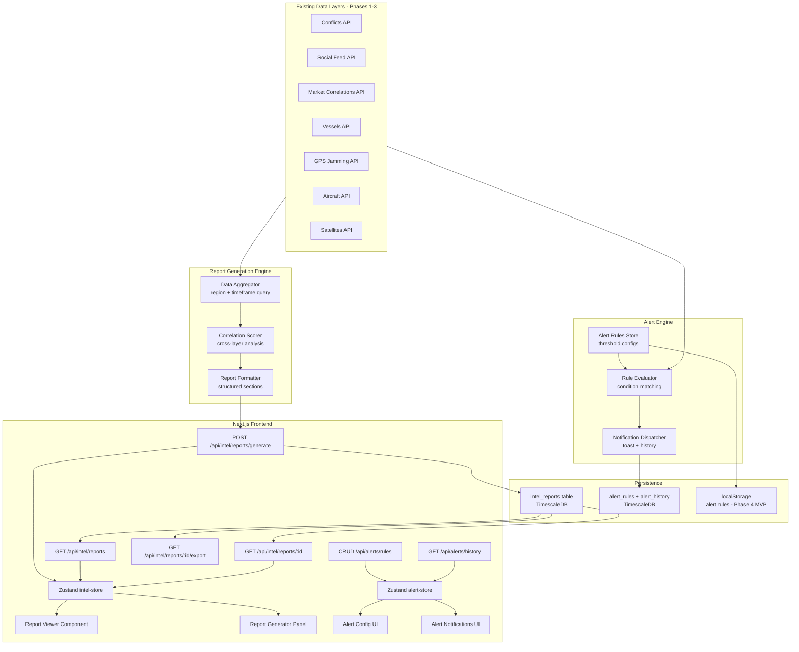
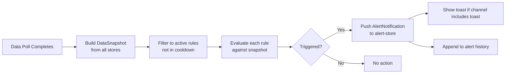

# Meridian — Phase 4: Intelligence Reports & Alerting

## Goal

Build the intelligence and correlation layer — the core product differentiator. This phase delivers two major subsystems: (1) **Intelligence Reports** that synthesize data across all existing layers (conflicts, social feed, market correlations, vessel movements, GPS jamming, aircraft tracking) into structured, region-focused intelligence briefings, and (2) a **Real-time Alert System** that monitors data streams for configurable threshold conditions and fires notifications when triggers are met. Phase 4 transforms Meridian from a data visualization tool into an actionable intelligence platform — the "so what?" layer that turns raw data into decisions.

---

## Why This Phase Exists

Phases 1–3 answer **"what is happening"** and **"what it means for markets."** Phase 4 answers **"what should I do about it?"** A Strait of Hormuz conflict escalation is a data point until it is synthesized into a structured briefing with threat assessment, market impact analysis, key entity tracking, and a timeline — then it becomes an intelligence product worth paying for. The alert system extends this by ensuring users never miss critical developments: when a GPS jamming event exceeds a threshold, or a conflict severity spikes in a watched region, or social sentiment turns sharply negative from official sources, the system proactively notifies rather than waiting for the user to check.

The intelligence report system draws directly from the [Intel Report Spec](../docs/intel-report-spec.md), adapting its parallel research agent architecture to work with Meridian's existing real-time data layers instead of external web search. The alert system is the real-time complement: reports are periodic deep-dives, alerts are instant triggers.

---

## Architecture Overview



---

## Step-by-Step Implementation

### Step 4.1 — Database Schema: Intelligence Reports & Alerts

Add new tables for intelligence reports, alert rules, and alert history. These follow the pattern established in `database/init/002_schema.sql` and `database/init/004_market_schema.sql`.

**File:** `database/init/006_intel_alerts_schema.sql` (new)

```sql
-- Intelligence Reports & Alerts Schema

-- ============================================
-- Enum Types
-- ============================================

CREATE TYPE report_status AS ENUM (
    'generating',    -- Report generation in progress
    'complete',      -- Report ready to view
    'failed',        -- Generation failed
    'archived'       -- Soft-deleted / old
);

CREATE TYPE classification_level AS ENUM (
    'unclassified',  -- Open source, shareable
    'internal',      -- Internal use only
    'confidential',  -- Restricted distribution
    'critical'       -- Highest sensitivity
);

CREATE TYPE confidence_rating AS ENUM (
    'confirmed',     -- Multiple corroborating sources
    'likely',        -- Strong single source or partial corroboration
    'possible',      -- Single source, plausible
    'speculative'    -- Unverified, flagged as uncertain
);

CREATE TYPE threat_level AS ENUM (
    'critical',      -- Immediate action required
    'high',          -- Significant risk, monitor closely
    'elevated',      -- Notable activity, increased vigilance
    'moderate',      -- Baseline activity with concerns
    'low'            -- Normal conditions
);

CREATE TYPE alert_severity AS ENUM ('critical', 'high', 'medium', 'low', 'info');

CREATE TYPE alert_status AS ENUM ('active', 'paused', 'triggered', 'expired');

CREATE TYPE alert_channel AS ENUM ('toast', 'panel', 'email', 'discord');

-- ============================================
-- Intelligence Reports
-- ============================================

CREATE TABLE intel_reports (
    id UUID DEFAULT uuid_generate_v4() PRIMARY KEY,
    title VARCHAR(500) NOT NULL,              -- "Strait of Hormuz Intelligence Report"
    region_id VARCHAR(100) NOT NULL,          -- Links to instrument_region_map.region_id
    region_name VARCHAR(200) NOT NULL,
    region_center GEOGRAPHY(Point, 4326),
    region_radius_km DOUBLE PRECISION,
    timeframe_start TIMESTAMPTZ NOT NULL,
    timeframe_end TIMESTAMPTZ NOT NULL,
    status report_status NOT NULL DEFAULT 'generating',
    classification classification_level DEFAULT 'unclassified',

    -- Report content sections (stored as JSONB for flexibility)
    executive_summary TEXT,
    threat_assessment JSONB DEFAULT '{}',     -- { level, description, factors[] }
    situation_overview TEXT,
    key_events JSONB DEFAULT '[]',            -- Array of event summaries
    market_impact JSONB DEFAULT '{}',         -- { instruments[], correlations[], narrative }
    entity_tracking JSONB DEFAULT '[]',       -- Key entities: vessels, aircraft, actors
    social_sentiment JSONB DEFAULT '{}',      -- { overall, byPlatform, keyPosts[] }
    timeline JSONB DEFAULT '[]',              -- Chronological event array
    recommendations TEXT,

    -- Metadata
    data_sources_used JSONB DEFAULT '[]',     -- Which API data contributed
    confidence confidence_rating DEFAULT 'possible',
    overall_threat_level threat_level DEFAULT 'moderate',
    word_count INTEGER,
    generation_time_ms INTEGER,               -- How long generation took

    created_at TIMESTAMPTZ NOT NULL DEFAULT NOW(),
    updated_at TIMESTAMPTZ NOT NULL DEFAULT NOW(),
    created_by VARCHAR(100) DEFAULT 'system'
);

CREATE INDEX idx_intel_reports_region ON intel_reports (region_id);
CREATE INDEX idx_intel_reports_status ON intel_reports (status);
CREATE INDEX idx_intel_reports_created ON intel_reports (created_at DESC);
CREATE INDEX idx_intel_reports_threat ON intel_reports (overall_threat_level);

-- ============================================
-- Alert Rules
-- ============================================

CREATE TABLE alert_rules (
    id UUID DEFAULT uuid_generate_v4() PRIMARY KEY,
    name VARCHAR(200) NOT NULL,
    description TEXT,

    -- What to monitor
    data_layer VARCHAR(50) NOT NULL,          -- conflict, gps-jamming, social, market, vessel, aircraft
    region_id VARCHAR(100),                   -- Optional: limit to a region
    region_center GEOGRAPHY(Point, 4326),
    region_radius_km DOUBLE PRECISION,

    -- Condition
    condition_type VARCHAR(50) NOT NULL,       -- threshold, correlation, sentiment, proximity
    condition_config JSONB NOT NULL,           -- Condition-specific params (see types below)

    -- Alert behavior
    severity alert_severity DEFAULT 'medium',
    channels alert_channel[] DEFAULT '{toast,panel}',
    cooldown_minutes INTEGER DEFAULT 30,       -- Min time between re-triggers
    max_triggers INTEGER,                      -- Max times to fire (null = unlimited)

    -- State
    status alert_status DEFAULT 'active',
    trigger_count INTEGER DEFAULT 0,
    last_triggered_at TIMESTAMPTZ,

    created_at TIMESTAMPTZ NOT NULL DEFAULT NOW(),
    updated_at TIMESTAMPTZ NOT NULL DEFAULT NOW(),
    created_by VARCHAR(100) DEFAULT 'anonymous'
);

CREATE INDEX idx_alert_rules_layer ON alert_rules (data_layer);
CREATE INDEX idx_alert_rules_status ON alert_rules (status) WHERE status = 'active';
CREATE INDEX idx_alert_rules_region ON alert_rules (region_id);

-- ============================================
-- Alert History (fired alerts)
-- ============================================

CREATE TABLE alert_history (
    id UUID DEFAULT uuid_generate_v4(),
    rule_id UUID NOT NULL REFERENCES alert_rules(id) ON DELETE CASCADE,
    rule_name VARCHAR(200) NOT NULL,
    severity alert_severity NOT NULL,

    -- What triggered it
    trigger_data JSONB NOT NULL,               -- The event/data that matched the condition
    trigger_summary TEXT NOT NULL,              -- Human-readable description
    trigger_value DOUBLE PRECISION,            -- The numeric value that exceeded threshold

    -- Delivery
    channels_notified alert_channel[],
    acknowledged BOOLEAN DEFAULT FALSE,
    acknowledged_at TIMESTAMPTZ,

    fired_at TIMESTAMPTZ NOT NULL DEFAULT NOW(),

    PRIMARY KEY (id, fired_at)
);

SELECT create_hypertable('alert_history', 'fired_at');

CREATE INDEX idx_alert_history_rule ON alert_history (rule_id);
CREATE INDEX idx_alert_history_severity ON alert_history (severity);
CREATE INDEX idx_alert_history_ack ON alert_history (acknowledged) WHERE acknowledged = FALSE;
```

**Dependencies:** None — this is the foundation.

**Checklist:**
- [ ] Create `database/init/006_intel_alerts_schema.sql`
- [ ] Add `intel_report` and `alert` values to existing enums if needed
- [ ] Run migration against dev database via docker-compose
- [ ] Verify tables created with correct indexes

---

### Step 4.2 — TypeScript Types: Intelligence Reports

Define all TypeScript interfaces for the intelligence report system. These types are consumed by the API routes, store, and UI components.

**File:** `lib/types/intel-report.ts` (new)

```typescript
/**
 * Intelligence report data types.
 * Structured region-focused intelligence briefings that synthesize
 * data across all Meridian data layers.
 */

// ============================================
// Enum / Union Types
// ============================================

export type ReportStatus = "generating" | "complete" | "failed" | "archived";

export type ClassificationLevel =
    | "unclassified"
    | "internal"
    | "confidential"
    | "critical";

export type ConfidenceRating =
    | "confirmed"    // Multiple corroborating sources
    | "likely"       // Strong single source or partial corroboration
    | "possible"     // Single source, plausible
    | "speculative"; // Unverified, flagged

export type ThreatLevel =
    | "critical"     // Immediate action required
    | "high"         // Significant risk, monitor closely
    | "elevated"     // Notable activity, increased vigilance
    | "moderate"     // Baseline activity with concerns
    | "low";         // Normal conditions

export type ReportSection =
    | "executive_summary"
    | "threat_assessment"
    | "situation_overview"
    | "key_events"
    | "market_impact"
    | "entity_tracking"
    | "social_sentiment"
    | "timeline"
    | "recommendations";

// ============================================
// Report Sub-Structures
// ============================================

/** Threat assessment section */
export interface ThreatAssessment {
    level: ThreatLevel;
    description: string;
    factors: ThreatFactor[];
    previousLevel: ThreatLevel | null;
    trend: "escalating" | "stable" | "de-escalating";
}

export interface ThreatFactor {
    category: string;          // "military_activity", "economic_disruption", etc.
    description: string;
    severity: "critical" | "high" | "medium" | "low";
    confidence: ConfidenceRating;
    sources: string[];
}

/** Key event summary within a report */
export interface ReportEvent {
    id: string;
    timestamp: string;         // ISO 8601
    layer: string;             // "conflict", "vessel", "gps-jamming", etc.
    title: string;
    description: string;
    severity: string;
    location: { lat: number; lng: number } | null;
    locationName: string | null;
    confidence: ConfidenceRating;
    relatedEntityIds: string[];
}

/** Market impact section */
export interface MarketImpactSection {
    narrative: string;
    affectedInstruments: MarketImpactItem[];
    correlationSummary: string;
    overallMarketSentiment: "bullish" | "bearish" | "neutral" | "volatile";
}

export interface MarketImpactItem {
    symbol: string;
    name: string;
    currentPrice: number | null;
    changePercent: number | null;
    impactDirection: "positive" | "negative" | "neutral";
    impactMagnitude: "high" | "medium" | "low";
    rationale: string;
}

/** Entity tracking section */
export interface TrackedEntity {
    id: string;
    type: "vessel" | "aircraft" | "actor" | "organization";
    name: string;
    description: string;
    lastKnownLocation: { lat: number; lng: number } | null;
    lastSeen: string | null;   // ISO 8601
    flagOfInterest: string | null;
    relevance: string;
}

/** Social sentiment section */
export interface SocialSentimentSection {
    overallSentiment: "positive" | "negative" | "neutral" | "mixed";
    sentimentScore: number;    // -1.0 to 1.0
    postCount: number;
    byPlatform: {
        platform: string;
        count: number;
        avgSentiment: number;
    }[];
    keyPosts: {
        id: string;
        platform: string;
        author: string;
        content: string;
        sentiment: string;
        engagement: number;
        postedAt: string;
    }[];
    narrative: string;
}

/** Timeline entry */
export interface TimelineEntry {
    timestamp: string;         // ISO 8601
    layer: string;
    title: string;
    description: string;
    severity: string;
    entityId: string | null;
}

/** Data source contribution metadata */
export interface DataSourceContribution {
    layer: string;
    eventCount: number;
    timeRange: { start: string; end: string };
    isSampleData: boolean;
}

// ============================================
// Core Report Interface
// ============================================

/** A complete intelligence report */
export interface IntelReport {
    id: string;
    title: string;
    regionId: string;
    regionName: string;
    regionCenter: { lat: number; lng: number } | null;
    regionRadiusKm: number | null;
    timeframeStart: string;    // ISO 8601
    timeframeEnd: string;      // ISO 8601
    status: ReportStatus;
    classification: ClassificationLevel;

    // Content sections
    executiveSummary: string | null;
    threatAssessment: ThreatAssessment | null;
    situationOverview: string | null;
    keyEvents: ReportEvent[];
    marketImpact: MarketImpactSection | null;
    entityTracking: TrackedEntity[];
    socialSentiment: SocialSentimentSection | null;
    timeline: TimelineEntry[];
    recommendations: string | null;

    // Metadata
    dataSourcesUsed: DataSourceContribution[];
    confidence: ConfidenceRating;
    overallThreatLevel: ThreatLevel;
    wordCount: number | null;
    generationTimeMs: number | null;
    createdAt: string;
    updatedAt: string;
    createdBy: string;
}

/** Params for requesting a new report */
export interface ReportGenerationRequest {
    regionId: string;
    regionName?: string;
    regionCenter?: { lat: number; lng: number };
    regionRadiusKm?: number;
    timeframeHours?: number;   // How far back to look (default 24)
    classification?: ClassificationLevel;
    includeSections?: ReportSection[];  // Defaults to all
}

/** Summary for listing reports (lighter than full report) */
export interface IntelReportSummary {
    id: string;
    title: string;
    regionId: string;
    regionName: string;
    status: ReportStatus;
    classification: ClassificationLevel;
    overallThreatLevel: ThreatLevel;
    confidence: ConfidenceRating;
    executiveSummary: string | null;
    eventCount: number;
    createdAt: string;
}

// ============================================
// Helper Functions
// ============================================

export function getThreatLevelColor(level: ThreatLevel): string {
    switch (level) {
        case "critical": return "#dc2626"; // red-600
        case "high":     return "#ea580c"; // orange-600
        case "elevated": return "#d97706"; // amber-600
        case "moderate": return "#2563eb"; // blue-600
        case "low":      return "#16a34a"; // green-600
    }
}

export function getThreatLevelLabel(level: ThreatLevel): string {
    switch (level) {
        case "critical": return "CRITICAL";
        case "high":     return "HIGH";
        case "elevated": return "ELEVATED";
        case "moderate": return "MODERATE";
        case "low":      return "LOW";
    }
}

export function getClassificationColor(level: ClassificationLevel): string {
    switch (level) {
        case "unclassified": return "#6b7280"; // gray-500
        case "internal":     return "#2563eb"; // blue-600
        case "confidential": return "#d97706"; // amber-600
        case "critical":     return "#dc2626"; // red-600
    }
}

export function getConfidenceLabel(rating: ConfidenceRating): string {
    switch (rating) {
        case "confirmed":   return "Confirmed";
        case "likely":      return "Likely";
        case "possible":    return "Possible";
        case "speculative": return "Speculative";
    }
}

export function getConfidenceColor(rating: ConfidenceRating): string {
    switch (rating) {
        case "confirmed":   return "#16a34a"; // green-600
        case "likely":      return "#2563eb"; // blue-600
        case "possible":    return "#d97706"; // amber-600
        case "speculative": return "#dc2626"; // red-600
    }
}

export function getStatusColor(status: ReportStatus): string {
    switch (status) {
        case "generating": return "#eab308"; // yellow-500
        case "complete":   return "#22c55e"; // green-500
        case "failed":     return "#ef4444"; // red-500
        case "archived":   return "#6b7280"; // gray-500
    }
}
```

**Dependencies:** None — pure type definitions.

**Checklist:**
- [ ] Create `lib/types/intel-report.ts` with all interfaces
- [ ] Ensure `ThreatLevel`, `ConfidenceRating`, `ClassificationLevel` match DB enums
- [ ] Export all helper functions for color/label lookups
- [ ] All section sub-types defined to match DB JSONB shapes

---

### Step 4.3 — TypeScript Types: Alert System

Define all TypeScript interfaces for the alert engine, rules, and notification system.

**File:** `lib/types/alert.ts` (new)

```typescript
/**
 * Alert system types for real-time monitoring and notifications.
 * Alert rules define conditions; alert notifications are fired instances.
 */

// ============================================
// Enum / Union Types
// ============================================

export type AlertSeverity = "critical" | "high" | "medium" | "low" | "info";

export type AlertStatus = "active" | "paused" | "triggered" | "expired";

export type AlertChannel = "toast" | "panel" | "email" | "discord";

/** The type of condition the alert evaluates */
export type AlertConditionType =
    | "threshold"      // Numeric value exceeds a threshold
    | "correlation"    // Market correlation score exceeds threshold
    | "sentiment"      // Social sentiment crosses boundary
    | "proximity"      // Entity enters a geographic zone
    | "count"          // Event count in region exceeds threshold
    | "absence";       // Expected data not received for N minutes

/** Which data layer the alert monitors */
export type AlertDataLayer =
    | "conflict"
    | "gps-jamming"
    | "social"
    | "market"
    | "vessel"
    | "aircraft";

// ============================================
// Condition Configs (per type)
// ============================================

/** Threshold condition: fires when a numeric value exceeds a boundary */
export interface ThresholdCondition {
    type: "threshold";
    field: string;              // "severity", "fatalities", "reportCount", etc.
    operator: "gt" | "gte" | "lt" | "lte" | "eq";
    value: number;
}

/** Correlation condition: fires when market correlation score exceeds threshold */
export interface CorrelationCondition {
    type: "correlation";
    minScore: number;            // 0.0-1.0 composite correlation score
    instrumentSymbols?: string[]; // Optional: only specific instruments
    minChangePct?: number;       // Optional: price change % threshold
}

/** Sentiment condition: fires on social sentiment shifts */
export interface SentimentCondition {
    type: "sentiment";
    sentimentDirection: "negative" | "positive" | "aggressive" | "urgent";
    minScore: number;            // Absolute sentiment score threshold (0.0-1.0)
    platforms?: string[];        // Optional: filter by platform
    minPostCount?: number;       // Minimum posts to confirm trend
}

/** Proximity condition: fires when entity enters a geographic zone */
export interface ProximityCondition {
    type: "proximity";
    entityTypes: string[];       // "vessel", "aircraft"
    radiusKm: number;
    flagFilter?: string[];       // Optional: only flag countries
    vesselTypeFilter?: string[]; // Optional: only certain vessel types
}

/** Count condition: fires when event count exceeds threshold */
export interface CountCondition {
    type: "count";
    minCount: number;
    timeWindowMinutes: number;   // Rolling window
}

/** Absence condition: fires when data goes stale */
export interface AbsenceCondition {
    type: "absence";
    maxSilenceMinutes: number;   // Fire after this many minutes without data
}

export type AlertConditionConfig =
    | ThresholdCondition
    | CorrelationCondition
    | SentimentCondition
    | ProximityCondition
    | CountCondition
    | AbsenceCondition;

// ============================================
// Core Interfaces
// ============================================

/** An alert rule definition */
export interface AlertRule {
    id: string;
    name: string;
    description: string;
    dataLayer: AlertDataLayer;
    regionId: string | null;
    regionName: string | null;
    regionCenter: { lat: number; lng: number } | null;
    regionRadiusKm: number | null;
    conditionType: AlertConditionType;
    conditionConfig: AlertConditionConfig;
    severity: AlertSeverity;
    channels: AlertChannel[];
    cooldownMinutes: number;
    maxTriggers: number | null;
    status: AlertStatus;
    triggerCount: number;
    lastTriggeredAt: string | null;
    createdAt: string;
    updatedAt: string;
}

/** A fired alert notification */
export interface AlertNotification {
    id: string;
    ruleId: string;
    ruleName: string;
    severity: AlertSeverity;
    triggerData: Record<string, unknown>;
    triggerSummary: string;
    triggerValue: number | null;
    channelsNotified: AlertChannel[];
    acknowledged: boolean;
    acknowledgedAt: string | null;
    firedAt: string;
}

/** Params for creating/updating an alert rule */
export interface AlertRuleInput {
    name: string;
    description?: string;
    dataLayer: AlertDataLayer;
    regionId?: string;
    regionName?: string;
    regionCenter?: { lat: number; lng: number };
    regionRadiusKm?: number;
    conditionType: AlertConditionType;
    conditionConfig: AlertConditionConfig;
    severity?: AlertSeverity;
    channels?: AlertChannel[];
    cooldownMinutes?: number;
    maxTriggers?: number;
}

// ============================================
// Preset Alert Templates
// ============================================

/** Pre-built alert configurations users can apply with one click */
export interface AlertPreset {
    id: string;
    name: string;
    description: string;
    icon: string;              // Lucide icon name
    category: string;          // "geopolitical", "market", "maritime", etc.
    ruleTemplate: Omit<AlertRuleInput, "name" | "description">;
}

// ============================================
// Helper Functions
// ============================================

export function getAlertSeverityColor(severity: AlertSeverity): string {
    switch (severity) {
        case "critical": return "#dc2626";
        case "high":     return "#ea580c";
        case "medium":   return "#d97706";
        case "low":      return "#2563eb";
        case "info":     return "#6b7280";
    }
}

export function getAlertSeverityIcon(severity: AlertSeverity): string {
    switch (severity) {
        case "critical": return "AlertOctagon";
        case "high":     return "AlertTriangle";
        case "medium":   return "AlertCircle";
        case "low":      return "Info";
        case "info":     return "Bell";
    }
}

export function getAlertStatusColor(status: AlertStatus): string {
    switch (status) {
        case "active":    return "#22c55e";
        case "paused":    return "#6b7280";
        case "triggered": return "#f59e0b";
        case "expired":   return "#94a3b8";
    }
}

export function getConditionTypeLabel(type: AlertConditionType): string {
    switch (type) {
        case "threshold":   return "Threshold";
        case "correlation": return "Market Correlation";
        case "sentiment":   return "Social Sentiment";
        case "proximity":   return "Geographic Proximity";
        case "count":       return "Event Count";
        case "absence":     return "Data Absence";
    }
}

export function formatAlertTrigger(notification: AlertNotification): string {
    const timeAgo = formatTimeAgo(new Date(notification.firedAt));
    return `${notification.ruleName} — ${notification.triggerSummary} (${timeAgo})`;
}

function formatTimeAgo(date: Date): string {
    const seconds = Math.floor((Date.now() - date.getTime()) / 1000);
    if (seconds < 60) return "just now";
    const minutes = Math.floor(seconds / 60);
    if (minutes < 60) return `${minutes}m ago`;
    const hours = Math.floor(minutes / 60);
    if (hours < 24) return `${hours}h ago`;
    const days = Math.floor(hours / 24);
    return `${days}d ago`;
}
```

**Dependencies:** None — pure type definitions.

**Checklist:**
- [ ] Create `lib/types/alert.ts` with all interfaces
- [ ] Define all 6 condition config union members
- [ ] Ensure enum types align with DB enums from Step 4.1
- [ ] Export all helper functions

---

### Step 4.4 — Report Data Aggregator Service

The core server-side utility that gathers data from all existing API data sources for a given region and timeframe. This is the "research phase" equivalent from the intel-report-spec — instead of spawning LLM sub-agents to search the web, we query our own data layers in parallel.

**File:** `lib/services/intel-aggregator.ts` (new)

This is a **server-side only** module (used in API routes, not in the browser). It imports from existing service files to fetch data, then filters by region/time.

```typescript
/**
 * Intelligence data aggregator.
 * Gathers, filters, and structures data from all Meridian data layers
 * for a given region and timeframe to feed report generation.
 *
 * Server-side only — used by /api/intel/reports/generate
 */

// Types for aggregated input
export interface AggregationParams {
    regionId: string;
    regionName: string;
    regionCenter: { lat: number; lng: number };
    regionRadiusKm: number;
    timeframeStart: string;   // ISO 8601
    timeframeEnd: string;
}

export interface AggregatedData {
    params: AggregationParams;
    conflicts: {
        events: ConflictEvent[];
        totalFatalities: number;
        severityCounts: Record<string, number>;
        isSampleData: boolean;
    };
    vessels: {
        vessels: Vessel[];
        byType: Record<string, number>;
        isSampleData: boolean;
    };
    gpsJamming: {
        zones: GPSJammingZone[];
        totalAffectedAircraft: number;
        isSampleData: boolean;
    };
    socialFeed: {
        posts: SocialPost[];
        sentimentAvg: number;
        byPlatform: Record<string, number>;
        isSampleData: boolean;
    };
    market: {
        correlations: InstrumentCorrelation[];
        scores: CorrelationResult[];
        affectedInstruments: MarketInstrument[];
        isSampleData: boolean;
    };
    aircraft: {
        aircraft: Aircraft[];
        militaryCount: number;
        isSampleData: boolean;
    };
    satellites: {
        satellites: Satellite[];
        isSampleData: boolean;
    };
    metadata: {
        aggregatedAt: string;
        totalEvents: number;
        dataSourceCount: number;
    };
}

/**
 * Primary function — aggregates data from all layers in parallel.
 * Each layer fetch is independent; failures are caught and logged
 * without blocking other layers.
 *
 * Implementation:
 * 1. Call internal API routes (fetch from localhost) for each data source
 * 2. Filter results by haversine distance to regionCenter within regionRadiusKm
 * 3. Filter by timeframe (timeframeStart to timeframeEnd)
 * 4. Compute summary statistics per layer
 * 5. Run correlation scoring for the region
 * 6. Return structured AggregatedData
 */
export async function aggregateRegionData(
    params: AggregationParams
): Promise<AggregatedData> { /* ... */ }

// Internal helpers:
// - filterByProximity<T>(items, getCoords, center, radiusKm)
// - filterByTimeframe<T>(items, getTime, start, end)
// - computeConflictStats(events)
// - computeSentimentStats(posts)
// - fetchLayerSafe<T>(fetcher): catches errors, returns empty + logs warning
```

**Key design decision:** The aggregator calls the existing Next.js API routes via `fetch("http://localhost:3000/api/...")` rather than directly querying the DB. This keeps the data access pattern consistent — the API routes already handle sample data fallback, caching, and data transformation. The aggregator is a composition layer, not a bypass.

**Spatial filtering:** Uses the same `haversineKm` function from `lib/correlation-engine.ts` to filter events within the region radius. Import and reuse rather than duplicate.

**Dependencies:** Step 4.2 (types)

**Checklist:**
- [ ] Create `lib/services/intel-aggregator.ts`
- [ ] Implement `aggregateRegionData` with parallel fetches to all 7 data layer APIs
- [ ] Implement haversine-based spatial filtering (reuse from correlation-engine)
- [ ] Implement timeframe filtering
- [ ] Compute per-layer summary statistics
- [ ] Handle partial failures gracefully (one layer failing doesn't block others)
- [ ] Add type imports from all existing type files

---

### Step 4.5 — Report Formatter & Generator

Transforms aggregated data into structured report sections. This is the "synthesis" equivalent from the intel-report-spec — instead of an LLM synthesizing 4 sub-agent outputs, we apply deterministic formatting rules to produce each report section.

**File:** `lib/services/intel-formatter.ts` (new)

```typescript
/**
 * Intelligence report formatter.
 * Takes aggregated data from intel-aggregator and produces
 * structured report sections.
 *
 * Server-side only — used by /api/intel/reports/generate
 */

import type { AggregatedData } from "./intel-aggregator";
import type {
    IntelReport,
    ThreatAssessment,
    ReportEvent,
    MarketImpactSection,
    TrackedEntity,
    SocialSentimentSection,
    TimelineEntry,
    ThreatLevel,
    ConfidenceRating,
    DataSourceContribution,
} from "@/lib/types/intel-report";

/**
 * Generate a complete report from aggregated data.
 * Each section is generated independently.
 */
export function generateReport(
    data: AggregatedData,
    reportId: string,
    title: string,
    classification: ClassificationLevel
): IntelReport { /* ... */ }

/**
 * Generate the executive summary — 4-6 bullet points
 * covering the most critical findings across all layers.
 *
 * Priority: critical conflicts > GPS jamming > vessel anomalies >
 *           market impact > social sentiment > aircraft activity
 */
export function generateExecutiveSummary(data: AggregatedData): string { /* ... */ }

/**
 * Compute threat assessment from conflict severity distribution,
 * GPS jamming activity, and entity proximity.
 */
export function computeThreatAssessment(data: AggregatedData): ThreatAssessment { /* ... */ }

/**
 * Generate situation overview narrative.
 * A 2-3 paragraph prose summary of the regional situation.
 */
export function generateSituationOverview(data: AggregatedData): string { /* ... */ }

/**
 * Extract and rank key events across all layers by severity and recency.
 * Returns top 10-15 events sorted by importance.
 */
export function extractKeyEvents(data: AggregatedData): ReportEvent[] { /* ... */ }

/**
 * Compute market impact section from correlation scores
 * and instrument price data.
 */
export function computeMarketImpact(data: AggregatedData): MarketImpactSection { /* ... */ }

/**
 * Identify and track key entities (vessels, aircraft, actors)
 * that are present in the region.
 */
export function identifyTrackedEntities(data: AggregatedData): TrackedEntity[] { /* ... */ }

/**
 * Analyze social media sentiment for the region.
 */
export function analyzeSocialSentiment(data: AggregatedData): SocialSentimentSection { /* ... */ }

/**
 * Build chronological timeline from all events.
 * Merges events across layers, sorted by timestamp.
 */
export function buildTimeline(data: AggregatedData): TimelineEntry[] { /* ... */ }

/**
 * Generate recommendations based on threat level and key findings.
 */
export function generateRecommendations(
    threatAssessment: ThreatAssessment,
    marketImpact: MarketImpactSection
): string { /* ... */ }

/**
 * Compute overall threat level from weighted factors:
 * - Conflict severity distribution (weight: 0.35)
 * - GPS jamming active zones (weight: 0.20)
 * - Vessel anomalies (weight: 0.15)
 * - Social sentiment negativity (weight: 0.15)
 * - Market correlation scores (weight: 0.15)
 */
export function computeOverallThreatLevel(data: AggregatedData): ThreatLevel { /* ... */ }

/**
 * Compute confidence rating based on data freshness and source count.
 * - confirmed: 5+ data sources with data < 1 hour old
 * - likely: 3+ data sources with data < 6 hours old
 * - possible: 1-2 data sources
 * - speculative: only sample data available
 */
export function computeConfidence(data: AggregatedData): ConfidenceRating { /* ... */ }

/**
 * Compute data source contribution metadata.
 */
export function getDataSourceContributions(data: AggregatedData): DataSourceContribution[] { /* ... */ }
```

**Threat level computation algorithm:**

```
score = 0.0

// Conflict factor (0-1, weight 0.35)
if any conflict severity == "critical": conflictScore = 1.0
else if conflicts with "high" > 3: conflictScore = 0.8
else: conflictScore = highCount * 0.2 + mediumCount * 0.1

// GPS Jamming factor (0-1, weight 0.20)
jammingScore = activeZones > 0 ? min(1.0, totalAffectedAircraft / 50) : 0

// Vessel anomaly factor (0-1, weight 0.15)
vesselScore = militaryVesselCount > 5 ? 0.8 : militaryVesselCount * 0.15

// Sentiment factor (0-1, weight 0.15)
sentimentScore = abs(sentimentAvg) where sentimentAvg < -0.3

// Market factor (0-1, weight 0.15)
marketScore = max correlation score

compositeScore = conflictScore * 0.35 + jammingScore * 0.20 +
                 vesselScore * 0.15 + sentimentScore * 0.15 + marketScore * 0.15

Mapping:
  compositeScore >= 0.8 → "critical"
  compositeScore >= 0.6 → "high"
  compositeScore >= 0.4 → "elevated"
  compositeScore >= 0.2 → "moderate"
  else → "low"
```

**Dependencies:** Steps 4.2, 4.4

**Checklist:**
- [ ] Create `lib/services/intel-formatter.ts`
- [ ] Implement `generateReport` as the main entry point
- [ ] Implement all section generators
- [ ] Implement `computeOverallThreatLevel` with weighted scoring algorithm
- [ ] Implement `computeConfidence` based on data freshness
- [ ] Ensure executive summary is standalone readable
- [ ] Timeline merges events from all layers and sorts chronologically

---

### Step 4.6 — API Routes: Report Generation & Retrieval

Three API routes for the intelligence report lifecycle: generate, list, and view.

#### 4.6.1 — `POST /api/intel/reports/generate`

**File:** `app/api/intel/reports/generate/route.ts` (new)

```typescript
// POST /api/intel/reports/generate
//
// Request body: ReportGenerationRequest
// {
//   regionId: "strait_of_hormuz",
//   regionName: "Strait of Hormuz",          // optional, inferred from regionId
//   regionCenter: { lat: 26.6, lng: 56.3 },  // optional, from region map
//   regionRadiusKm: 150,                      // optional, from region map
//   timeframeHours: 24,                       // default: 24
//   classification: "unclassified",           // default: "unclassified"
//   includeSections: [...]                    // default: all sections
// }
//
// Response: { report: IntelReport }
//
// Flow:
// 1. Validate request, resolve region metadata from instrument_region_map
// 2. Create report record with status "generating"
// 3. Call aggregateRegionData() to gather data from all layers
// 4. Call generateReport() to format into structured sections
// 5. Update report record with status "complete" and content
// 6. Return the complete report
//
// Error handling:
// - If aggregation fails, set status to "failed" and return error
// - Timeout after 30 seconds
```

**Region resolution:** The `regionId` maps to the `instrument_region_map` seed data from Phase 3. The route looks up `regionCenter` and `regionRadiusKm` from the existing correlation data if not provided in the request. This means any region that has market correlations already mapped is available for report generation.

**Pre-defined regions (from Phase 3 seed data):**

| regionId | regionName | Center | Radius |
|----------|-----------|--------|--------|
| `strait_of_hormuz` | Strait of Hormuz | 56.3°E, 26.6°N | 150 km |
| `suez_canal` | Suez Canal | 32.3°E, 30.5°N | 100 km |
| `south_china_sea` | South China Sea | 114.0°E, 12.0°N | 800 km |
| `taiwan_strait` | Taiwan Strait | 119.5°E, 24.0°N | 200 km |
| `black_sea` | Black Sea | 34.0°E, 43.5°N | 500 km |
| `red_sea` | Red Sea / Bab el-Mandeb | 43.5°E, 13.0°N | 300 km |
| `persian_gulf` | Persian Gulf | 52.0°E, 27.0°N | 400 km |
| `baltic_sea` | Baltic Sea | 20.0°E, 58.0°N | 400 km |

#### 4.6.2 — `GET /api/intel/reports`

**File:** `app/api/intel/reports/route.ts` (new)

```typescript
// GET /api/intel/reports?regionId=strait_of_hormuz&status=complete&limit=20
//
// Query params:
//   regionId  — filter by region (optional)
//   status    — filter by status (optional, default: "complete")
//   limit     — max results (optional, default: 20)
//   offset    — pagination offset (optional, default: 0)
//
// Response: {
//   reports: IntelReportSummary[],
//   total: number,
//   isSampleData: boolean
// }
//
// Returns summary-level data (no full content sections).
// For MVP, returns from an in-memory array of generated reports.
// Upgrade path: query intel_reports table.
```

#### 4.6.3 — `GET /api/intel/reports/[id]`

**File:** `app/api/intel/reports/[id]/route.ts` (new)

```typescript
// GET /api/intel/reports/:id
//
// Path params:
//   id — Report UUID
//
// Response: { report: IntelReport }
//
// Returns the full report with all content sections.
// 404 if report not found.
```

#### 4.6.4 — `GET /api/intel/reports/[id]/export`

**File:** `app/api/intel/reports/[id]/export/route.ts` (new)

```typescript
// GET /api/intel/reports/:id/export?format=markdown
// GET /api/intel/reports/:id/export?format=pdf
//
// Query params:
//   format — "markdown" or "pdf" (default: "markdown")
//
// Response:
//   markdown: text/markdown file download
//   pdf: application/pdf file download (stretch goal)
//
// Markdown export renders the report into a clean markdown document
// with all sections, headers, bullet points, and metadata.
// PDF export uses the same markdown, converted via a lightweight
// HTML-to-PDF pipeline (or a library like jspdf).
```

**Dependencies:** Steps 4.2, 4.4, 4.5

**Checklist:**
- [ ] Create `app/api/intel/reports/generate/route.ts`
- [ ] Create `app/api/intel/reports/route.ts`
- [ ] Create `app/api/intel/reports/[id]/route.ts`
- [ ] Create `app/api/intel/reports/[id]/export/route.ts`
- [ ] Implement region resolution from existing correlation data
- [ ] In-memory report storage for MVP (Map or array)
- [ ] Add 30-second timeout handling on report generation
- [ ] Implement markdown export formatter
- [ ] PDF export as stretch goal (can stub initially)

---

### Step 4.7 — API Routes: Alert Rules & History

CRUD routes for alert rules and a read route for alert history (fired notifications).

#### 4.7.1 — `CRUD /api/alerts/rules`

**File:** `app/api/alerts/rules/route.ts` (new)

```typescript
// GET    /api/alerts/rules                    — List all alert rules
// POST   /api/alerts/rules                    — Create a new rule
// PUT    /api/alerts/rules                    — Update existing rule (body.id required)
// DELETE /api/alerts/rules?id=xxx             — Delete a rule
//
// GET Response: { rules: AlertRule[], isSampleData: boolean }
//
// POST/PUT Body: AlertRuleInput
// POST/PUT Response: { rule: AlertRule }
//
// For MVP, rules are stored in-memory and synced to localStorage
// on the client side. The API route validates and normalizes the
// rule definition.
//
// Preset alert templates:
// GET /api/alerts/rules/presets — Returns pre-built AlertPreset[]
// These are one-click configurations for common monitoring scenarios.
```

**Pre-built alert presets:**

```typescript
const ALERT_PRESETS: AlertPreset[] = [
    {
        id: "hormuz-conflict",
        name: "Hormuz Conflict Escalation",
        description: "Alert when conflict severity exceeds high in the Strait of Hormuz region",
        icon: "Flame",
        category: "geopolitical",
        ruleTemplate: {
            dataLayer: "conflict",
            regionId: "strait_of_hormuz",
            conditionType: "threshold",
            conditionConfig: {
                type: "threshold",
                field: "severity",
                operator: "gte",
                value: 4  // "high" = 4 on numeric scale
            },
            severity: "high",
            channels: ["toast", "panel"],
            cooldownMinutes: 60,
        },
    },
    {
        id: "gps-jamming-spike",
        name: "GPS Jamming Spike",
        description: "Alert when GPS jamming reports exceed 10 affected aircraft",
        icon: "Radio",
        category: "electronic_warfare",
        ruleTemplate: {
            dataLayer: "gps-jamming",
            conditionType: "threshold",
            conditionConfig: {
                type: "threshold",
                field: "affectedAircraftCount",
                operator: "gt",
                value: 10
            },
            severity: "medium",
            channels: ["toast", "panel"],
            cooldownMinutes: 30,
        },
    },
    {
        id: "negative-sentiment-official",
        name: "Official Source Negative Sentiment",
        description: "Alert when sentiment from White House or official sources turns sharply negative",
        icon: "Landmark",
        category: "political",
        ruleTemplate: {
            dataLayer: "social",
            conditionType: "sentiment",
            conditionConfig: {
                type: "sentiment",
                sentimentDirection: "negative",
                minScore: 0.7,
                platforms: ["whitehouse"],
                minPostCount: 1
            },
            severity: "high",
            channels: ["toast", "panel"],
            cooldownMinutes: 120,
        },
    },
    {
        id: "market-correlation-spike",
        name: "Market Correlation Spike",
        description: "Alert when a geospatial event triggers a high market correlation score",
        icon: "TrendingUp",
        category: "market",
        ruleTemplate: {
            dataLayer: "market",
            conditionType: "correlation",
            conditionConfig: {
                type: "correlation",
                minScore: 0.7,
            },
            severity: "medium",
            channels: ["toast", "panel"],
            cooldownMinutes: 60,
        },
    },
    {
        id: "vessel-proximity-hormuz",
        name: "Military Vessel Near Hormuz",
        description: "Alert when a military vessel enters the Strait of Hormuz zone",
        icon: "Anchor",
        category: "maritime",
        ruleTemplate: {
            dataLayer: "vessel",
            regionId: "strait_of_hormuz",
            conditionType: "proximity",
            conditionConfig: {
                type: "proximity",
                entityTypes: ["vessel"],
                radiusKm: 150,
                vesselTypeFilter: ["military"]
            },
            severity: "medium",
            channels: ["toast", "panel"],
            cooldownMinutes: 120,
        },
    },
];
```

#### 4.7.2 — `GET /api/alerts/history`

**File:** `app/api/alerts/history/route.ts` (new)

```typescript
// GET /api/alerts/history?severity=critical&acknowledged=false&limit=50
//
// Query params:
//   severity      — filter by severity (optional)
//   acknowledged  — filter by ack status: true/false (optional)
//   ruleId        — filter by rule (optional)
//   limit         — max results (default: 50)
//
// Response: {
//   notifications: AlertNotification[],
//   unacknowledgedCount: number,
//   isSampleData: boolean
// }
```

#### 4.7.3 — `POST /api/alerts/history/[id]/acknowledge`

**File:** `app/api/alerts/history/[id]/acknowledge/route.ts` (new)

```typescript
// POST /api/alerts/history/:id/acknowledge
//
// Marks an alert notification as acknowledged.
// Response: { notification: AlertNotification }
```

**Dependencies:** Step 4.3 (types)

**Checklist:**
- [ ] Create `app/api/alerts/rules/route.ts` with CRUD operations
- [ ] Create `app/api/alerts/rules/presets/route.ts` with preset templates
- [ ] Create `app/api/alerts/history/route.ts`
- [ ] Create `app/api/alerts/history/[id]/acknowledge/route.ts`
- [ ] Implement 5+ alert presets for common scenarios
- [ ] In-memory storage for MVP with localStorage sync plan
- [ ] Input validation on rule creation

---

### Step 4.8 — Frontend Services: Intel & Alert API Clients

Fetch client functions following the pattern in `lib/services/conflicts.ts` and `lib/services/market.ts`.

**File:** `lib/services/intel-reports.ts` (new)

```typescript
/**
 * Frontend API client for intelligence reports.
 * Follows the pattern established in lib/services/market.ts
 */

export const INTEL_POLLING = {
    REPORTS_LIST: 300_000,    // 5 minutes — refresh report list
} as const;

export async function generateReport(
    params: ReportGenerationRequest
): Promise<{ report: IntelReport }> { /* POST /api/intel/reports/generate */ }

export async function fetchReports(params?: {
    regionId?: string;
    status?: ReportStatus;
    limit?: number;
    offset?: number;
}): Promise<{ reports: IntelReportSummary[]; total: number; isSampleData: boolean }> {
    /* GET /api/intel/reports */
}

export async function fetchReport(
    id: string
): Promise<{ report: IntelReport }> {
    /* GET /api/intel/reports/:id */
}

export async function exportReport(
    id: string,
    format: "markdown" | "pdf"
): Promise<Blob> {
    /* GET /api/intel/reports/:id/export?format=... */
}
```

**File:** `lib/services/alerts.ts` (new)

```typescript
/**
 * Frontend API client for alert rules and notifications.
 */

export const ALERT_POLLING = {
    HISTORY: 30_000,          // 30 seconds — check for new notifications
    RULES: 60_000,            // 1 minute — refresh rule statuses
} as const;

export async function fetchAlertRules(): Promise<{
    rules: AlertRule[];
    isSampleData: boolean;
}> { /* GET /api/alerts/rules */ }

export async function createAlertRule(
    input: AlertRuleInput
): Promise<{ rule: AlertRule }> {
    /* POST /api/alerts/rules */
}

export async function updateAlertRule(
    id: string,
    input: Partial<AlertRuleInput>
): Promise<{ rule: AlertRule }> {
    /* PUT /api/alerts/rules */
}

export async function deleteAlertRule(
    id: string
): Promise<void> {
    /* DELETE /api/alerts/rules?id=xxx */
}

export async function fetchAlertPresets(): Promise<{
    presets: AlertPreset[];
}> { /* GET /api/alerts/rules/presets */ }

export async function fetchAlertHistory(params?: {
    severity?: AlertSeverity;
    acknowledged?: boolean;
    limit?: number;
}): Promise<{
    notifications: AlertNotification[];
    unacknowledgedCount: number;
    isSampleData: boolean;
}> { /* GET /api/alerts/history */ }

export async function acknowledgeAlert(
    id: string
): Promise<{ notification: AlertNotification }> {
    /* POST /api/alerts/history/:id/acknowledge */
}
```

**Dependencies:** Steps 4.2, 4.3 (types)

**Checklist:**
- [ ] Create `lib/services/intel-reports.ts`
- [ ] Create `lib/services/alerts.ts`
- [ ] Implement all fetch functions with error handling
- [ ] Export polling constants
- [ ] Follow the same error handling pattern as `lib/services/market.ts`

---

### Step 4.9 — Zustand Store: `intel-store.ts`

Dedicated store for intelligence report state. Follows the same separate-store pattern as `lib/stores/market-store.ts`.

**File:** `lib/stores/intel-store.ts` (new)

```typescript
import { create } from "zustand";
import { useShallow } from "zustand/react/shallow";
import type {
    IntelReport,
    IntelReportSummary,
    ReportGenerationRequest,
    ReportStatus,
} from "@/lib/types/intel-report";
import {
    generateReport,
    fetchReports,
    fetchReport,
    exportReport,
} from "@/lib/services/intel-reports";

interface IntelState {
    // Report list
    reports: IntelReportSummary[];
    reportsLoading: boolean;
    reportsError: string | null;

    // Active report (full detail view)
    activeReport: IntelReport | null;
    activeReportLoading: boolean;

    // Report generation
    isGenerating: boolean;
    generationError: string | null;

    // Selected region for generation
    selectedRegionId: string | null;

    // Polling
    pollingInterval: ReturnType<typeof setInterval> | null;

    // Actions
    fetchReports: (params?: { regionId?: string; status?: ReportStatus }) => Promise<void>;
    fetchReport: (id: string) => Promise<void>;
    generateReport: (params: ReportGenerationRequest) => Promise<IntelReport | null>;
    exportReport: (id: string, format: "markdown" | "pdf") => Promise<void>;
    setSelectedRegion: (regionId: string | null) => void;
    clearActiveReport: () => void;

    // Polling
    startPolling: () => void;
    stopPolling: () => void;

    // Reset
    reset: () => void;
}
```

**Key behaviors:**
- `generateReport` sets `isGenerating = true`, calls the API, updates the reports list on success, and returns the new report
- `fetchReports` loads summary list for the report history panel
- `fetchReport` loads a full report for the detailed viewer
- `exportReport` triggers a browser download of markdown or PDF
- `setSelectedRegion` is used by the region picker in the generation UI
- Polling on the reports list catches status transitions (generating → complete)

**Exported hooks:**

```typescript
export const useReports = () => useIntelStore(useShallow((s) => ({
    reports: s.reports,
    isLoading: s.reportsLoading,
    error: s.reportsError,
})));

export const useActiveReport = () => useIntelStore(useShallow((s) => ({
    report: s.activeReport,
    isLoading: s.activeReportLoading,
})));

export const useReportGeneration = () => useIntelStore(useShallow((s) => ({
    isGenerating: s.isGenerating,
    error: s.generationError,
    generateReport: s.generateReport,
    selectedRegionId: s.selectedRegionId,
    setSelectedRegion: s.setSelectedRegion,
})));
```

**Dependencies:** Steps 4.2, 4.8

**Checklist:**
- [ ] Create `lib/stores/intel-store.ts`
- [ ] Implement all state properties and actions
- [ ] Export typed hooks with `useShallow` for render optimization
- [ ] Implement polling for report list (5-min interval)
- [ ] Implement report download trigger for export
- [ ] Handle generation timeout (30s client-side timeout with user feedback)

---

### Step 4.10 — Zustand Store: `alert-store.ts`

Dedicated store for alert rules, notifications, and the toast queue.

**File:** `lib/stores/alert-store.ts` (new)

```typescript
import { create } from "zustand";
import { useShallow } from "zustand/react/shallow";
import type {
    AlertRule,
    AlertRuleInput,
    AlertNotification,
    AlertPreset,
    AlertSeverity,
} from "@/lib/types/alert";
import {
    fetchAlertRules,
    createAlertRule,
    updateAlertRule,
    deleteAlertRule,
    fetchAlertPresets,
    fetchAlertHistory,
    acknowledgeAlert,
} from "@/lib/services/alerts";

// === localStorage keys ===
const ALERT_RULES_KEY = "meridian-alert-rules";
const ALERT_HISTORY_KEY = "meridian-alert-history";

interface AlertState {
    // Rules
    rules: AlertRule[];
    rulesLoading: boolean;
    presets: AlertPreset[];

    // Notifications (history)
    notifications: AlertNotification[];
    notificationsLoading: boolean;
    unacknowledgedCount: number;

    // Toast queue (active toasts shown in UI)
    toastQueue: AlertNotification[];
    maxToasts: number;

    // Panel visibility
    alertPanelOpen: boolean;

    // Polling
    historyPollingInterval: ReturnType<typeof setInterval> | null;

    // Actions — Rules
    fetchRules: () => Promise<void>;
    fetchPresets: () => Promise<void>;
    createRule: (input: AlertRuleInput) => Promise<AlertRule | null>;
    updateRule: (id: string, input: Partial<AlertRuleInput>) => Promise<void>;
    deleteRule: (id: string) => Promise<void>;
    applyPreset: (preset: AlertPreset) => Promise<AlertRule | null>;
    toggleRuleStatus: (id: string) => Promise<void>;

    // Actions — Notifications
    fetchHistory: (params?: { severity?: AlertSeverity; acknowledged?: boolean }) => Promise<void>;
    acknowledgeNotification: (id: string) => Promise<void>;
    acknowledgeAll: () => Promise<void>;

    // Actions — Toast
    pushToast: (notification: AlertNotification) => void;
    dismissToast: (id: string) => void;
    clearToasts: () => void;

    // Actions — Panel
    toggleAlertPanel: () => void;
    openAlertPanel: () => void;
    closeAlertPanel: () => void;

    // Polling
    startHistoryPolling: () => void;
    stopHistoryPolling: () => void;

    // Reset
    reset: () => void;
}
```

**localStorage persistence pattern:** Following the same pattern as `market-store.ts` watchlist persistence. Alert rules and history are stored in localStorage for the MVP. On each rule CRUD operation, the store syncs to localStorage. On initialization, the store loads from localStorage.

**Toast queue behavior:**
- Maximum 3 concurrent toasts
- Each toast auto-dismisses after 8 seconds
- Critical severity toasts require manual dismissal
- Toasts stack from bottom-right of the viewport
- Clicking a toast opens the alert panel with that notification focused

**Exported hooks:**

```typescript
export const useAlertRules = () => useAlertStore(useShallow((s) => ({
    rules: s.rules,
    isLoading: s.rulesLoading,
    presets: s.presets,
})));

export const useAlertNotifications = () => useAlertStore(useShallow((s) => ({
    notifications: s.notifications,
    isLoading: s.notificationsLoading,
    unacknowledgedCount: s.unacknowledgedCount,
})));

export const useAlertToasts = () => useAlertStore(useShallow((s) => ({
    toasts: s.toastQueue,
    dismissToast: s.dismissToast,
})));

export const useAlertPanel = () => useAlertStore(useShallow((s) => ({
    isOpen: s.alertPanelOpen,
    toggle: s.toggleAlertPanel,
    open: s.openAlertPanel,
    close: s.closeAlertPanel,
})));
```

**Dependencies:** Steps 4.3, 4.8

**Checklist:**
- [ ] Create `lib/stores/alert-store.ts`
- [ ] Implement all state properties and actions
- [ ] Implement localStorage read/write for rules and history
- [ ] Implement toast queue with auto-dismiss logic
- [ ] Export typed hooks with `useShallow`
- [ ] Implement history polling (30-second interval)
- [ ] Critical toasts require manual dismissal

---

### Step 4.11 — Alert Evaluation Engine

Client-side engine that evaluates alert rules against incoming data from the polling providers. This runs in the browser, checking each active rule against the latest data on every poll cycle.

**File:** `lib/alert-engine.ts` (new)

```typescript
/**
 * Alert rule evaluation engine.
 * Runs client-side, checking active alert rules against
 * the latest data from all stores on each poll cycle.
 *
 * Architecture:
 * - The DataPollingProvider and MarketPollingProvider already poll data
 * - After each data update, the alert engine runs all active rules
 * - Matching rules fire notifications via the alert store
 */

import type {
    AlertRule,
    AlertConditionConfig,
    AlertNotification,
    ThresholdCondition,
    CorrelationCondition,
    SentimentCondition,
    ProximityCondition,
    CountCondition,
} from "@/lib/types/alert";
import type { ConflictEvent } from "@/lib/types/conflict";
import type { GPSJammingZone } from "@/lib/types/gps-jamming";
import type { SocialPost } from "@/lib/types/social-post";
import type { Vessel } from "@/lib/types/vessel";
import type { Aircraft } from "@/lib/types/aircraft";
import { haversineKm } from "@/lib/correlation-engine";

// ============================================
// Data snapshot: current state of all stores
// ============================================

export interface DataSnapshot {
    conflicts: ConflictEvent[];
    gpsJamming: GPSJammingZone[];
    socialFeed: SocialPost[];
    vessels: Vessel[];
    aircraft: Aircraft[];
    correlationScores: { symbol: string; score: number }[];
}

// ============================================
// Evaluation result
// ============================================

export interface EvaluationResult {
    ruleId: string;
    triggered: boolean;
    triggerValue: number | null;
    triggerSummary: string;
    triggerData: Record<string, unknown>;
}

// ============================================
// Public API
// ============================================

/**
 * Evaluate all active rules against the current data snapshot.
 * Returns results only for rules that triggered.
 * Respects cooldown periods — skips rules that fired too recently.
 */
export function evaluateRules(
    rules: AlertRule[],
    data: DataSnapshot,
): EvaluationResult[] { /* ... */ }

/**
 * Evaluate a single rule against the data snapshot.
 */
export function evaluateRule(
    rule: AlertRule,
    data: DataSnapshot,
): EvaluationResult { /* ... */ }

// ============================================
// Condition evaluators (one per condition type)
// ============================================

function evaluateThreshold(
    condition: ThresholdCondition,
    rule: AlertRule,
    data: DataSnapshot,
): EvaluationResult { /* ... */ }

function evaluateCorrelation(
    condition: CorrelationCondition,
    rule: AlertRule,
    data: DataSnapshot,
): EvaluationResult { /* ... */ }

function evaluateSentiment(
    condition: SentimentCondition,
    rule: AlertRule,
    data: DataSnapshot,
): EvaluationResult { /* ... */ }

function evaluateProximity(
    condition: ProximityCondition,
    rule: AlertRule,
    data: DataSnapshot,
): EvaluationResult { /* ... */ }

function evaluateCount(
    condition: CountCondition,
    rule: AlertRule,
    data: DataSnapshot,
): EvaluationResult { /* ... */ }

// ============================================
// Helpers
// ============================================

/** Check if a rule is within its cooldown period */
function isInCooldown(rule: AlertRule): boolean {
    if (!rule.lastTriggeredAt || !rule.cooldownMinutes) return false;
    const cooldownMs = rule.cooldownMinutes * 60 * 1000;
    const elapsed = Date.now() - new Date(rule.lastTriggeredAt).getTime();
    return elapsed < cooldownMs;
}

/** Filter data items by region proximity */
function filterByRegion<T>(
    items: T[],
    getCoords: (item: T) => { lat: number; lng: number } | null,
    center: { lat: number; lng: number } | null,
    radiusKm: number | null,
): T[] { /* uses haversineKm */ }
```

**Evaluation flow:**



**Dependencies:** Steps 4.3, 4.10; existing `lib/correlation-engine.ts` for `haversineKm`

**Checklist:**
- [ ] Create `lib/alert-engine.ts`
- [ ] Implement `evaluateRules` and `evaluateRule`
- [ ] Implement all 5 condition evaluators (threshold, correlation, sentiment, proximity, count)
- [ ] Implement cooldown checking
- [ ] Implement region-based data filtering using `haversineKm`
- [ ] Ensure `evaluateThreshold` handles different field names per data layer
- [ ] Absence condition can be deferred (requires last-update tracking)

---

### Step 4.12 — Alert Polling Provider

A React provider component that wires the alert engine into the existing polling infrastructure. Runs after each data update to evaluate alert rules.

**File:** `components/providers/alert-polling-provider.tsx` (new)

```typescript
/**
 * Integrates the alert evaluation engine with the data polling system.
 * On each data poll cycle, builds a DataSnapshot from all stores and
 * evaluates active alert rules.
 *
 * Must be rendered inside the existing provider tree in app/page.tsx.
 */

"use client";

import { useEffect, useRef } from "react";
import { useDataStore } from "@/lib/stores/data-store";
import { useAircraftStore } from "@/lib/stores/aircraft-store";
import { useMarketStore } from "@/lib/stores/market-store";
import { useAlertStore } from "@/lib/stores/alert-store";
import { evaluateRules, type DataSnapshot } from "@/lib/alert-engine";

export function AlertPollingProvider({ children }: { children?: React.ReactNode }) {
    // Subscribe to data updates from all stores
    // Build DataSnapshot when data changes
    // Run evaluateRules on each change
    // Push triggered notifications to alert store

    // Use a ref to track last evaluation time to debounce (max every 10s)
    const lastEvalRef = useRef<number>(0);
    const EVAL_DEBOUNCE_MS = 10_000;

    useEffect(() => {
        // Subscribe to data store changes
        const unsubData = useDataStore.subscribe(/* ... */);
        const unsubAircraft = useAircraftStore.subscribe(/* ... */);
        const unsubMarket = useMarketStore.subscribe(/* ... */);

        return () => {
            unsubData();
            unsubAircraft();
            unsubMarket();
        };
    }, []);

    return <>{children}</>;
}
```

**Update `components/providers/index.ts`:**

```typescript
export { AlertPollingProvider } from "./alert-polling-provider";
```

**Update `app/page.tsx`:** Add `<AlertPollingProvider />` to the provider tree.

**Dependencies:** Steps 4.10, 4.11

**Checklist:**
- [ ] Create `components/providers/alert-polling-provider.tsx`
- [ ] Export from `components/providers/index.ts`
- [ ] Wire into `app/page.tsx` provider tree
- [ ] Implement debounced evaluation (max once per 10 seconds)
- [ ] Build `DataSnapshot` from all three stores
- [ ] Push triggered notifications to alert store toast queue

---

### Step 4.13 — Report Viewer UI Components

The main UI for viewing intelligence reports. Uses shadcn/ui components (Card, Badge, ScrollArea, Separator, Button, Skeleton).

**File:** `components/intel-reports/report-viewer.tsx` (new)

A full-screen-capable report viewer with collapsible sections. Opens in the sidebar or as a slide-over panel.

```typescript
/**
 * Intelligence Report Viewer
 *
 * Renders a complete IntelReport with all sections:
 * - Header: title, region, classification badge, threat level badge
 * - Executive Summary (always expanded)
 * - Threat Assessment with level indicator and factor list
 * - Situation Overview (prose)
 * - Key Events (sortable list with severity badges)
 * - Market Impact (instrument cards with impact indicators)
 * - Entity Tracking (vessel/aircraft/actor cards)
 * - Social Sentiment (sentiment gauge + key posts)
 * - Timeline (vertical timeline with color-coded entries)
 * - Recommendations
 * - Metadata footer (data sources, confidence, generation time)
 *
 * Props:
 *   report: IntelReport
 *   onClose: () => void
 *   onExport: (format: "markdown" | "pdf") => void
 */
```

**Visual layout:**

```
┌──────────────────────────────────────────────────┐
│ ← Back                     [Export ▾] [Close ✕]  │
├──────────────────────────────────────────────────┤
│ 🌍 Strait of Hormuz Intelligence Report          │
│ Region: Strait of Hormuz · 150km radius          │
│ Period: Mar 11 06:00 — Mar 12 06:00 ET           │
│ [UNCLASSIFIED] [THREAT: HIGH ▲] [LIKELY]         │
├──────────────────────────────────────────────────┤
│ EXECUTIVE SUMMARY                                │
│ • 3 critical conflict events near Hormuz...      │
│ • GPS jamming affecting 23 aircraft...           │
│ • WTI crude up 4.2% on supply disruption...      │
│ • 2 military vessels detected in zone...         │
├──────────────────────────────────────────────────┤
│ ▼ THREAT ASSESSMENT              Level: HIGH ▲   │
│   Trend: ESCALATING                              │
│   Factors:                                       │
│   - Military activity [CRITICAL] [Confirmed]     │
│   - GPS interference [HIGH] [Likely]             │
│   - Supply disruption risk [HIGH] [Likely]       │
├──────────────────────────────────────────────────┤
│ ▼ KEY EVENTS (12)                                │
│   [sorted by severity, then recency]             │
├──────────────────────────────────────────────────┤
│ ▼ MARKET IMPACT                                  │
│   Overall: VOLATILE                              │
│   CL=F  WTI Crude    $87.42  +4.2%  [HIGH ▲]    │
│   BZ=F  Brent Crude  $91.18  +3.8%  [HIGH ▲]    │
│   FRO   Frontline    $22.50  +6.1%  [MED ▲]     │
├──────────────────────────────────────────────────┤
│ ▼ ENTITY TRACKING (4)                            │
│ ▼ SOCIAL SENTIMENT                               │
│ ▼ TIMELINE                                       │
│ ▼ RECOMMENDATIONS                                │
├──────────────────────────────────────────────────┤
│ Sources: 6/7 layers · Confidence: Likely         │
│ Generated in 4.2s · Mar 12, 2026 06:00 ET       │
└──────────────────────────────────────────────────┘
```

**File:** `components/intel-reports/report-generator.tsx` (new)

The UI panel for configuring and triggering report generation.

```typescript
/**
 * Report Generation Panel
 *
 * Allows users to:
 * 1. Select a region from predefined list or click on globe
 * 2. Configure timeframe (6h, 12h, 24h, 48h, 7d)
 * 3. Select classification level
 * 4. Choose which sections to include
 * 5. Click "Generate Report" and see progress
 *
 * Layout: renders as a section in the left sidebar or as a modal.
 */
```

**File:** `components/intel-reports/report-list.tsx` (new)

List of previously generated reports with filters.

```typescript
/**
 * Report History List
 *
 * Shows generated reports as cards with:
 * - Title, region, date
 * - Threat level badge
 * - Status badge (generating/complete/failed)
 * - Click to open in viewer
 * - Filter by region, threat level
 */
```

**File:** `components/intel-reports/threat-level-badge.tsx` (new)

Reusable threat level indicator badge.

```typescript
/**
 * Visual indicator for threat levels.
 * Renders as a colored badge with icon:
 * - CRITICAL: red pulsing dot
 * - HIGH: orange
 * - ELEVATED: amber
 * - MODERATE: blue
 * - LOW: green
 */
```

**File:** `components/intel-reports/index.ts` (new)

Barrel export.

**Dependencies:** Steps 4.2, 4.9

**Checklist:**
- [ ] Create `components/intel-reports/report-viewer.tsx`
- [ ] Create `components/intel-reports/report-generator.tsx`
- [ ] Create `components/intel-reports/report-list.tsx`
- [ ] Create `components/intel-reports/threat-level-badge.tsx`
- [ ] Create `components/intel-reports/index.ts`
- [ ] Use shadcn Card, Badge, Button, ScrollArea, Separator, Skeleton
- [ ] All sections collapsible except Executive Summary
- [ ] Export dropdown with Markdown/PDF options
- [ ] Report generator has region selector with all 8 predefined regions
- [ ] Timeframe selector with preset options
- [ ] Loading skeleton during report generation

---

### Step 4.14 — Alert UI Components

UI components for configuring alert rules and viewing notifications.

**File:** `components/alerts/alert-config-panel.tsx` (new)

```typescript
/**
 * Alert Configuration Panel
 *
 * Two sections:
 * 1. Presets — one-click preset alerts with toggle switches
 * 2. Custom Rules — create/edit custom alert rules
 *
 * Layout: slide-over panel from the right side, or embedded in settings.
 *
 * Preset card:
 *   [Icon] Hormuz Conflict Escalation     [Toggle ON/OFF]
 *          Alert when conflict severity
 *          exceeds high near Hormuz
 *          [Edit] [Delete]
 *
 * Custom rule form:
 *   Name: [________________]
 *   Data Layer: [Dropdown: conflict, gps-jamming, social, market, vessel, aircraft]
 *   Region: [Dropdown: any / predefined regions]
 *   Condition Type: [Dropdown: threshold, correlation, sentiment, proximity, count]
 *   [Dynamic condition config fields based on type]
 *   Severity: [Dropdown: critical, high, medium, low, info]
 *   Channels: [Checkboxes: toast, panel]
 *   Cooldown: [Number] minutes
 *   [Create Rule]
 */
```

**File:** `components/alerts/alert-history-panel.tsx` (new)

```typescript
/**
 * Alert History Panel
 *
 * Shows fired alert notifications in reverse chronological order.
 * Each notification card shows:
 * - Severity icon + color
 * - Rule name + trigger summary
 * - Time fired (relative: "3m ago", "1h ago")
 * - Acknowledged status
 * - [Acknowledge] button for unread alerts
 * - [View Details] to see trigger data
 *
 * Header shows unacknowledged count badge.
 * [Acknowledge All] button at the top.
 *
 * Filter tabs: All | Critical | High | Medium | Low
 */
```

**File:** `components/alerts/alert-toast.tsx` (new)

```typescript
/**
 * Alert Toast Notification
 *
 * Renders in the bottom-right corner of the viewport.
 * Stacks up to 3 toasts vertically.
 *
 * Toast layout:
 * ┌──────────────────────────────────────┐
 * │ ⚠ [HIGH] Hormuz Conflict         ✕  │
 * │ Conflict severity exceeded threshold │
 * │ 3 events in Strait of Hormuz         │
 * │                              just now │
 * └──────────────────────────────────────┘
 *
 * Behavior:
 * - Auto-dismiss after 8 seconds (configurable)
 * - Critical severity toasts require manual dismiss
 * - Click body → open alert panel
 * - Click ✕ → dismiss
 * - Entrance animation: slide in from right
 * - Exit animation: fade out
 */
```

**File:** `components/alerts/alert-badge.tsx` (new)

```typescript
/**
 * Small badge for the header bar showing unacknowledged alert count.
 * Renders a red dot with count when > 0.
 * Click opens the alert history panel.
 */
```

**File:** `components/alerts/index.ts` (new)

Barrel export.

**Dependencies:** Steps 4.3, 4.10

**Checklist:**
- [ ] Create `components/alerts/alert-config-panel.tsx`
- [ ] Create `components/alerts/alert-history-panel.tsx`
- [ ] Create `components/alerts/alert-toast.tsx`
- [ ] Create `components/alerts/alert-badge.tsx`
- [ ] Create `components/alerts/index.ts`
- [ ] Use shadcn Card, Badge, Button, ScrollArea, Separator
- [ ] Toast stack in bottom-right with animations
- [ ] Preset cards with one-click toggle
- [ ] Custom rule form with dynamic condition fields
- [ ] Filter tabs on alert history
- [ ] Acknowledge all button

---

### Step 4.15 — Integration: Wire Into Main Layout

Connect all new components into the existing application layout. Update the header, sidebar, page layout, and layer panel.

**File:** `app/page.tsx` (modify)

```typescript
// Add to imports:
import { AlertPollingProvider } from "@/components/providers";
import { AlertToastContainer } from "@/components/alerts";
import { ReportPanel } from "@/components/intel-reports";

// Add to the provider tree (inside existing providers):
// <AlertPollingProvider />

// Add to the layout:
// <AlertToastContainer />  — fixed position, bottom-right, above all content
// <ReportPanel />           — conditional slide-over or sidebar panel
```

**File:** `components/header/header.tsx` (modify)

```typescript
// Add to the header bar:
// 1. "Intel Reports" button/icon — opens the report generation panel
// 2. "Alerts" button with AlertBadge — opens alert history panel
// 3. Use lucide icons: FileText (reports), Bell (alerts)
//
// Layout position: right side of header, next to existing controls
```

**File:** `components/header/status-bar.tsx` (modify)

```typescript
// Add to the status bar:
// 1. Active alert rule count indicator
// 2. Latest report status (if generating)
```

**File:** `components/sidebar/sidebar.tsx` (modify)

```typescript
// Add a "Generate Report" action button when viewing entity details.
// When an entity is selected and it's in a predefined region,
// show a button to generate a region report with that entity's
// region pre-selected.
```

**File:** `components/layers/layer-panel.tsx` (modify)

```typescript
// Add an "Intelligence" section at the bottom of the layer panel:
// - "Intel Reports" — opens report list/generator
// - "Alert Rules (N active)" — opens alert config panel
// These are navigation actions, not layer toggles.
```

**File:** `lib/types/geo-event.ts` (modify)

```typescript
// Add "intel-report" to LayerType union if reports should appear on globe:
// export type LayerType = "aircraft" | "vessel" | "satellite" | "conflict"
//     | "gps-jamming" | "social" | "intel-report";
//
// This is optional — only needed if report regions are visualized on the globe
// as highlighted areas.
```

**Dependencies:** All previous steps (4.1–4.14)

**Checklist:**
- [ ] Update `app/page.tsx` with AlertPollingProvider and toast container
- [ ] Update `components/header/header.tsx` with Intel Reports and Alerts buttons
- [ ] Update `components/header/status-bar.tsx` with alert/report indicators
- [ ] Update `components/sidebar/sidebar.tsx` with "Generate Report" action
- [ ] Update `components/layers/layer-panel.tsx` with Intelligence section
- [ ] Optionally update `lib/types/geo-event.ts` with intel-report layer type
- [ ] Verify all new panels open/close correctly without conflicting with existing panels
- [ ] Verify AlertPollingProvider runs after data polling updates

---

## Implementation Order

```mermaid
graph TD
    S1["Step 4.1<br/>Database Schema"] --> S2["Step 4.2<br/>Report Types"]
    S1 --> S3["Step 4.3<br/>Alert Types"]
    S2 --> S4["Step 4.4<br/>Data Aggregator"]
    S4 --> S5["Step 4.5<br/>Report Formatter"]
    S2 --> S6["Step 4.6<br/>Report API Routes"]
    S3 --> S7["Step 4.7<br/>Alert API Routes"]
    S5 --> S6
    S2 --> S8["Step 4.8<br/>Frontend Services"]
    S3 --> S8
    S8 --> S9["Step 4.9<br/>Intel Store"]
    S8 --> S10["Step 4.10<br/>Alert Store"]
    S3 --> S11["Step 4.11<br/>Alert Engine"]
    S10 --> S12["Step 4.12<br/>Alert Polling Provider"]
    S11 --> S12
    S9 --> S13["Step 4.13<br/>Report UI Components"]
    S10 --> S14["Step 4.14<br/>Alert UI Components"]
    S12 --> S15["Step 4.15<br/>Integration"]
    S13 --> S15
    S14 --> S15

    style S1 fill:#1a1a2e,stroke:#00ff88
    style S2 fill:#1a1a2e,stroke:#00ff88
    style S3 fill:#1a1a2e,stroke:#00ff88
    style S4 fill:#1a1a2e,stroke:#00aaff
    style S5 fill:#1a1a2e,stroke:#00aaff
    style S6 fill:#1a1a2e,stroke:#00aaff
    style S7 fill:#1a1a2e,stroke:#00aaff
    style S8 fill:#1a1a2e,stroke:#aa88ff
    style S9 fill:#1a1a2e,stroke:#aa88ff
    style S10 fill:#1a1a2e,stroke:#aa88ff
    style S11 fill:#1a1a2e,stroke:#ff6600
    style S12 fill:#1a1a2e,stroke:#ff6600
    style S13 fill:#1a1a2e,stroke:#ff4444
    style S14 fill:#1a1a2e,stroke:#ff4444
    style S15 fill:#1a1a2e,stroke:#ff4444
```



**Recommended implementation sequence:**

1. **Foundation (Steps 4.1–4.3):** Database schema and all TypeScript types first — everything depends on the data model.
2. **Report Backend (Steps 4.4–4.6):** Data aggregator, report formatter, and API routes. Build the full server-side pipeline that can generate a report from a region ID.
3. **Alert Backend (Steps 4.7–4.8):** Alert API routes and frontend services. Establish the alert CRUD infrastructure.
4. **Stores (Steps 4.9–4.10):** Zustand stores for both intel reports and alerts. These are the state bridge between API and UI.
5. **Alert Engine + Provider (Steps 4.11–4.12):** The real-time evaluation engine and its polling provider. This enables alerts to fire automatically.
6. **UI Components (Steps 4.13–4.14):** Report viewer, generator, alert config, and notifications. These consume the stores.
7. **Integration (Step 4.15):** Wire everything into the main layout. This is the final step that makes it all visible.

---

## Files Changed / Created

| File | Action | Description |
|------|--------|-------------|
| `database/init/006_intel_alerts_schema.sql` | **Create** | Intel reports, alert rules, alert history tables |
| `lib/types/intel-report.ts` | **Create** | Report interfaces, threat levels, confidence ratings |
| `lib/types/alert.ts` | **Create** | Alert rule, notification, condition config interfaces |
| `lib/services/intel-aggregator.ts` | **Create** | Server-side data aggregation across all layers |
| `lib/services/intel-formatter.ts` | **Create** | Report section generators and threat scoring |
| `lib/services/intel-reports.ts` | **Create** | Frontend API client for report endpoints |
| `lib/services/alerts.ts` | **Create** | Frontend API client for alert endpoints |
| `lib/stores/intel-store.ts` | **Create** | Zustand store for report state |
| `lib/stores/alert-store.ts` | **Create** | Zustand store for alert rules and notifications |
| `lib/alert-engine.ts` | **Create** | Client-side alert rule evaluation engine |
| `app/api/intel/reports/generate/route.ts` | **Create** | Report generation endpoint |
| `app/api/intel/reports/route.ts` | **Create** | Report list endpoint |
| `app/api/intel/reports/[id]/route.ts` | **Create** | Single report detail endpoint |
| `app/api/intel/reports/[id]/export/route.ts` | **Create** | Report export (markdown/PDF) |
| `app/api/alerts/rules/route.ts` | **Create** | Alert rule CRUD endpoint |
| `app/api/alerts/rules/presets/route.ts` | **Create** | Alert preset templates endpoint |
| `app/api/alerts/history/route.ts` | **Create** | Alert notification history endpoint |
| `app/api/alerts/history/[id]/acknowledge/route.ts` | **Create** | Alert acknowledge endpoint |
| `components/intel-reports/report-viewer.tsx` | **Create** | Full report viewer with collapsible sections |
| `components/intel-reports/report-generator.tsx` | **Create** | Report generation configuration panel |
| `components/intel-reports/report-list.tsx` | **Create** | Report history list |
| `components/intel-reports/threat-level-badge.tsx` | **Create** | Reusable threat level badge |
| `components/intel-reports/index.ts` | **Create** | Barrel export |
| `components/alerts/alert-config-panel.tsx` | **Create** | Alert rule configuration UI |
| `components/alerts/alert-history-panel.tsx` | **Create** | Alert notification history panel |
| `components/alerts/alert-toast.tsx` | **Create** | Toast notification component |
| `components/alerts/alert-badge.tsx` | **Create** | Header alert count badge |
| `components/alerts/index.ts` | **Create** | Barrel export |
| `components/providers/alert-polling-provider.tsx` | **Create** | Alert evaluation provider |
| `components/providers/index.ts` | Modify | Export AlertPollingProvider |
| `app/page.tsx` | Modify | Add providers, toast container, report panel |
| `components/header/header.tsx` | Modify | Add Intel Reports and Alerts buttons |
| `components/header/status-bar.tsx` | Modify | Add alert/report indicators |
| `components/sidebar/sidebar.tsx` | Modify | Add "Generate Report" action |
| `components/layers/layer-panel.tsx` | Modify | Add Intelligence section |
| `lib/types/geo-event.ts` | Modify | Optionally add intel-report to LayerType |

---

## Key Design Decisions

### Deterministic Formatting vs LLM Synthesis

The intel-report-spec describes an LLM-powered synthesis pipeline (Claude + Perplexity). For Phase 4 MVP, we use **deterministic formatting** instead — the report formatter applies rule-based logic to structure data into report sections. This has three advantages: (1) zero API cost per report, (2) instant generation (seconds vs minutes), (3) consistent output format. The LLM synthesis path from the spec is the Phase 4.5 upgrade — add Claude API integration to generate prose narratives for the executive summary, situation overview, and recommendations sections. The data aggregation and section structure built here is the foundation that the LLM will enhance later.

### Client-Side Alert Evaluation

Alert rules are evaluated client-side rather than server-side. This is intentional for the MVP: (1) no additional server infrastructure needed, (2) evaluations happen on the same data the user is seeing, (3) toast notifications are instant. The trade-off is that alerts only fire when the user has the app open. Server-side evaluation (for email/Discord delivery) is the Phase 6 upgrade path when the Python pipeline gains a rule evaluation loop.

### Separate Stores for Intel and Alerts

Following the precedent set in Phase 3 (separate `market-store.ts` instead of extending `data-store.ts`), both the intel report state and alert state get their own dedicated Zustand stores. The intel store manages reports (generation, listing, viewing, export). The alert store manages rules (CRUD), notifications (history, acknowledgment), and the toast queue. This keeps each store focused and prevents the main data store from growing further.

### localStorage for Alert Rules (MVP)

Alert rules are persisted to localStorage, matching the watchlist pattern from Phase 3's `market-store.ts`. This removes the need for authentication or database writes for the MVP. The migration path to DB-backed persistence is the same as watchlists: on first authenticated login (Phase 6), sync localStorage rules to the server.

### Report Storage: In-Memory for MVP

Generated reports are stored in a Map in the API route handler for the MVP. This means reports do not survive server restarts, which is acceptable for development and demonstration. The `intel_reports` DB table schema is defined in Step 4.1 so the database migration is ready when DB persistence is needed.

---

## Dependencies on Other Phases

- **Phase 1 (Foundation):** Must be complete — globe, sidebar, header, layer panel all exist ✅
- **Phase 2 (Multi-Source):** Must be complete — data store, polling infrastructure, all data layer APIs ✅
- **Phase 2.5 (Social/News):** Must be complete — social feed data is a key input for sentiment analysis and report sections ✅
- **Phase 3 (Market Data):** Must be complete — market correlations, instrument data, and correlation scoring are key inputs ✅
- **Phase 5 (Historical Replay):** Report timeline data structure is designed to be compatible with the future time-slider. Reports can be replayed as "snapshots" of past intelligence.
- **Phase 6 (Productization):** Alert rules migrate from localStorage to DB. Report generation moves to server-side scheduled jobs (matching the cron architecture in intel-report-spec). LLM synthesis is added for Pro/Institutional tier users. Email/Discord alert delivery channels become functional.

---

## API Cost Estimate

| Component | Cost | Notes |
|-----------|------|-------|
| Report generation (deterministic) | **$0** | No LLM calls in Phase 4 MVP |
| Alert evaluation | **$0** | Client-side rule evaluation |
| Data aggregation | **$0** | Queries existing free API routes |
| **Phase 4 total** | **$0/mo** | All new functionality is compute-only |

**Upgrade path (Phase 4.5 — LLM enhancement):**

| Component | Model | Est. Cost/Report |
|-----------|-------|-----------------|
| Executive summary generation | Claude Sonnet | ~$0.03 |
| Situation overview narrative | Claude Sonnet | ~$0.03 |
| Recommendations generation | Claude Sonnet | ~$0.02 |
| **Total per LLM-enhanced report** | | **~$0.08** |

---

*Meridian Phase 4 — Intelligence Reports & Alerting Plan v1.0*
*Generated: 2026-03-12 | Author: Architect Mode*
