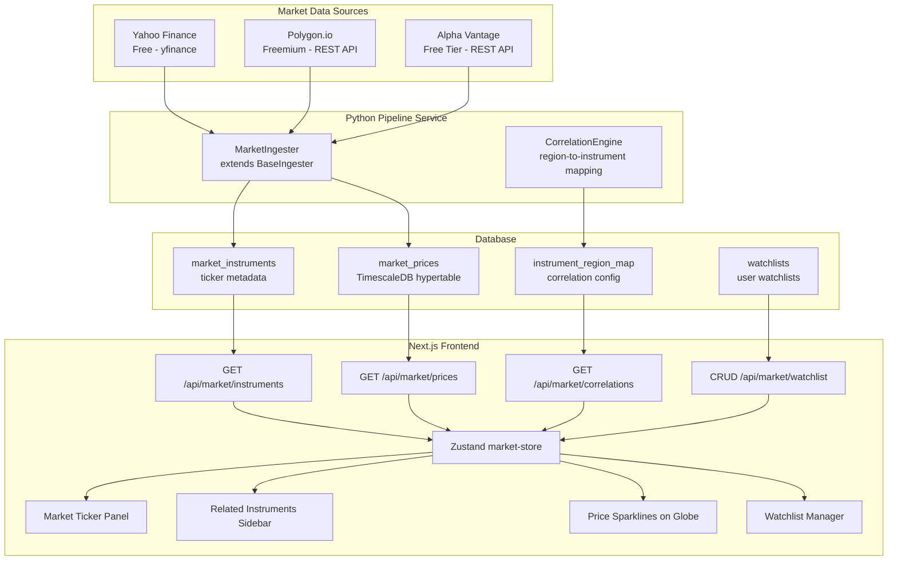

# Meridian — Phase 3: Market Data Integration

## Goal

Connect the geospatial intelligence layers (aircraft, vessels, satellites, conflicts, GPS jamming, social/news) to the financial markets by integrating real-time market data, building an instrument-to-region correlation map, and surfacing affected financial instruments when analysts click on geospatial events. This phase transforms Meridian from a situational awareness tool into an actionable trading intelligence platform — the "what is happening" becomes "what it means for your portfolio."

---

## Why This Phase Exists

Phases 1–2.5 answer **"what is physically happening in the world."** Phase 3 answers **"what does it mean for markets."** A GPS jamming event in the Strait of Hormuz is interesting to a defense analyst but *actionable* to a commodities trader watching WTI crude. A conflict escalation near Taiwan is geopolitical news until you see TSM and SOXX reacting in real-time. The instrument-to-region correlation map is the highest-value feature in the entire Meridian platform — it is the bridge between physical world intelligence and financial decision-making.

---

## Architecture Overview



---

## Data Source Details

### Source 1: Yahoo Finance via `yfinance` (Free — Recommended for MVP)

| Property | Value |
|----------|-------|
| **Library** | `yfinance` Python package (wraps Yahoo Finance endpoints) |
| **Auth** | None required |
| **Rate Limit** | Unofficial; ~2,000 requests/hour before throttling |
| **Data Coverage** | US/intl equities, ETFs, futures, forex, crypto, indices |
| **Latency** | 15-minute delayed quotes (free); real-time available on Yahoo Finance Premium |
| **Historical** | Full history available (daily, weekly, monthly) |
| **Intraday** | 1m, 2m, 5m, 15m, 30m, 60m, 90m intervals (last 7-60 days) |
| **Risk** | Unofficial API — may break without notice. Yahoo has historically tolerated `yfinance` usage |

**Why start here:** Zero cost, broadest coverage (stocks, ETFs, futures, forex, crypto all in one library), mature Python package with good error handling. The 15-minute delay is acceptable for a correlation/intelligence product — we are tracking trends and regime changes, not executing HFT.

### Source 2: Polygon.io (Freemium — Upgrade Path)

| Property | Value |
|----------|-------|
| **Endpoint** | `https://api.polygon.io/v2/` |
| **Auth** | API key (free tier available) |
| **Free Tier** | 5 API calls/minute, end-of-day data, 2 years history |
| **Starter** | $29/mo — unlimited calls, 15-min delayed, full history |
| **Developer** | $79/mo — real-time data, WebSocket streaming |
| **Data Coverage** | US stocks, options, forex, crypto (no futures on free tier) |
| **WebSocket** | Available on paid tiers for real-time price streaming |

**When to upgrade:** When Meridian needs real-time WebSocket price streaming or options data. The free tier is too restrictive (5 calls/min) for an MVP polling 50+ instruments.

### Source 3: Alpha Vantage (Free Tier — Supplementary)

| Property | Value |
|----------|-------|
| **Endpoint** | `https://www.alphavantage.co/query` |
| **Auth** | Free API key (registration required) |
| **Free Tier** | 25 requests/day, 5 requests/minute |
| **Premium** | $49.99/mo — 75 requests/minute |
| **Data Coverage** | US stocks, forex, crypto, commodities, economic indicators |
| **Unique Value** | Economic indicators (GDP, CPI, unemployment) — useful for macro correlation |

**Role in Meridian:** Supplementary source for economic indicators and commodity data not well-covered by Yahoo Finance. The 25 requests/day free tier limits it to daily batch pulls rather than real-time polling.

### Recommendation

| Priority | Source | Use Case | Cost |
|----------|--------|----------|------|
| **Primary** | Yahoo Finance (yfinance) | All instrument polling, intraday prices, historical data | $0 |
| **Secondary** | Alpha Vantage | Economic indicators, commodity supplements | $0 (free tier) |
| **Upgrade** | Polygon.io | Real-time WebSocket streaming (Phase 6+) | $29-79/mo |

---

## Step-by-Step Implementation

### Step 3.1 — Database Schema: Market Tables

Add new tables for instruments, prices, region-instrument correlations, and watchlists.

**File:** `database/init/004_market_schema.sql` (new)

```sql
-- Market Data Integration Schema

-- ============================================
-- Enum Types
-- ============================================

CREATE TYPE instrument_type AS ENUM (
    'stock', 'etf', 'future', 'forex', 'crypto', 'index', 'commodity'
);

CREATE TYPE market_sector AS ENUM (
    'energy', 'shipping', 'defense', 'semiconductors', 'agriculture',
    'aviation', 'metals', 'forex_majors', 'crypto', 'industrials',
    'technology', 'financials', 'other'
);

-- ============================================
-- Instruments (ticker metadata)
-- ============================================

CREATE TABLE market_instruments (
    id UUID DEFAULT uuid_generate_v4() PRIMARY KEY,
    symbol VARCHAR(20) NOT NULL UNIQUE,          -- e.g. CL=F, NVDA, ZIM
    name VARCHAR(300) NOT NULL,                   -- e.g. WTI Crude Oil Futures
    instrument_type instrument_type NOT NULL,
    sector market_sector NOT NULL,
    exchange VARCHAR(50),                          -- e.g. NYMEX, NASDAQ
    currency VARCHAR(10) DEFAULT 'USD',
    is_active BOOLEAN DEFAULT TRUE,
    metadata JSONB DEFAULT '{}',                  -- additional data: market cap, etc.
    created_at TIMESTAMPTZ NOT NULL DEFAULT NOW(),
    updated_at TIMESTAMPTZ NOT NULL DEFAULT NOW()
);

-- ============================================
-- Price History (time-series)
-- ============================================

CREATE TABLE market_prices (
    instrument_id UUID NOT NULL REFERENCES market_instruments(id),
    price DOUBLE PRECISION NOT NULL,
    open_price DOUBLE PRECISION,
    high_price DOUBLE PRECISION,
    low_price DOUBLE PRECISION,
    close_price DOUBLE PRECISION,
    volume BIGINT,
    change_pct DOUBLE PRECISION,                  -- percent change from previous close
    recorded_at TIMESTAMPTZ NOT NULL DEFAULT NOW(),

    PRIMARY KEY (instrument_id, recorded_at)
);

SELECT create_hypertable('market_prices', 'recorded_at');

-- ============================================
-- Instrument-Region Correlation Map
-- ============================================

CREATE TABLE instrument_region_map (
    id UUID DEFAULT uuid_generate_v4() PRIMARY KEY,
    region_id VARCHAR(100) NOT NULL,              -- e.g. strait_of_hormuz, taiwan_strait
    region_name VARCHAR(200) NOT NULL,            -- Display name
    region_center GEOGRAPHY(Point, 4326),         -- Center point for proximity calc
    region_radius_km DOUBLE PRECISION,            -- Approximate coverage radius
    instrument_id UUID NOT NULL REFERENCES market_instruments(id),
    sensitivity DOUBLE PRECISION DEFAULT 1.0,     -- 0.0 to 2.0: how strongly correlated
    correlation_direction VARCHAR(10) DEFAULT 'positive',  -- positive or inverse
    rationale TEXT,                                -- Why this instrument is affected
    is_active BOOLEAN DEFAULT TRUE,
    created_at TIMESTAMPTZ NOT NULL DEFAULT NOW()
);

CREATE INDEX idx_region_map_region ON instrument_region_map (region_id);
CREATE INDEX idx_region_map_instrument ON instrument_region_map (instrument_id);
CREATE INDEX idx_region_map_center ON instrument_region_map USING GIST (region_center);

-- ============================================
-- Watchlists (user-defined, Phase 6 auth)
-- ============================================

CREATE TABLE watchlists (
    id UUID DEFAULT uuid_generate_v4() PRIMARY KEY,
    user_id VARCHAR(100) DEFAULT 'anonymous',     -- Placeholder until auth in Phase 6
    name VARCHAR(200) NOT NULL DEFAULT 'Default',
    instrument_ids UUID[] NOT NULL DEFAULT '{}',
    is_default BOOLEAN DEFAULT FALSE,
    created_at TIMESTAMPTZ NOT NULL DEFAULT NOW(),
    updated_at TIMESTAMPTZ NOT NULL DEFAULT NOW()
);

CREATE INDEX idx_watchlist_user ON watchlists (user_id);

-- ============================================
-- Indexes on price data
-- ============================================

CREATE INDEX idx_prices_instrument ON market_prices (instrument_id);
CREATE INDEX idx_prices_recorded ON market_prices (recorded_at DESC);

-- ============================================
-- Continuous Aggregate: Hourly price OHLC
-- ============================================

CREATE MATERIALIZED VIEW market_prices_hourly
WITH (timescaledb.continuous) AS
SELECT
    time_bucket('1 hour', recorded_at) AS bucket,
    instrument_id,
    first(price, recorded_at) AS open_price,
    max(price) AS high_price,
    min(price) AS low_price,
    last(price, recorded_at) AS close_price,
    sum(volume) AS total_volume,
    count(*) AS data_points
FROM market_prices
GROUP BY bucket, instrument_id;
```

Also update the `layer_type` enum in `002_schema.sql`:

```sql
ALTER TYPE layer_type ADD VALUE 'market';
```

**Checklist:**
- [ ] Create `004_market_schema.sql`
- [ ] Add `market` to `layer_type` enum
- [ ] Run migration against dev database
- [ ] Seed `market_instruments` with initial instrument set
- [ ] Seed `instrument_region_map` with correlation mappings

---

### Step 3.2 — Instrument-to-Region Correlation Map (KEY FEATURE)

This is the core differentiator. A configurable mapping from geospatial regions/event zones to the financial instruments they affect. This mapping powers the "Related Instruments" panel, correlation scoring, and price sparklines on the globe.

**Seed data for `instrument_region_map`:**

**File:** `database/seeds/market_correlations.sql` (new)

```sql
-- =============================================
-- Strait of Hormuz — Oil & Tanker Stocks
-- =============================================
-- 20% of global oil passes through Hormuz.
-- Disruptions spike crude prices and tanker rates.

INSERT INTO instrument_region_map
    (region_id, region_name, region_center, region_radius_km, instrument_id, sensitivity, correlation_direction, rationale)
VALUES
    ('strait_of_hormuz', 'Strait of Hormuz',
     ST_SetSRID(ST_MakePoint(56.3, 26.6), 4326), 150,
     (SELECT id FROM market_instruments WHERE symbol = 'CL=F'),
     1.8, 'positive', 'WTI crude spikes on Hormuz disruption — 20% of global oil transits here'),

    ('strait_of_hormuz', 'Strait of Hormuz',
     ST_SetSRID(ST_MakePoint(56.3, 26.6), 4326), 150,
     (SELECT id FROM market_instruments WHERE symbol = 'BZ=F'),
     1.9, 'positive', 'Brent crude even more sensitive — reflects global benchmark pricing'),

    ('strait_of_hormuz', 'Strait of Hormuz',
     ST_SetSRID(ST_MakePoint(56.3, 26.6), 4326), 150,
     (SELECT id FROM market_instruments WHERE symbol = 'FRO'),
     1.5, 'positive', 'Frontline tanker rates surge when Hormuz risk rises'),

    ('strait_of_hormuz', 'Strait of Hormuz',
     ST_SetSRID(ST_MakePoint(56.3, 26.6), 4326), 150,
     (SELECT id FROM market_instruments WHERE symbol = 'STNG'),
     1.5, 'positive', 'Scorpio Tankers benefits from elevated shipping rates'),

    ('strait_of_hormuz', 'Strait of Hormuz',
     ST_SetSRID(ST_MakePoint(56.3, 26.6), 4326), 150,
     (SELECT id FROM market_instruments WHERE symbol = 'TNK'),
     1.4, 'positive', 'Teekay Tankers — smaller cap, higher beta to tanker rates');

-- =============================================
-- Suez Canal — Container Shipping
-- =============================================
-- 12% of global trade transits Suez.
-- Blockages reroute ships around Cape of Good Hope (+10 days).

INSERT INTO instrument_region_map
    (region_id, region_name, region_center, region_radius_km, instrument_id, sensitivity, correlation_direction, rationale)
VALUES
    ('suez_canal', 'Suez Canal',
     ST_SetSRID(ST_MakePoint(32.3, 30.5), 4326), 100,
     (SELECT id FROM market_instruments WHERE symbol = 'ZIM'),
     1.7, 'positive', 'ZIM shipping rates surge on Suez disruption — container rates spike'),

    ('suez_canal', 'Suez Canal',
     ST_SetSRID(ST_MakePoint(32.3, 30.5), 4326), 100,
     (SELECT id FROM market_instruments WHERE symbol = 'MATX'),
     1.4, 'positive', 'Matson — Pacific-focused but benefits from global rate environment'),

    ('suez_canal', 'Suez Canal',
     ST_SetSRID(ST_MakePoint(32.3, 30.5), 4326), 100,
     (SELECT id FROM market_instruments WHERE symbol = 'APMM.CO'),
     1.6, 'positive', 'Maersk — largest container line, direct Suez exposure');

-- =============================================
-- South China Sea — Semiconductors & Rare Earth
-- =============================================
-- Key shipping lane for semiconductor supply chain.
-- Tensions affect chip stocks and rare earth ETFs.

INSERT INTO instrument_region_map
    (region_id, region_name, region_center, region_radius_km, instrument_id, sensitivity, correlation_direction, rationale)
VALUES
    ('south_china_sea', 'South China Sea',
     ST_SetSRID(ST_MakePoint(114.0, 12.0), 4326), 800,
     (SELECT id FROM market_instruments WHERE symbol = 'NVDA'),
     1.3, 'inverse', 'NVIDIA supply chain risk — GPUs transit SCS routes'),

    ('south_china_sea', 'South China Sea',
     ST_SetSRID(ST_MakePoint(114.0, 12.0), 4326), 800,
     (SELECT id FROM market_instruments WHERE symbol = 'TSM'),
     1.7, 'inverse', 'TSMC — most exposed; Taiwan proximity + SCS shipping lanes'),

    ('south_china_sea', 'South China Sea',
     ST_SetSRID(ST_MakePoint(114.0, 12.0), 4326), 800,
     (SELECT id FROM market_instruments WHERE symbol = 'ASML'),
     1.2, 'inverse', 'ASML — lithography monopoly, supply chain depends on SCS stability'),

    ('south_china_sea', 'South China Sea',
     ST_SetSRID(ST_MakePoint(114.0, 12.0), 4326), 800,
     (SELECT id FROM market_instruments WHERE symbol = 'REMX'),
     1.5, 'inverse', 'Rare Earth ETF — China dominates rare earth processing');

-- =============================================
-- Taiwan Strait — Semiconductor Concentration Risk
-- =============================================
-- TSMC produces 90% of advanced chips.
-- Military escalation here is a global economic risk event.

INSERT INTO instrument_region_map
    (region_id, region_name, region_center, region_radius_km, instrument_id, sensitivity, correlation_direction, rationale)
VALUES
    ('taiwan_strait', 'Taiwan Strait',
     ST_SetSRID(ST_MakePoint(119.5, 24.0), 4326), 200,
     (SELECT id FROM market_instruments WHERE symbol = 'TSM'),
     2.0, 'inverse', 'TSMC is ground zero — 90% of advanced chips manufactured in Taiwan'),

    ('taiwan_strait', 'Taiwan Strait',
     ST_SetSRID(ST_MakePoint(119.5, 24.0), 4326), 200,
     (SELECT id FROM market_instruments WHERE symbol = 'AAPL'),
     1.4, 'inverse', 'Apple — massive TSMC dependency for A-series and M-series chips'),

    ('taiwan_strait', 'Taiwan Strait',
     ST_SetSRID(ST_MakePoint(119.5, 24.0), 4326), 200,
     (SELECT id FROM market_instruments WHERE symbol = 'SOXX'),
     1.8, 'inverse', 'iShares Semiconductor ETF — broad semiconductor basket'),

    ('taiwan_strait', 'Taiwan Strait',
     ST_SetSRID(ST_MakePoint(119.5, 24.0), 4326), 200,
     (SELECT id FROM market_instruments WHERE symbol = 'SMH'),
     1.8, 'inverse', 'VanEck Semiconductor ETF — alternative broad semi exposure');

-- =============================================
-- Black Sea — Agricultural Commodities
-- =============================================
-- Ukraine + Russia = 30% of global wheat exports.
-- Black Sea disruption spikes grain futures.

INSERT INTO instrument_region_map
    (region_id, region_name, region_center, region_radius_km, instrument_id, sensitivity, correlation_direction, rationale)
VALUES
    ('black_sea', 'Black Sea',
     ST_SetSRID(ST_MakePoint(34.0, 43.5), 4326), 500,
     (SELECT id FROM market_instruments WHERE symbol = 'ZW=F'),
     1.9, 'positive', 'Wheat futures — Ukraine is top-5 global wheat exporter'),

    ('black_sea', 'Black Sea',
     ST_SetSRID(ST_MakePoint(34.0, 43.5), 4326), 500,
     (SELECT id FROM market_instruments WHERE symbol = 'ZC=F'),
     1.4, 'positive', 'Corn futures — Ukraine is major corn exporter'),

    ('black_sea', 'Black Sea',
     ST_SetSRID(ST_MakePoint(34.0, 43.5), 4326), 500,
     (SELECT id FROM market_instruments WHERE symbol = 'WEAT'),
     1.7, 'positive', 'Teucrium Wheat Fund ETF — direct wheat exposure');

-- =============================================
-- Red Sea / Gulf of Aden — Shipping & Oil
-- =============================================
-- Houthi attacks forced major rerouting since 2023.
-- Container rates 3-4x when Red Sea is disrupted.

INSERT INTO instrument_region_map
    (region_id, region_name, region_center, region_radius_km, instrument_id, sensitivity, correlation_direction, rationale)
VALUES
    ('red_sea', 'Red Sea / Gulf of Aden',
     ST_SetSRID(ST_MakePoint(42.0, 14.0), 4326), 600,
     (SELECT id FROM market_instruments WHERE symbol = 'BDRY'),
     1.8, 'positive', 'Breakwave Dry Bulk Shipping ETF — direct shipping rate exposure'),

    ('red_sea', 'Red Sea / Gulf of Aden',
     ST_SetSRID(ST_MakePoint(42.0, 14.0), 4326), 600,
     (SELECT id FROM market_instruments WHERE symbol = 'ZIM'),
     1.6, 'positive', 'ZIM — Israeli shipping line, directly affected by Red Sea disruption'),

    ('red_sea', 'Red Sea / Gulf of Aden',
     ST_SetSRID(ST_MakePoint(42.0, 14.0), 4326), 600,
     (SELECT id FROM market_instruments WHERE symbol = 'CL=F'),
     1.2, 'positive', 'Oil prices rise on Red Sea tension — alternate routes add cost');

-- =============================================
-- GPS Jamming Zones — Aviation
-- =============================================
-- GPS jamming affects flight safety and routes.
-- Concentrated in Eastern Mediterranean, Baltic, Middle East.

INSERT INTO instrument_region_map
    (region_id, region_name, region_center, region_radius_km, instrument_id, sensitivity, correlation_direction, rationale)
VALUES
    ('gps_jamming_zones', 'GPS Jamming Zones',
     ST_SetSRID(ST_MakePoint(35.0, 35.0), 4326), 1000,
     (SELECT id FROM market_instruments WHERE symbol = 'JETS'),
     1.1, 'inverse', 'US Global Jets ETF — sustained jamming disrupts airline operations'),

    ('gps_jamming_zones', 'GPS Jamming Zones',
     ST_SetSRID(ST_MakePoint(35.0, 35.0), 4326), 1000,
     (SELECT id FROM market_instruments WHERE symbol = 'LMT'),
     0.8, 'positive', 'Lockheed Martin — defense contractor, benefits from GPS threat awareness'),

    ('gps_jamming_zones', 'GPS Jamming Zones',
     ST_SetSRID(ST_MakePoint(35.0, 35.0), 4326), 1000,
     (SELECT id FROM market_instruments WHERE symbol = 'RTX'),
     0.7, 'positive', 'RTX — GPS alternative tech and defense electronics');
```

**Also create the instruments seed file:**

**File:** `database/seeds/market_instruments.sql` (new)

```sql
-- Seed: Core market instruments tracked by Meridian
-- Covers oil, shipping, semiconductors, agriculture, aviation, defense

INSERT INTO market_instruments (symbol, name, instrument_type, sector, exchange, currency) VALUES
-- Energy / Oil
('CL=F',    'WTI Crude Oil Futures',           'future',    'energy',          'NYMEX',   'USD'),
('BZ=F',    'Brent Crude Oil Futures',          'future',    'energy',          'ICE',     'USD'),
('NG=F',    'Natural Gas Futures',              'future',    'energy',          'NYMEX',   'USD'),
('XLE',     'Energy Select Sector SPDR Fund',   'etf',       'energy',          'NYSE',    'USD'),

-- Shipping / Tankers
('FRO',     'Frontline PLC',                    'stock',     'shipping',        'NYSE',    'USD'),
('STNG',    'Scorpio Tankers Inc',              'stock',     'shipping',        'NYSE',    'USD'),
('TNK',     'Teekay Tankers Ltd',               'stock',     'shipping',        'NYSE',    'USD'),
('ZIM',     'ZIM Integrated Shipping',          'stock',     'shipping',        'NYSE',    'USD'),
('MATX',    'Matson Inc',                       'stock',     'shipping',        'NYSE',    'USD'),
('BDRY',    'Breakwave Dry Bulk Shipping ETF',  'etf',       'shipping',        'NYSE',    'USD'),
('APMM.CO','AP Moller-Maersk',                 'stock',     'shipping',        'CPH',     'DKK'),

-- Semiconductors
('NVDA',    'NVIDIA Corporation',               'stock',     'semiconductors',  'NASDAQ',  'USD'),
('TSM',     'Taiwan Semiconductor Mfg',         'stock',     'semiconductors',  'NYSE',    'USD'),
('ASML',    'ASML Holding NV',                  'stock',     'semiconductors',  'NASDAQ',  'USD'),
('SOXX',    'iShares Semiconductor ETF',        'etf',       'semiconductors',  'NASDAQ',  'USD'),
('SMH',     'VanEck Semiconductor ETF',         'etf',       'semiconductors',  'NASDAQ',  'USD'),

-- Agriculture
('ZW=F',    'Wheat Futures',                    'future',    'agriculture',     'CBOT',    'USD'),
('ZC=F',    'Corn Futures',                     'future',    'agriculture',     'CBOT',    'USD'),
('ZS=F',    'Soybean Futures',                  'future',    'agriculture',     'CBOT',    'USD'),
('WEAT',    'Teucrium Wheat Fund',              'etf',       'agriculture',     'NYSE',    'USD'),

-- Aviation
('JETS',    'US Global Jets ETF',               'etf',       'aviation',        'NYSE',    'USD'),

-- Defense
('LMT',     'Lockheed Martin Corporation',      'stock',     'defense',         'NYSE',    'USD'),
('RTX',     'RTX Corporation',                  'stock',     'defense',         'NYSE',    'USD'),
('NOC',     'Northrop Grumman Corporation',     'stock',     'defense',         'NYSE',    'USD'),
('ITA',     'iShares US Aerospace & Defense ETF','etf',      'defense',         'NYSE',    'USD'),

-- Rare Earth / Metals
('REMX',    'VanEck Rare Earth/Strategic Metals ETF', 'etf', 'metals',         'NYSE',    'USD'),
('GLD',     'SPDR Gold Shares',                 'etf',       'metals',          'NYSE',    'USD'),
('GC=F',    'Gold Futures',                     'future',    'metals',          'COMEX',   'USD'),

-- Broad Market (for context)
('SPY',     'SPDR S&P 500 ETF Trust',           'etf',       'other',           'NYSE',    'USD'),
('QQQ',     'Invesco QQQ Trust',                'etf',       'technology',      'NASDAQ',  'USD'),
('VIX',     'CBOE Volatility Index',            'index',     'other',           'CBOE',    'USD'),

-- Crypto
('BTC-USD', 'Bitcoin USD',                      'crypto',    'crypto',          'CRYPTO',  'USD'),

-- Forex
('EURUSD=X','EUR/USD',                          'forex',     'forex_majors',    'FOREX',   'USD'),
('CNY=X',   'USD/CNY',                          'forex',     'forex_majors',    'FOREX',   'CNY');
```

**Region summary table (for reference):**

| Region | Center Coordinates | Radius | Key Instruments | Primary Sector |
|--------|-------------------|--------|-----------------|----------------|
| Strait of Hormuz | 56.3°E, 26.6°N | 150km | CL=F, BZ=F, FRO, STNG, TNK | Energy / Shipping |
| Suez Canal | 32.3°E, 30.5°N | 100km | ZIM, MATX, APMM.CO | Container Shipping |
| South China Sea | 114.0°E, 12.0°N | 800km | NVDA, TSM, ASML, REMX | Semiconductors |
| Taiwan Strait | 119.5°E, 24.0°N | 200km | TSM, AAPL, SOXX, SMH | Semiconductors |
| Black Sea | 34.0°E, 43.5°N | 500km | ZW=F, ZC=F, WEAT | Agriculture |
| Red Sea / Gulf of Aden | 42.0°E, 14.0°N | 600km | BDRY, ZIM, CL=F | Shipping / Energy |
| GPS Jamming Zones | 35.0°E, 35.0°N | 1000km | JETS, LMT, RTX | Aviation / Defense |

**Checklist:**
- [ ] Create seed file for instruments
- [ ] Create seed file for region-instrument correlations
- [ ] Document each correlation with rationale
- [ ] Verify all ticker symbols are valid with Yahoo Finance

---

### Step 3.3 — Pipeline Config: Add Market API Settings

**File:** `services/pipeline/config.py` (modify)

Add these fields to the existing `Settings` class:

```python
# Market data API keys
YAHOO_FINANCE_ENABLED: bool = True              # Primary source (free)
POLYGON_API_KEY: str = ""                        # Secondary source (freemium)
ALPHA_VANTAGE_API_KEY: str = ""                  # Supplementary source (free tier)

# Market data polling
MARKET_INTERVAL: int = 60                        # 60 seconds for free tier
MARKET_INSTRUMENTS_FILE: str = ""                # Optional: path to custom instruments JSON
MARKET_MAX_BATCH_SIZE: int = 20                  # Max tickers per batch request
```

**Checklist:**
- [ ] Add config fields to `Settings` class
- [ ] Add corresponding env vars to `.env.local.example`
- [ ] Document API key setup in README

---

### Step 3.4 — Python Ingester: `MarketIngester`

**File:** `services/pipeline/ingesters/market.py` (new)

Follows the same `BaseIngester` pattern as `acled.py` and `social.py`. Uses `yfinance` as primary data source with Polygon.io and Alpha Vantage as fallbacks.

```python
class MarketIngester(BaseIngester):
    """
    Fetches market price data for tracked instruments.
    Primary: Yahoo Finance (yfinance) — free, broad coverage.
    Fallback: Polygon.io / Alpha Vantage for specific data gaps.
    
    Batches requests to stay within rate limits.
    Polls at 60s intervals for the active instrument set.
    """

    def __init__(self, interval_seconds: int = 60):
        super().__init__("market", interval_seconds)
        self.tracked_symbols: list[str] = []  # Loaded from DB or config

    async def fetch(self) -> list[dict[str, Any]]:
        """Fetch current prices for all tracked instruments."""
        results = []
        for batch in self._chunk_symbols(self.tracked_symbols):
            try:
                batch_data = await self._fetch_yahoo_batch(batch)
                results.extend(batch_data)
            except Exception as e:
                self.logger.warning(f"Yahoo batch failed: {e}")
                # Fallback to individual fetches
                for symbol in batch:
                    try:
                        data = await self._fetch_yahoo_single(symbol)
                        results.append(data)
                    except Exception:
                        pass
        return results if results else self._get_sample_data()

    async def _fetch_yahoo_batch(self, symbols: list[str]) -> list[dict]:
        """Fetch batch of tickers using yfinance.download()."""
        ...

    async def _fetch_yahoo_single(self, symbol: str) -> dict:
        """Fetch single ticker as fallback."""
        ...

    async def _fetch_polygon(self, symbol: str) -> dict:
        """Fetch from Polygon.io REST API (fallback)."""
        ...

    async def _fetch_alpha_vantage(self, symbol: str) -> dict:
        """Fetch from Alpha Vantage (supplementary)."""
        ...

    async def normalize(self, raw_data: list[dict]) -> list[dict]:
        """Normalize into unified price format matching market_prices table."""
        ...

    def _chunk_symbols(self, symbols: list[str], size: int = 20) -> list[list[str]]:
        """Split symbol list into batches for rate limiting."""
        return [symbols[i:i+size] for i in range(0, len(symbols), size)]

    @staticmethod
    def _get_sample_data() -> list[dict]:
        """Sample market data for development when no API is available."""
        ...
```

**Key design decisions:**
- Batch fetching via `yfinance.download()` to minimize request count
- Graceful degradation: batch fails → retry individually → sample data
- Symbol list loaded from DB (`market_instruments` table) on startup
- Separate methods per data source for testability
- `_chunk_symbols` respects rate limits

**Checklist:**
- [ ] Create `market.py` ingester extending `BaseIngester`
- [ ] Implement `yfinance` batch fetching
- [ ] Implement `yfinance` single-ticker fallback
- [ ] Implement Polygon.io REST client (behind feature flag)
- [ ] Implement Alpha Vantage client (for economic indicators)
- [ ] Add sample data method for development
- [ ] Register ingester in `main.py` scheduler
- [ ] Add `yfinance` to `requirements.txt`

---

### Step 3.5 — TypeScript Types: Market Data Interfaces

**File:** `lib/types/market.ts` (new)

```typescript
/**
 * Market data types for Phase 3 — Market Data Integration
 */

export type InstrumentType = "stock" | "etf" | "future" | "forex" | "crypto" | "index" | "commodity";

export type MarketSector =
    | "energy" | "shipping" | "defense" | "semiconductors" | "agriculture"
    | "aviation" | "metals" | "forex_majors" | "crypto" | "industrials"
    | "technology" | "financials" | "other";

/**
 * A tracked financial instrument (ticker)
 */
export interface MarketInstrument {
    id: string;
    symbol: string;               // e.g. CL=F, NVDA
    name: string;                 // e.g. WTI Crude Oil Futures
    instrumentType: InstrumentType;
    sector: MarketSector;
    exchange: string;
    currency: string;
    isActive: boolean;
    metadata: Record<string, unknown>;
}

/**
 * A single price data point
 */
export interface PricePoint {
    instrumentId: string;
    symbol: string;               // Denormalized for convenience
    price: number;
    open: number | null;
    high: number | null;
    low: number | null;
    close: number | null;
    volume: number | null;
    changePct: number;            // Percent change from previous close
    recordedAt: string;           // ISO 8601
}

/**
 * Sparkline data: array of price points for rendering mini charts
 */
export interface SparklineData {
    symbol: string;
    name: string;
    points: { time: string; price: number }[];
    changePct: number;
    currentPrice: number;
}

/**
 * Mapping from a geospatial region to an affected financial instrument
 */
export interface InstrumentCorrelation {
    regionId: string;
    regionName: string;
    regionCenter: [number, number];  // [lng, lat]
    regionRadiusKm: number;
    instrument: MarketInstrument;
    sensitivity: number;             // 0.0 - 2.0
    correlationDirection: "positive" | "inverse";
    rationale: string;
}

/**
 * Correlation score computed for a specific event-instrument pair
 */
export interface CorrelationScore {
    eventId: string;
    instrumentId: string;
    symbol: string;
    score: number;                   // 0.0 - 10.0 composite score
    severity: number;                // Event severity component
    sensitivity: number;             // Instrument sensitivity component
    proximity: number;               // Distance-based component
    direction: "positive" | "inverse";
    rationale: string;
}

/**
 * User watchlist
 */
export interface Watchlist {
    id: string;
    userId: string;
    name: string;
    instrumentIds: string[];
    isDefault: boolean;
    createdAt: string;
    updatedAt: string;
}

/**
 * Real-time instrument state: instrument + latest price + sparkline
 */
export interface InstrumentWithPrice extends MarketInstrument {
    latestPrice: PricePoint | null;
    sparkline: SparklineData | null;
}
```

Also update `LayerType` in `lib/types/geo-event.ts`:

```typescript
export type LayerType = "aircraft" | "vessel" | "satellite" | "conflict" | "gps-jamming" | "social" | "market";
```

**Checklist:**
- [ ] Create `lib/types/market.ts` with all interfaces
- [ ] Add `"market"` to `LayerType` union in `geo-event.ts`
- [ ] Add market layer to `DEFAULT_LAYERS` in `geo-event.ts`

---

### Step 3.6 — Next.js API Routes: Market Data Endpoints

Four new API routes for market data:

#### 3.6.1 — `GET /api/market/instruments`

**File:** `app/api/market/instruments/route.ts` (new)

```typescript
// GET /api/market/instruments?sector=energy&type=future
//
// Query params:
//   sector  — filter by MarketSector (optional)
//   type    — filter by InstrumentType (optional)
//
// Response: { instruments: MarketInstrument[], isSampleData: boolean }
```

Returns all tracked instruments. Initially hardcoded from the seed data, later connected to DB.

#### 3.6.2 — `GET /api/market/prices`

**File:** `app/api/market/prices/route.ts` (new)

```typescript
// GET /api/market/prices?symbols=CL=F,NVDA,TSM&period=1d&interval=5m
//
// Query params:
//   symbols  — comma-separated ticker symbols (required)
//   period   — 1d, 5d, 1mo, 3mo, 6mo, 1y, ytd (default: 1d)
//   interval — 1m, 5m, 15m, 1h, 1d (default: 5m for intraday)
//
// Response: { prices: Record<string, PricePoint[]>, isSampleData: boolean }
```

Fetches price data. For MVP, proxies directly to Yahoo Finance; later reads from the `market_prices` hypertable.

#### 3.6.3 — `GET /api/market/correlations`

**File:** `app/api/market/correlations/route.ts` (new)

```typescript
// GET /api/market/correlations?regionId=strait_of_hormuz
// GET /api/market/correlations?lat=26.6&lng=56.3&radius=200
// GET /api/market/correlations?eventId=conflict-123
//
// Query params (one of):
//   regionId — lookup by predefined region ID
//   lat,lng,radius — lookup by proximity to a point
//   eventId — lookup correlations for a specific geo-event
//
// Response: {
//   correlations: InstrumentCorrelation[],
//   scores: CorrelationScore[] (if eventId provided),
//   isSampleData: boolean
// }
```

The most important endpoint — returns which instruments are affected by a given region or event, with correlation scores.

#### 3.6.4 — `CRUD /api/market/watchlist`

**File:** `app/api/market/watchlist/route.ts` (new)

```typescript
// GET  /api/market/watchlist              — Get user watchlist(s)
// POST /api/market/watchlist              — Create/update watchlist
//   Body: { name: string, instrumentIds: string[] }
// DELETE /api/market/watchlist?id=xxx     — Remove watchlist
//
// Response: { watchlists: Watchlist[], isSampleData: boolean }
```

Initially backed by localStorage on the frontend; this API route is the upgrade path for DB-backed persistence when auth is added in Phase 6.

**Checklist:**
- [ ] Create `/api/market/instruments/route.ts` with sample data
- [ ] Create `/api/market/prices/route.ts` with Yahoo Finance proxy
- [ ] Create `/api/market/correlations/route.ts` with correlation lookup
- [ ] Create `/api/market/watchlist/route.ts` with CRUD operations
- [ ] Add caching layer (in-memory, matching conflict route pattern)
- [ ] Add request timeout handling

---

### Step 3.7 — Frontend Service: `market.ts`

**File:** `lib/services/market.ts` (new)

Fetch client following the pattern in `lib/services/conflicts.ts`:

```typescript
export const MARKET_POLLING = {
    PRICES: 60_000,          // 60 seconds — price updates
    INSTRUMENTS: 3600_000,   // 1 hour — instrument list refresh
    CORRELATIONS: 300_000,   // 5 minutes — correlation data
} as const;

export async function fetchInstruments(params?: {
    sector?: MarketSector;
    type?: InstrumentType;
}): Promise<{ instruments: MarketInstrument[]; isSampleData: boolean }> { ... }

export async function fetchPrices(params: {
    symbols: string[];
    period?: string;
    interval?: string;
}): Promise<{ prices: Record<string, PricePoint[]>; isSampleData: boolean }> { ... }

export async function fetchCorrelations(params: {
    regionId?: string;
    lat?: number;
    lng?: number;
    radius?: number;
    eventId?: string;
}): Promise<{ correlations: InstrumentCorrelation[]; scores: CorrelationScore[] }> { ... }

export async function fetchWatchlist(): Promise<{ watchlists: Watchlist[] }> { ... }
export async function saveWatchlist(watchlist: Partial<Watchlist>): Promise<Watchlist> { ... }
export async function deleteWatchlist(id: string): Promise<void> { ... }
```

**Checklist:**
- [ ] Create `lib/services/market.ts`
- [ ] Implement all fetch functions
- [ ] Export polling constants
- [ ] Add error handling with typed responses

---

### Step 3.8 — Zustand Store: `market-store.ts` (NEW — Separate Store)

**File:** `lib/stores/market-store.ts` (new)

**Design decision:** Create a **separate store** rather than adding to the already-large `data-store.ts`. The market store has fundamentally different concerns (watchlists, correlations, sparklines) that would bloat the data store.

```typescript
import { create } from "zustand";
import { useShallow } from "zustand/react/shallow";
import type {
    MarketInstrument,
    PricePoint,
    SparklineData,
    InstrumentCorrelation,
    CorrelationScore,
    Watchlist,
    InstrumentWithPrice,
} from "@/lib/types/market";

interface MarketState {
    // Instruments
    instruments: MarketInstrument[];
    instrumentsLoading: boolean;

    // Prices (keyed by symbol)
    prices: Record<string, PricePoint[]>;
    latestPrices: Record<string, PricePoint>;
    pricesLoading: boolean;

    // Sparklines (keyed by symbol)
    sparklines: Record<string, SparklineData>;

    // Correlations (keyed by regionId)
    correlations: Record<string, InstrumentCorrelation[]>;
    activeCorrelationScores: CorrelationScore[];

    // Watchlist
    watchlists: Watchlist[];
    activeWatchlistId: string | null;

    // Polling
    pollingIntervals: Record<string, ReturnType<typeof setInterval> | null>;

    // Actions
    fetchInstruments: () => Promise<void>;
    fetchPrices: (symbols: string[]) => Promise<void>;
    fetchCorrelationsForRegion: (regionId: string) => Promise<void>;
    fetchCorrelationsForEvent: (eventId: string) => Promise<void>;
    fetchSparklines: (symbols: string[]) => Promise<void>;

    // Watchlist actions
    loadWatchlists: () => void;         // From localStorage initially
    saveWatchlist: (watchlist: Partial<Watchlist>) => void;
    removeFromWatchlist: (symbol: string) => void;
    addToWatchlist: (symbol: string) => void;

    // Polling actions
    startPricePolling: () => void;
    stopPricePolling: () => void;

    // Computed / derived
    getInstrumentBySymbol: (symbol: string) => MarketInstrument | undefined;
    getInstrumentsWithPrices: () => InstrumentWithPrice[];
    getWatchlistInstruments: () => InstrumentWithPrice[];
    getTrendingInstruments: () => InstrumentWithPrice[];
}
```

**Watchlist persistence strategy:**
1. **Phase 3 (now):** `localStorage` — no auth required, instant persistence
2. **Phase 6 (later):** Migrate to DB-backed API when authentication is added
3. **Migration path:** On first authenticated login, sync localStorage watchlist to DB

**Checklist:**
- [ ] Create `lib/stores/market-store.ts`
- [ ] Implement instrument fetching and caching
- [ ] Implement price fetching with batch support
- [ ] Implement correlation lookups
- [ ] Implement sparkline data derivation from price history
- [ ] Implement watchlist CRUD with localStorage
- [ ] Implement price polling at 60s intervals
- [ ] Add selector hooks: `useMarketInstruments()`, `useWatchlist()`, `useCorrelationsForRegion()`
- [ ] Add `useInstrumentPrice(symbol)` selector

---

### Step 3.9 — UI: Market Ticker Panel

**File:** `components/market/market-ticker.tsx` (new directory + component)

A collapsible panel (similar to the Intel Feed drawer) showing live market data. Positioned as a top bar or right-side panel.

**Panel anatomy:**
```
┌──────────────────────────────────────────────────────────────────────┐
│ 📊 Markets                                       ▼ Collapse         │
│ ─────────────────────────────────────────────────────────────────── │
│ WATCHLIST                                                           │
│ CL=F   $72.45  ▲ +1.23%  ━━━━━━╱╲━━━━                             │
│ NVDA   $892.30 ▼ -0.45%  ━━╲╱━━━━━━━                              │
│ ZIM    $18.76  ▲ +5.67%  ━━━━━━━╱━━━                              │
│ ─────────────────────────────────────────────────────────────────── │
│ TRENDING (highest absolute % change in tracked instruments)         │
│ BZ=F   $76.12  ▲ +2.34%  ━━━━━╱╱╲━━                               │
│ TSM    $156.80 ▼ -1.89%  ━━╲━━━━━━━                               │
│ WEAT   $5.43   ▲ +3.21%  ━━━━━╱━━━━                               │
│ ─────────────────────────────────────────────────────────────────── │
│ + Add to Watchlist                                                  │
└──────────────────────────────────────────────────────────────────────┘
```

**Features:**
- Collapsible/expandable panel
- Two sections: Watchlist (user-configured) + Trending (auto-sorted by absolute change %)
- Each row: Symbol, current price, change % (green/red), mini sparkline (SVG or canvas)
- Click instrument → fly globe to associated region + show correlation details
- "Add to Watchlist" button → instrument picker modal
- Sector grouping toggle (group by energy/shipping/semis/etc.)
- Auto-refresh at 60s intervals

**Checklist:**
- [ ] Create `components/market/` directory
- [ ] Build `market-ticker.tsx` main panel component
- [ ] Build `instrument-row.tsx` row component with sparkline
- [ ] Build `sparkline-chart.tsx` lightweight SVG sparkline component
- [ ] Build `instrument-picker.tsx` modal for adding to watchlist
- [ ] Wire to market store
- [ ] Add collapse/expand animation
- [ ] Integrate into main layout

---

### Step 3.10 — UI: Related Instruments Sidebar Section

**File:** `components/sidebar/related-instruments.tsx` (new)

When a user clicks a geospatial event (conflict, GPS jamming zone, vessel in a chokepoint), show the correlated financial instruments in the sidebar. This is the core UX that bridges geospatial and market intelligence.

**Section anatomy (embedded in existing sidebar detail views):**
```
┌─────────────────────────────────────────────────────┐
│ 📈 Related Instruments                               │
│ ────────────────────────────────────────────────────│
│ Region: Strait of Hormuz                             │
│ ────────────────────────────────────────────────────│
│ CL=F  WTI Crude         $72.45  ▲1.23%  ●●●●○      │
│   Sensitivity: Very High (1.8)  |  Direction: ↑     │
│   Hormuz disruption → crude spike (20% of oil)      │
│ ────────────────────────────────────────────────────│
│ BZ=F  Brent Crude        $76.12  ▲2.34%  ●●●●●     │
│   Sensitivity: Critical (1.9)   |  Direction: ↑     │
│   Brent even more sensitive — global benchmark      │
│ ────────────────────────────────────────────────────│
│ FRO   Frontline           $22.10  ▲0.87%  ●●●○○    │
│   Sensitivity: High (1.5)       |  Direction: ↑     │
│   Tanker rates surge on Hormuz risk                  │
│ ────────────────────────────────────────────────────│
│ [+ Add all to Watchlist]                             │
└─────────────────────────────────────────────────────┘
```

**Implementation approach:**
1. When a conflict/GPS jamming/vessel event is selected, compute which regions it falls within (proximity to region centers)
2. Fetch correlations for those regions via `fetchCorrelationsForEvent(eventId)`
3. Compute correlation scores: `severity × sensitivity × proximity_factor`
4. Sort by score descending, display in sidebar section
5. Show sensitivity dots (1-5 scale), direction indicator, rationale text

**Also update these existing sidebar components:**
- `entity-details-multi.tsx` — Add `<RelatedInstruments>` section to conflict, GPS jamming, and vessel detail views
- `sidebar.tsx` — Pass event data to related instruments component

**Checklist:**
- [ ] Create `components/sidebar/related-instruments.tsx`
- [ ] Implement region proximity calculation
- [ ] Implement correlation score computation
- [ ] Build sensitivity indicator (dot scale)
- [ ] Add "Add all to Watchlist" action
- [ ] Integrate into `entity-details-multi.tsx` for relevant entity types
- [ ] Wire to market store for live prices

---

### Step 3.11 — Correlation Scoring Engine

**File:** `lib/utils/correlation-scoring.ts` (new)

The algorithm that computes how strongly a geospatial event affects a financial instrument.

```typescript
/**
 * Correlation Score = severity × sensitivity × proximity_factor
 *
 * Components:
 *   severity (0.0 - 2.0):
 *     Derived from event severity level:
 *     critical=2.0, high=1.5, medium=1.0, low=0.5, info=0.2
 *
 *   sensitivity (0.0 - 2.0):
 *     From instrument_region_map.sensitivity
 *     How responsive this instrument historically is to events in this region
 *
 *   proximity_factor (0.0 - 1.0):
 *     1.0 if event is within region radius
 *     Decays linearly from 1.0 to 0.0 over 2x the region radius
 *     0.0 if event is beyond 2x region radius
 *
 * Final score: 0.0 to 4.0, normalized to 0.0 - 10.0 for display
 */

export function computeCorrelationScore(params: {
    eventSeverity: Severity;
    instrumentSensitivity: number;
    eventLat: number;
    eventLng: number;
    regionCenterLat: number;
    regionCenterLng: number;
    regionRadiusKm: number;
}): number { ... }

export function severityToNumeric(severity: Severity): number { ... }

export function distanceKm(
    lat1: number, lng1: number,
    lat2: number, lng2: number
): number { ... }  // Haversine formula

export function proximityFactor(
    distanceKm: number,
    regionRadiusKm: number
): number { ... }
```

**Checklist:**
- [ ] Create `lib/utils/correlation-scoring.ts`
- [ ] Implement Haversine distance calculation
- [ ] Implement proximity decay function
- [ ] Implement severity-to-numeric mapping
- [ ] Implement composite score calculation
- [ ] Add unit tests for scoring functions

---

### Step 3.12 — Price Sparklines on Globe (Overlay)

**File:** `lib/cesium-layers.ts` (modify)

Render small price sparkline overlays anchored to region centers on the globe. When the market layer is toggled on, each correlated region shows a floating panel with its top instruments and sparkline charts.

**Visual concept:**
```
        ┌─────────────┐
        │ CL=F ▲1.2%  │
        │ ━━━╱╲━━━    │  ← floating above Strait of Hormuz
        │ BZ=F ▲2.3%  │
        │ ━╱╱━━━━━    │
        └──────┬──────┘
               │
               ● (region center pin)
```

**Implementation approach:**
- Use Cesium `BillboardCollection` or HTML overlay divs positioned via `Cesium.SceneTransforms.wgs84ToWindowCoordinates()`
- Render a React portal for each region with active market data
- Show top 2-3 instruments per region (by sensitivity)
- Update sparklines at the same interval as price polling (60s)
- Only render when zoom level is appropriate (hide at globe-level zoom)
- Toggle visibility with the market layer switch

**Checklist:**
- [ ] Add `renderMarketSparklines()` function to cesium-layers
- [ ] Implement region center pin markers
- [ ] Implement floating sparkline overlay (HTML overlay or Billboard)
- [ ] Add zoom-level-based visibility thresholds
- [ ] Wire to market layer toggle
- [ ] Optimize: only render visible regions within the current viewport

---

### Step 3.13 — Watchlist Feature (localStorage MVP)

**File:** `components/market/watchlist-manager.tsx` (new)

Watchlist management UI for selecting and organizing tracked instruments.

**Features:**
- Default watchlist auto-populated with top-sensitivity instruments from correlated regions
- Add/remove instruments from watchlist
- Reorder instruments via drag-and-drop (stretch)
- Multiple named watchlists (stretch)
- Persistence: `localStorage` key `meridian_watchlists`

**localStorage schema:**
```typescript
interface StoredWatchlist {
    id: string;
    name: string;
    symbols: string[];  // Store symbols, not UUIDs, for portability
    createdAt: string;
    updatedAt: string;
}

// localStorage key: "meridian_watchlists"
// Value: JSON.stringify(StoredWatchlist[])
```

**Migration path to DB (Phase 6):**
1. Check if user is authenticated
2. If yes, POST localStorage watchlists to `/api/market/watchlist`
3. Merge server-side watchlists with local (server wins on conflict)
4. Clear localStorage after successful sync
5. All subsequent reads/writes go through the API

**Checklist:**
- [ ] Build `watchlist-manager.tsx` UI component
- [ ] Implement localStorage read/write utility
- [ ] Implement "Add to Watchlist" from instrument picker
- [ ] Implement "Remove from Watchlist" action
- [ ] Add default watchlist seeding (top instruments per region)
- [ ] Document migration path to DB-backed persistence

---

## Implementation Order

```mermaid
graph TD
    S1["Step 3.1<br/>Database Schema"] --> S2["Step 3.2<br/>Correlation Map Seed Data"]
    S2 --> S3["Step 3.3<br/>Pipeline Config"]
    S3 --> S4["Step 3.4<br/>Market Ingester"]
    S4 --> S5["Step 3.5<br/>TypeScript Types"]
    S5 --> S6["Step 3.6<br/>API Routes"]
    S6 --> S7["Step 3.7<br/>Frontend Service"]
    S7 --> S8["Step 3.8<br/>Market Store"]
    S8 --> S9["Step 3.9<br/>Market Ticker Panel"]
    S8 --> S10["Step 3.10<br/>Related Instruments Sidebar"]
    S8 --> S11["Step 3.11<br/>Correlation Scoring"]
    S9 --> S12["Step 3.12<br/>Globe Sparklines"]
    S10 --> S12
    S11 --> S12
    S8 --> S13["Step 3.13<br/>Watchlist Feature"]

    style S1 fill:#1a1a2e,stroke:#00ff88
    style S2 fill:#1a1a2e,stroke:#00ff88
    style S3 fill:#1a1a2e,stroke:#00ff88
    style S4 fill:#1a1a2e,stroke:#00aaff
    style S5 fill:#1a1a2e,stroke:#00aaff
    style S6 fill:#1a1a2e,stroke:#00aaff
    style S7 fill:#1a1a2e,stroke:#aa88ff
    style S8 fill:#1a1a2e,stroke:#aa88ff
    style S9 fill:#1a1a2e,stroke:#ff6600
    style S10 fill:#1a1a2e,stroke:#ff6600
    style S11 fill:#1a1a2e,stroke:#ff6600
    style S12 fill:#1a1a2e,stroke:#ff4444
    style S13 fill:#1a1a2e,stroke:#ff4444
```



**Recommended implementation sequence:**

1. **Database + Seed Data (Steps 3.1–3.2):** Schema and correlation map first — everything depends on the data model.
2. **Pipeline Backend (Steps 3.3–3.4):** Market ingester to start pulling real price data.
3. **Types + API + Service (Steps 3.5–3.7):** TypeScript types, API routes with sample data, and frontend service. Build the full data pipeline end-to-end with sample data first.
4. **Store + UI (Steps 3.8–3.10):** Market store, ticker panel, and related instruments sidebar — the primary user-facing features.
5. **Scoring + Sparklines + Watchlist (Steps 3.11–3.13):** Advanced features that build on top of the core infrastructure.

---

## Files Changed / Created

| File | Action | Description |
|------|--------|-------------|
| `database/init/004_market_schema.sql` | **Create** | Market instruments, prices, correlations, watchlists tables |
| `database/init/002_schema.sql` | Modify | Add `market` to `layer_type` enum |
| `database/seeds/market_instruments.sql` | **Create** | Seed data for tracked instruments (~35 tickers) |
| `database/seeds/market_correlations.sql` | **Create** | Seed data for region-instrument correlation map |
| `services/pipeline/config.py` | Modify | Add market API key settings |
| `services/pipeline/requirements.txt` | Modify | Add `yfinance` |
| `services/pipeline/ingesters/market.py` | **Create** | Market data ingester (Yahoo Finance primary) |
| `services/pipeline/ingesters/__init__.py` | Modify | Export `MarketIngester` |
| `services/pipeline/main.py` | Modify | Register market ingester in scheduler |
| `lib/types/market.ts` | **Create** | MarketInstrument, PricePoint, Watchlist, etc. |
| `lib/types/geo-event.ts` | Modify | Add `market` to LayerType + DEFAULT_LAYERS |
| `lib/services/market.ts` | **Create** | Frontend API client for market endpoints |
| `lib/stores/market-store.ts` | **Create** | Separate Zustand store for market data |
| `lib/utils/correlation-scoring.ts` | **Create** | Correlation score computation utilities |
| `app/api/market/instruments/route.ts` | **Create** | Instruments list API |
| `app/api/market/prices/route.ts` | **Create** | Price data API (Yahoo Finance proxy) |
| `app/api/market/correlations/route.ts` | **Create** | Region-instrument correlation lookup API |
| `app/api/market/watchlist/route.ts` | **Create** | Watchlist CRUD API |
| `components/market/market-ticker.tsx` | **Create** | Market ticker panel component |
| `components/market/instrument-row.tsx` | **Create** | Individual instrument row with sparkline |
| `components/market/sparkline-chart.tsx` | **Create** | Lightweight SVG sparkline renderer |
| `components/market/instrument-picker.tsx` | **Create** | Modal for adding instruments to watchlist |
| `components/market/watchlist-manager.tsx` | **Create** | Watchlist management UI |
| `components/market/index.ts` | **Create** | Barrel export |
| `components/sidebar/related-instruments.tsx` | **Create** | Related instruments section for sidebar |
| `components/sidebar/entity-details-multi.tsx` | Modify | Add RelatedInstruments to event detail views |
| `components/sidebar/sidebar.tsx` | Modify | Pass event context to related instruments |
| `components/layers/layer-panel.tsx` | Modify | Add market layer toggle |
| `lib/cesium-layers.ts` | Modify | Add market sparkline overlays on globe |
| `.env.local.example` | Modify | Add POLYGON_API_KEY, ALPHA_VANTAGE_API_KEY |

---

## API Cost Estimate

| Source | Cost | Notes |
|--------|------|-------|
| Yahoo Finance (yfinance) | **$0** | Unofficial but stable; 15-min delay |
| Alpha Vantage (free tier) | **$0** | 25 requests/day; economic indicators only |
| Polygon.io (free tier) | **$0** | 5 calls/min; too limited for MVP; reserve as upgrade |
| Polygon.io (Starter) | **$29/mo** | Upgrade path: unlimited calls, 15-min delay |
| Polygon.io (Developer) | **$79/mo** | Upgrade path: real-time WebSocket streaming |

**Phase 3 budget: $0/mo** (Yahoo Finance + Alpha Vantage free tiers)

---

## Key Design Decisions

### Yahoo Finance vs Polygon.io

Yahoo Finance via `yfinance` is the clear MVP choice: zero cost, broadest data coverage (stocks + ETFs + futures + forex + crypto), and a mature Python library. The risk is that Yahoo Finance is an *unofficial* API — it could theoretically break or be rate-limited. Mitigation: abstract behind the `MarketIngester` interface so swapping to Polygon is a config change, not a rewrite.

### Separate Market Store

The `data-store.ts` already manages 5 data source slices with polling. Adding market data (instruments, prices, sparklines, correlations, watchlists) would nearly double its size and introduce fundamentally different concerns. A separate `market-store.ts` keeps both stores focused and maintainable.

### Correlation Map: Static vs Dynamic

The instrument-to-region correlation map starts as **static seed data** (hand-curated mappings based on domain expertise). This is intentional — the correlations are the product's editorial voice. In Phase 4 (Intelligence Layer), dynamic correlations can be computed by analyzing historical event-market patterns, but the static map provides immediate value and does not require ML infrastructure.

### Real-time vs Polling

Free-tier market data polling at **60-second intervals** is the Phase 3 target. This is sufficient for a correlation/intelligence product (we are not building an order execution system). Real-time WebSocket streaming via Polygon.io Developer tier ($79/mo) is the Phase 6 upgrade path when Meridian has paying users.

### Watchlist Persistence: localStorage → DB

Starting with `localStorage` removes the dependency on authentication (Phase 6). The migration path is clean: on first authenticated login, sync localStorage watchlists to the server and switch all subsequent reads/writes to the API. This lets Phase 3 ship a complete watchlist feature without blocking on auth infrastructure.

---

## Dependencies on Other Phases

- **Phase 1 (Foundation):** Must be complete — globe, sidebar, layer panel all exist ✅
- **Phase 2 (Multi-Source):** Must be complete — data store pattern, polling infrastructure, entity detail views, cesium-layers rendering ✅
- **Phase 2.5 (Social/News):** Optional — social feed provides additional event context but is not required for market data. Can be built in parallel.
- **Phase 4 (Intelligence):** Market data becomes a *key input* for the correlation engine. The `instrument_region_map` and correlation scores feed directly into signal detection (e.g., "conflict near Hormuz + oil price spike > 2% → generate Hormuz Disruption signal"). Phase 3 builds the data infrastructure that Phase 4 consumes.
- **Phase 5 (Historical Replay):** Market price history (`market_prices` hypertable) enables overlaying historical price charts alongside event timelines during replay. The sparkline infrastructure built here is reused for historical views.
- **Phase 6 (Productization):** Watchlist persistence migrates from localStorage to DB. Market data tier upgrades (Polygon.io paid plans) unlock real-time streaming for Pro/Institutional users.
