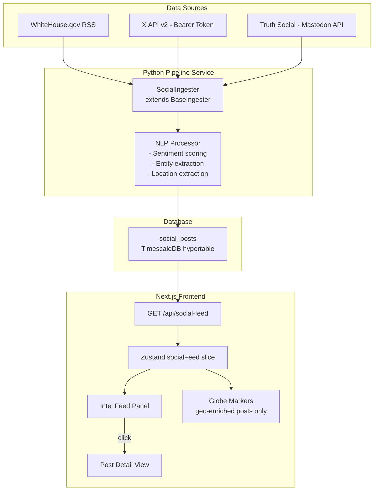
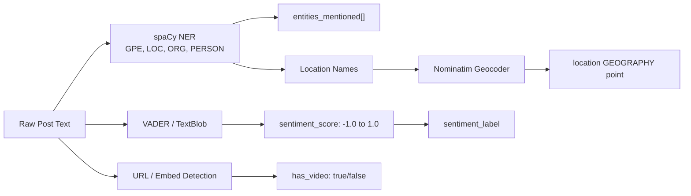

# Meridian — Phase 2.5: Social Media / News Intelligence Layer

## Goal

Integrate a real-time social media and government announcement feed into Meridian, providing analysts with the narrative context layer that explains *why* geospatial events are happening. Sources: X (Twitter) feeds about/from Trump, Trump posts on Truth Social, and White House official announcements. Posts with extractable geographic references are optionally geocoded and rendered as markers on the globe.

---

## Why This Phase Exists

The existing data layers (aircraft, vessels, satellites, conflicts, GPS jamming) answer **"what is physically happening."** Social media and government announcements answer **"what is being said about it"** — often *before* the physical data reflects it. A tariff announcement on Truth Social can move oil futures before a single ship reroutes. A military threat on X can precede GPS jamming events by hours. This layer closes the information gap.

---

## Architecture Overview



---

## Data Source Details

### Source 1: WhiteHouse.gov (Free, No API Key)

| Property | Value |
|----------|-------|
| **Endpoint** | `https://www.whitehouse.gov/feed/` |
| **Protocol** | RSS 2.0 / Atom |
| **Auth** | None |
| **Rate Limit** | Generous; poll every 2-5 minutes |
| **Content** | Press releases, executive orders, presidential statements, proclamations |
| **Reliability** | Extremely stable; government-maintained |

**Implementation:** Standard RSS parsing with `feedparser` (Python) or `rss-parser` (Node.js). Each RSS item becomes a `SocialPost` with `platform: "whitehouse"`.

**Supplementary:** The Federal Register API (`https://www.federalregister.gov/api/v1/`) provides structured JSON for executive orders and proclamations — useful for enrichment.

### Source 2: X / Twitter API v2 ($100+/month)

| Property | Value |
|----------|-------|
| **Endpoint** | `https://api.twitter.com/2/` |
| **Auth** | OAuth 2.0 Bearer Token |
| **Tier** | Basic ($100/mo) = 10K reads/month; Pro ($5K/mo) = 1M reads/month |
| **Key Endpoints** | `GET /2/users/:id/tweets` (timeline), `GET /2/tweets/search/recent` (search) |
| **Streaming** | Filtered Stream (`POST /2/tweets/search/stream/rules`) for real-time push |

**Implementation Approach:**
- **Basic tier strategy:** Poll `@realDonaldTrump` timeline every 2 minutes (≈720 reads/day = ~21K/month, slightly over Basic). Consider caching or longer intervals.
- **Pro tier strategy:** Filtered Stream with rules like `from:realDonaldTrump OR "Trump" "tariff" OR "Trump" "sanctions" OR "Trump" "military"` for real-time push.
- Extract tweet text, engagement metrics (likes, retweets, replies, quote tweets), media attachments, and linked URLs.

**Rate Limit Considerations:**
| Tier | Monthly Reads | Effective Poll Interval |
|------|--------------|------------------------|
| Basic | 10,000 | ~4.3 min per read |
| Pro | 1,000,000 | Real-time streaming viable |

### Source 3: Truth Social (No Official API — Experimental)

| Property | Value |
|----------|-------|
| **Platform** | Mastodon fork (Truth Social runs on modified Mastodon) |
| **API Attempt** | `GET /api/v1/accounts/:id/statuses` (Mastodon-compatible) |
| **Auth** | Potentially none for public profiles; may require app registration |
| **Reliability** | Low — may be blocked or rate-limited without notice |
| **Fallback 1** | RSS bridge / third-party aggregator services |
| **Fallback 2** | Puppeteer/Playwright headless scraping |

**Implementation Approach (ordered by reliability):**

1. **Mastodon API probe:** Attempt `GET https://truthsocial.com/api/v1/accounts/lookup?acct=realDonaldTrump` to get account ID, then `GET /api/v1/accounts/:id/statuses`. If it works, treat it like any REST API. If blocked, fall through.

2. **RSS bridge:** Use community-maintained Truth Social RSS bridges that scrape and expose feeds as standard RSS. Examples:
   - `https://bird.makeup/@realDonaldTrump@truthsocial.com`
   - Self-hosted Nitter-style proxies

3. **Headless scraper:** Puppeteer loads `https://truthsocial.com/@realDonaldTrump`, extracts post elements from the DOM. Most fragile option — breaks on any layout change.

**Fallback sample data:** Like the ACLED ingester's `_get_sample_data()` method, provide hardcoded sample Truth Social posts for development/demo when no live connection is available.

---

## Step-by-Step Implementation

### Step 2.5.1 — Database Schema: `social_posts` Table

Add new enum types and the `social_posts` hypertable to the database schema.

**File:** `database/init/003_social_schema.sql` (new)

```sql
-- Social Media / News Intelligence Schema

CREATE TYPE social_platform AS ENUM ('x', 'truth_social', 'whitehouse');
CREATE TYPE sentiment_label AS ENUM ('positive', 'negative', 'neutral', 'aggressive', 'urgent');

CREATE TABLE social_posts (
    id UUID DEFAULT uuid_generate_v4(),
    platform social_platform NOT NULL,
    post_id VARCHAR(255) NOT NULL,
    author VARCHAR(200) NOT NULL,
    content TEXT NOT NULL,
    url VARCHAR(500),
    sentiment sentiment_label,
    sentiment_score DOUBLE PRECISION,         -- -1.0 to 1.0
    engagement_likes INTEGER DEFAULT 0,
    engagement_reposts INTEGER DEFAULT 0,
    engagement_replies INTEGER DEFAULT 0,
    entities_mentioned JSONB DEFAULT '[]',     -- extracted: countries, orgs, people
    geo_references JSONB DEFAULT '[]',         -- extracted: location names
    location GEOGRAPHY(Point, 4326),           -- optional geocoded point
    media_urls JSONB DEFAULT '[]',             -- images, video thumbnails
    has_video BOOLEAN DEFAULT FALSE,
    metadata JSONB DEFAULT '{}',
    posted_at TIMESTAMPTZ NOT NULL,
    recorded_at TIMESTAMPTZ NOT NULL DEFAULT NOW(),

    PRIMARY KEY (id, recorded_at)
);

SELECT create_hypertable('social_posts', 'recorded_at');

-- Indexes
CREATE INDEX idx_social_platform ON social_posts (platform);
CREATE INDEX idx_social_posted_at ON social_posts (posted_at DESC);
CREATE INDEX idx_social_sentiment ON social_posts (sentiment);
CREATE INDEX idx_social_entities ON social_posts USING GIN (entities_mentioned);
CREATE INDEX idx_social_geo_refs ON social_posts USING GIN (geo_references);
CREATE INDEX idx_social_location ON social_posts USING GIST (location) WHERE location IS NOT NULL;
CREATE INDEX idx_social_has_video ON social_posts (has_video) WHERE has_video = TRUE;
```

Also update the `layer_type` enum in `002_schema.sql`:

```sql
-- Add to existing enum
ALTER TYPE layer_type ADD VALUE 'social';
```

**Checklist:**
- [ ] Create `003_social_schema.sql`
- [ ] Add `social` to `layer_type` enum
- [ ] Run migration against dev database

---

### Step 2.5.2 — Pipeline Config: Add Social API Keys

**File:** `services/pipeline/config.py`

Add these fields to the existing `Settings` class:

```python
# Social media API keys
X_BEARER_TOKEN: str = ""
TRUTH_SOCIAL_METHOD: str = "mastodon_api"  # "mastodon_api" | "rss_bridge" | "scraper"
TRUTH_SOCIAL_RSS_URL: str = ""             # If using RSS bridge
WHITEHOUSE_RSS_URL: str = "https://www.whitehouse.gov/feed/"

# Ingestion interval (seconds)
SOCIAL_INTERVAL: int = 120  # 2 minutes
```

**Checklist:**
- [ ] Add config fields to `Settings` class
- [ ] Add corresponding env vars to `.env.example`
- [ ] Document required API keys in README

---

### Step 2.5.3 — Python Ingester: `SocialIngester`

**File:** `services/pipeline/ingesters/social.py` (new)

Follows the same `BaseIngester` pattern as `acled.py`. Three internal fetch methods — one per source — with graceful fallback if a source is unavailable.

```python
class SocialIngester(BaseIngester):
    """
    Aggregates social media posts from X, Truth Social, and WhiteHouse.gov.
    Each sub-source has its own fetch method with independent error handling
    so a single source failure does not block others.
    """

    def __init__(self, interval_seconds: int = 120):
        super().__init__("social", interval_seconds)

    async def fetch(self) -> list[dict[str, Any]]:
        results = []
        for fetcher in [
            self._fetch_whitehouse,
            self._fetch_x,
            self._fetch_truth_social,
        ]:
            try:
                results.extend(await fetcher())
            except Exception as e:
                self.logger.warning(f"Sub-source {fetcher.__name__} failed: {e}")
        return results if results else self._get_sample_data()

    async def _fetch_whitehouse(self) -> list[dict[str, Any]]:
        """Parse WhiteHouse.gov RSS feed."""
        ...

    async def _fetch_x(self) -> list[dict[str, Any]]:
        """Fetch from X API v2 using Bearer Token."""
        ...

    async def _fetch_truth_social(self) -> list[dict[str, Any]]:
        """Attempt Mastodon-compatible API, fallback to RSS bridge."""
        ...

    async def normalize(self, raw_data: list[dict[str, Any]]) -> list[dict[str, Any]]:
        """Normalize into unified SocialPost format."""
        ...

    @staticmethod
    def _get_sample_data() -> list[dict[str, Any]]:
        """Sample data for development when no API keys configured."""
        ...
```

**Key design decisions:**
- Each sub-source wrapped in its own try/except — WhiteHouse RSS should never be blocked by X API failures
- Sample data fallback for development (matching ACLED ingester pattern)
- `normalize()` outputs a flat dict matching the `social_posts` table columns

**Checklist:**
- [ ] Create `social.py` ingester with three sub-source methods
- [ ] Implement WhiteHouse RSS parsing (feedparser)
- [ ] Implement X API v2 client with Bearer auth
- [ ] Implement Truth Social Mastodon API probe with fallback chain
- [ ] Add sample data method for development
- [ ] Register ingester in `main.py` scheduler
- [ ] Add `feedparser` to `requirements.txt`

---

### Step 2.5.4 — TypeScript Types: `SocialPost`

**File:** `lib/types/social-post.ts` (new)

```typescript
export type SocialPlatform = "x" | "truth_social" | "whitehouse";
export type SentimentLabel = "positive" | "negative" | "neutral" | "aggressive" | "urgent";

export interface SocialPost {
    id: string;
    platform: SocialPlatform;
    postId: string;
    author: string;
    content: string;
    url: string;
    sentiment: SentimentLabel | null;
    sentimentScore: number | null;  // -1.0 to 1.0
    engagement: {
        likes: number;
        reposts: number;
        replies: number;
    };
    entitiesMentioned: string[];    // ["China", "NATO", "tariffs"]
    geoReferences: string[];        // ["Beijing", "Brussels"]
    mediaUrls: string[];            // image/video URLs
    hasVideo: boolean;
    postedAt: string;               // ISO 8601
    metadata: Record<string, unknown>;
}
```

Also update `LayerType` in `lib/types/geo-event.ts`:

```typescript
export type LayerType = "aircraft" | "vessel" | "satellite" | "conflict" | "gps-jamming" | "social";
```

**Checklist:**
- [ ] Create `lib/types/social-post.ts`
- [ ] Add `"social"` to `LayerType` union in `geo-event.ts`

---

### Step 2.5.5 — Next.js API Route: `/api/social-feed`

**File:** `app/api/social-feed/route.ts` (new)

```typescript
// GET /api/social-feed?platform=x&limit=50&since=2024-01-01T00:00:00Z
//
// Query params:
//   platform  — "x" | "truth_social" | "whitehouse" | omit for all
//   limit     — max posts to return (default 50)
//   since     — ISO timestamp, only posts after this time
//
// Response: { posts: SocialPost[], isSampleData: boolean, metadata: {...} }
```

Initially returns sample/mock data (like the existing conflict and GPS jamming routes), then connects to the pipeline DB once that is deployed.

**Checklist:**
- [ ] Create API route with query parameter parsing
- [ ] Implement sample data response for development
- [ ] Add DB query support for production
- [ ] Add platform filter logic
- [ ] Add pagination support

---

### Step 2.5.6 — Frontend Service: `social-feed.ts`

**File:** `lib/services/social-feed.ts` (new)

Fetch client matching the pattern in `lib/services/conflicts.ts`:

```typescript
export const SOCIAL_FEED_POLLING = {
    STANDARD: 120_000,  // 2 minutes
    FAST: 30_000,       // 30 seconds (for breaking news mode)
} as const;

export async function fetchSocialFeed(params?: {
    platform?: SocialPlatform;
    limit?: number;
    since?: string;
}): Promise<{ posts: SocialPost[]; isSampleData: boolean }> {
    ...
}
```

**Checklist:**
- [ ] Create `social-feed.ts` service
- [ ] Implement `fetchSocialFeed` function
- [ ] Export polling constants

---

### Step 2.5.7 — Zustand Store: Add `socialFeed` Slice

**File:** `lib/stores/data-store.ts` (modify)

Add `socialFeed: SourceState<SocialPost>` to the existing unified data store. Follow the exact same pattern as `vessels`, `satellites`, `conflicts`, and `gpsJamming`.

Changes:
- Add `socialFeed` to `DataState` interface
- Add `fetchSocialFeed` action
- Add `"socialFeed"` to the `startPolling`/`stopPolling` union type
- Add `useSocialFeed()` selector hook
- Add `useSocialPostById()` selector hook
- Update `useEntityCounts` to include social posts
- Add to `startAllPolling` / `stopAllPolling` / `fetchAll`

**Checklist:**
- [ ] Add `socialFeed` state slice
- [ ] Add `fetchSocialFeed` action
- [ ] Update polling methods to include `socialFeed`
- [ ] Add selector hooks
- [ ] Update entity counts

---

### Step 2.5.8 — UI: Layer Panel Toggle

**File:** `components/layers/layer-panel.tsx` (modify)

Add a "Social / News" toggle to the layer panel. This controls whether the intel feed is visible and whether geo-enriched posts appear on the globe.

Also update `DEFAULT_LAYERS` in `lib/types/geo-event.ts`:

```typescript
{
    id: "social",
    name: "Social / News",
    description: "Social media posts and government announcements",
    icon: "Newspaper",  // or "MessageSquare" from Lucide
    color: "#ff6600",
    enabled: true,
    pollingInterval: 120_000,
}
```

**Checklist:**
- [ ] Add social layer to `DEFAULT_LAYERS`
- [ ] Add toggle in layer panel UI
- [ ] Wire toggle to store

---

### Step 2.5.9 — UI: Intel Feed Panel Component

**File:** `components/intel-feed/intel-feed.tsx` (new directory + component)

A scrollable, auto-updating feed of social media posts rendered as cards. Positioned as a bottom drawer or a tab within the existing layer panel.

**Card anatomy:**
```
┌─────────────────────────────────────────────────┐
│ 🏛️ WhiteHouse.gov              2 min ago        │
│ ─────────────────────────────────────────────── │
│ Executive Order on Trade Policy with China...    │
│                                                  │
│ 🌍 Beijing, China  ·  📊 Neutral                │
│ 🔗 whitehouse.gov/...                           │
│ ────────────────────────────────────────────────│
│ 𝕏 @realDonaldTrump             5 min ago        │
│ ─────────────────────────────────────────────── │
│ TARIFFS ON CHINA GOING UP TO 50%! They have     │
│ been ripping us off for years...                 │
│                                                  │
│ ❤️ 45.2K  🔄 12.1K  💬 8.3K  ·  🔴 Aggressive  │
│ 🎥 Video attached                                │
│ 🌍 China                                         │
└─────────────────────────────────────────────────┘
```

**Features:**
- Platform icon + color coding per source
- Relative timestamps ("2 min ago")
- Sentiment badge with color (green=positive, red=aggressive, yellow=neutral)
- Engagement metrics for X/Truth Social posts
- Video indicator badge (🎥) for posts with media
- Geo-reference tags — clicking one flies the camera to that location
- Click card → opens post detail in sidebar
- Filter tabs: All | X | Truth Social | White House
- Auto-scroll with pause-on-hover

**Checklist:**
- [ ] Create `components/intel-feed/` directory
- [ ] Build `intel-feed.tsx` main component
- [ ] Build `social-post-card.tsx` card component
- [ ] Build `platform-filter-tabs.tsx` filter UI
- [ ] Add sentiment badge component
- [ ] Add engagement metrics display
- [ ] Add video/media indicator
- [ ] Wire to Zustand store
- [ ] Add auto-scroll with pause-on-hover
- [ ] Integrate into main layout (bottom drawer or panel tab)

---

### Step 2.5.10 — UI: Post Detail in Sidebar

**File:** `components/sidebar/social-post-details.tsx` (new)

When clicking a social post card, display full details in the existing sidebar panel. Follows the same pattern as `VesselDetails`, `ConflictDetails`, etc. in `entity-details-multi.tsx`.

**Content sections:**
- Full post text (untruncated)
- Author info + platform
- Engagement breakdown
- Embedded media preview (images, video thumbnails)
- Extracted entities as tags
- Extracted geo-references with "Fly to" buttons
- Link to original post
- Sentiment analysis breakdown

Also update `sidebar.tsx` to handle `selectedEntityType === "social"`.

**Checklist:**
- [ ] Create `social-post-details.tsx` component
- [ ] Update `sidebar.tsx` to render social post details
- [ ] Add "social" case to entity type switch in sidebar
- [ ] Add `useSocialPostById()` hook call in sidebar

---

### Step 2.5.11 — Globe Rendering: Geo-Enriched Post Markers

**File:** `lib/cesium-layers.ts` (modify)

For social posts that have a geocoded `location` (from the NLP step or manual geo-references), render them on the globe as a distinct marker type. Use a speech-bubble or newspaper icon, colored by platform (#1DA1F2 for X, #4C1D95 for Truth Social, #002868 for White House).

**Checklist:**
- [ ] Add `renderSocialPosts()` function to cesium-layers
- [ ] Create marker style per platform
- [ ] Wire to the social layer toggle
- [ ] Handle click → select entity → open sidebar

---

### Step 2.5.12 — NLP Geo-Enrichment (Stretch Goal)

**File:** `services/pipeline/processors/geo_enrichment.py` (new directory + file)

A post-processing step that runs after `SocialIngester.normalize()`:

1. **Entity Extraction:** Use spaCy `en_core_web_sm` model to extract named entities of types `GPE` (geopolitical entity), `LOC` (location), `ORG` (organization), `PERSON`.
2. **Sentiment Analysis:** Use a lightweight model (TextBlob, VADER, or a small transformer) to score sentiment from -1.0 to 1.0 and assign a label.
3. **Geocoding:** Map extracted place names to lat/lng coordinates using Nominatim (free, OpenStreetMap) or Mapbox Geocoding API.
4. **Video Detection:** Flag posts containing video URLs (t.co links resolving to video, direct .mp4/.m3u8, YouTube/Twitter video embeds).
5. **Write-back:** Update `social_posts` row with extracted entities, sentiment, and geocoded location.



**Video geo-enrichment use case:** A protest video posted on X shows recognizable landmarks. The NLP step extracts location mentions from the tweet text (e.g., "Protests erupting in Tehran's Azadi Square"). The geocoder pins it. The post appears on the globe at that location with a 🎥 badge — before any conflict database has cataloged the event. This is the "first mover" intelligence advantage.

**Checklist:**
- [ ] Create `services/pipeline/processors/` directory
- [ ] Build `geo_enrichment.py` processor
- [ ] Implement spaCy NER extraction
- [ ] Implement sentiment scoring (VADER or TextBlob)
- [ ] Implement Nominatim geocoding with rate limiting
- [ ] Implement video/media URL detection
- [ ] Integrate processor into ingestion pipeline (post-normalize hook)
- [ ] Add `spacy`, `textblob`/`vaderSentiment`, `geopy` to `requirements.txt`
- [ ] Download spaCy model in Dockerfile: `python -m spacy download en_core_web_sm`

---

## Implementation Order

```mermaid
graph TD
    S1["Step 2.5.1<br/>Database Schema"] --> S2["Step 2.5.2<br/>Pipeline Config"]
    S2 --> S3["Step 2.5.3<br/>Python Ingester"]
    S3 --> S4["Step 2.5.4<br/>TypeScript Types"]
    S4 --> S5["Step 2.5.5<br/>API Route"]
    S5 --> S6["Step 2.5.6<br/>Frontend Service"]
    S6 --> S7["Step 2.5.7<br/>Zustand Store"]
    S7 --> S8["Step 2.5.8<br/>Layer Toggle"]
    S8 --> S9["Step 2.5.9<br/>Intel Feed Panel"]
    S9 --> S10["Step 2.5.10<br/>Sidebar Detail"]
    S10 --> S11["Step 2.5.11<br/>Globe Markers"]
    S11 --> S12["Step 2.5.12<br/>NLP Geo-Enrichment"]

    style S1 fill:#1a1a2e,stroke:#00ff88
    style S2 fill:#1a1a2e,stroke:#00ff88
    style S3 fill:#1a1a2e,stroke:#00aaff
    style S4 fill:#1a1a2e,stroke:#00aaff
    style S5 fill:#1a1a2e,stroke:#00aaff
    style S6 fill:#1a1a2e,stroke:#aa88ff
    style S7 fill:#1a1a2e,stroke:#aa88ff
    style S8 fill:#1a1a2e,stroke:#aa88ff
    style S9 fill:#1a1a2e,stroke:#ff6600
    style S10 fill:#1a1a2e,stroke:#ff6600
    style S11 fill:#1a1a2e,stroke:#ff6600
    style S12 fill:#1a1a2e,stroke:#ff4444
```



**Recommended source order within Step 2.5.3:**
1. **WhiteHouse RSS** — Free, reliable, zero API keys. Build the full pipeline end-to-end with this source first.
2. **X API v2** — Requires Bearer Token ($100/mo minimum). Well-documented REST API.
3. **Truth Social** — Experimental. Probe Mastodon API first, fall back to RSS bridge or scraping.
4. **NLP Geo-Enrichment** — Stretch goal. Requires spaCy + geocoder. Particularly valuable for video posts that surface events before traditional sources catalog them.

---

## Files Changed / Created

| File | Action | Description |
|------|--------|-------------|
| `database/init/003_social_schema.sql` | **Create** | Social posts hypertable + indexes |
| `database/init/002_schema.sql` | Modify | Add `social` to `layer_type` enum |
| `services/pipeline/config.py` | Modify | Add social API key settings |
| `services/pipeline/requirements.txt` | Modify | Add feedparser, spacy, geopy, vaderSentiment |
| `services/pipeline/ingesters/social.py` | **Create** | Social media ingester (3 sub-sources) |
| `services/pipeline/ingesters/__init__.py` | Modify | Export SocialIngester |
| `services/pipeline/main.py` | Modify | Register social ingester in scheduler |
| `services/pipeline/processors/geo_enrichment.py` | **Create** | NLP + geocoding processor (stretch) |
| `lib/types/social-post.ts` | **Create** | SocialPost TypeScript interface |
| `lib/types/geo-event.ts` | Modify | Add `social` to LayerType + DEFAULT_LAYERS |
| `lib/services/social-feed.ts` | **Create** | Frontend API client |
| `lib/stores/data-store.ts` | Modify | Add socialFeed slice + selectors |
| `app/api/social-feed/route.ts` | **Create** | Next.js API route |
| `components/intel-feed/intel-feed.tsx` | **Create** | Main intel feed panel |
| `components/intel-feed/social-post-card.tsx` | **Create** | Individual post card |
| `components/intel-feed/platform-filter-tabs.tsx` | **Create** | Platform filter tabs |
| `components/intel-feed/index.ts` | **Create** | Barrel export |
| `components/sidebar/social-post-details.tsx` | **Create** | Post detail sidebar view |
| `components/sidebar/sidebar.tsx` | Modify | Add social entity type handling |
| `components/layers/layer-panel.tsx` | Modify | Add social layer toggle |
| `lib/cesium-layers.ts` | Modify | Add social post globe markers |
| `.env.local.example` | Modify | Add X_BEARER_TOKEN, Truth Social config |

---

## API Cost Estimate

| Source | Cost | Notes |
|--------|------|-------|
| WhiteHouse.gov RSS | **$0** | Free forever |
| X API v2 Basic | **$100/mo** | 10K reads/month; enough for timeline polling only |
| X API v2 Pro | **$5,000/mo** | For keyword search + streaming; defer to later |
| Truth Social | **$0** | If Mastodon API works; scraping costs compute only |
| Nominatim Geocoding | **$0** | Free; 1 req/sec rate limit |
| spaCy NER | **$0** | Runs locally; ~100MB model download |
| VADER Sentiment | **$0** | Runs locally; pip install |

**Phase budget: $0-$100/mo** (WhiteHouse + X Basic tier)

---

## Dependencies on Other Phases

- **Phase 1 (Foundation):** Must be complete — globe, sidebar, layer panel all exist ✅
- **Phase 2 (Multi-Source):** Must be complete — data store pattern, polling infrastructure, entity detail views ✅
- **Phase 3 (Market Data):** Independent — can be built in parallel
- **Phase 4 (Intelligence):** Social feed becomes a *signal input* for the correlation engine. The `entities_mentioned` and `sentiment` fields feed directly into signal detection rules (e.g., "Trump mentions China + aggressive sentiment → watch CNY/USD and tariff-sensitive equities").
